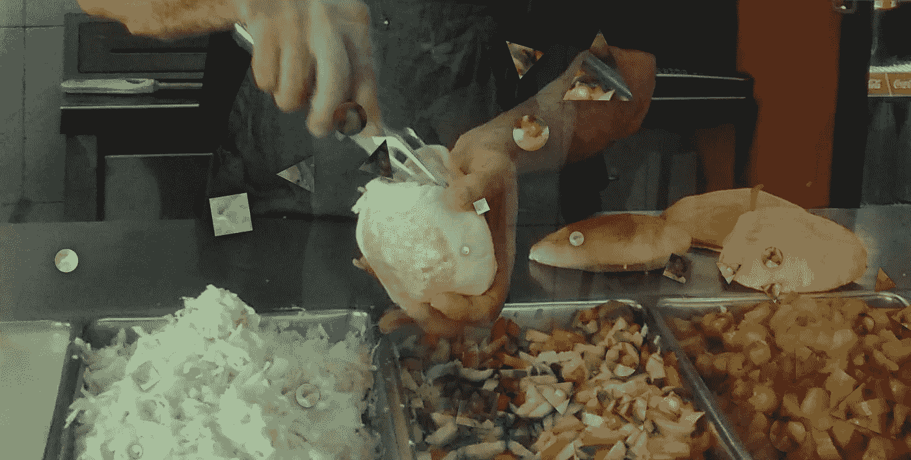
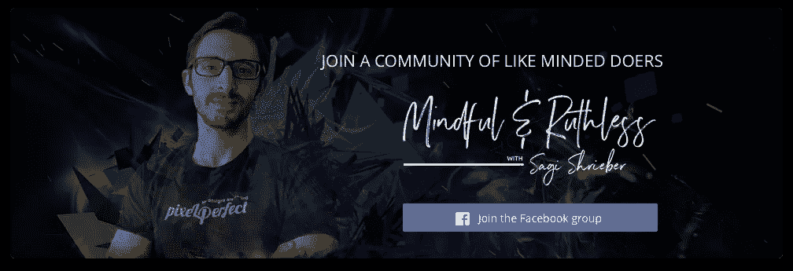

# 深度工作的沙拉三明治方法

> 原文：<https://medium.com/swlh/the-falafel-method-for-deep-work-490f88724283>

## 一个快速提高工作效率的正念技巧

如果你是一名设计师、开发人员、营销人员、企业家或任何一种从事复杂技术工作、需要你充分发挥大脑能力的专业人士，你可能正在努力寻找深度工作时间。

你不断试图进入一种“心流”状态，在这种状态下，你的大脑可以以最佳状态运行，并建立复杂任务所需的适当神经连接。

但是，如果我告诉你，你实际的深度工作与(有时是几个小时的)远非“深度”的工作混在一起，会怎么样呢？

所以我想和你分享这个小技巧，也许它会在你需要处理这些非深度任务的时候帮助你提高效率。

## 🚦方法停止:

我知道大多数人在看到松鼠之前都会阅读，所以…
我现在想问你两件事，即使在你读完这篇文章之后，这两件事也会对你有所帮助，并确保我们保持联系:

1.  我很想邀请你加入我的脸书创意企业家封闭小组，在那里我分享我所有的知识和资源，并且每周采访一次其他成功的企业家来了解我自己(最近采访了帕特·弗林)。
    🙌[**加入忌惮&无情打压脸书→**](https://www.facebook.com/groups/mindfulandruthless/)
2.  如果你是一个 youtube 用户，我会每周在我的 vlog 上发布视频，里面充满了我自己旅途中的灵感和美好。
    [**查看我的 Youtube，了解更多打造个人品牌的技巧→**](http://www.youtube.com/subscription_center?add_user=sagishrieber)

# 中东菜肴与生产力之间的联系

______

如果你在一家真正的以色列沙拉三明治店点了沙拉三明治，你就会看到终极生产力在发挥作用。

这不是一门艺术，也不是一门学问:它只是把事情做好。

排队，稍等片刻，
让某人切开皮塔饼，然后大喊"*鹰嘴豆泥薯条沙拉！"*看着你，
拿起你的皮塔饼(装满了上面的东西，通常与其说是一个问题，不如说是一个陈述)，赶快为下一个人服务。

浪费时间是不可接受的。如果你在午餐前做白日梦，你会发现一个愤怒的沙拉三明治制作者在大喊"*嘿！你！加油！你想在皮塔饼里放什么？*

皮塔饼被涂上鹰嘴豆泥，蔬菜和沙拉丸子被扔进皮塔饼里，顾客很快就被端上桌，一天过去了，最终结束了，所以他们可以回家做任何他们想做的事情，提供美味的食物。

不需要思考，只需要快手就可以为尽可能多的人服务。

# 现在让我们将其与我们自己的工作进行比较

______

技术工作通常涉及大量的思考、制定策略、研究，然后实际执行。尽管如此，在这个过程中还有很多不需要动脑筋的工作要做。

在你的日常工作中，你可能会想到无数这样的场景。

作为一名设计师，我可以分享一个例子:
有时我不得不根据客户的反馈对我的设计进行微型编辑。然后，我必须将这些设计重新同步到 Invision(我可以与客户分享我的设计的工具)。

这种任务需要时间。更糟糕的是，它通常混杂在充满艰难、耗脑任务的日常生活中。

但是，这个具体的任务本身并不需要我想太多。

我们都有这样的任务。你需要。你能想到那些是什么样的任务吗？

想想你偶尔会遇到的任务，这些任务不需要你的全部大脑能力，但通常是在其他需要的任务中出现的。

# **重复的场景**

______

我们正在工作，
我们的大脑正在努力工作，
我们在做任何事情之前都要考虑两次，
像下棋一样在我们的脑海中构思各种场景。
我们仔细考虑每一行代码，设计中的每一个新造型位置，重要邮件中的每一个字。

然后，一个我们实际上不需要考虑的重要任务出现了，但我们的大脑已经习惯了努力思考，以至于停留在“努力思考”的模式。

**结果呢？** 以一种或两种方式结束的认知失调:

*   我们甚至会放慢速度，做一些不需要动脑的任务，甚至比我们真正需要努力思考的任务还要慢。
*   更糟糕的是，我们最终会拖延，推掉那些“无聊”的工作。从一个深度工作会议中醒来，想着这是一个“喝咖啡的好时间”。

问题是，没有理由停止深入的工作会议！没有理由脱离‘心流’。这就是沙拉三明治方法发挥作用的地方。

# 介绍:深度工作的沙拉三明治方法

______

如果说我从沙拉三明治店学到了什么，那就是:**做简单事情的最好方法就是关掉你的大脑，他妈的去做。**

每当我深入设计工作的时候，我都会努力记住哪些任务需要我的全部大脑能力，哪些不需要。

每当我看到一张“简单且只需完成”的任务清单时，我就会进入 FM(沙拉三明治制作机)模式去完成它们。

没有脑力，只有速度。

> 好菜上得快。

不用动脑的任务本质上并不复杂；他们并不迷人，但他们需要完成。

他们是我们工作的一部分。

# 所以，主要的外卖是…

______

工作时要注意你的任务。

当你发现是时候做一些不用动脑的事情了，关掉你的大脑，全身心地投入。

你会发现，如果你专注于完成一些过去需要几个小时的任务，现在只需要几分钟就可以了。

使用这种方法，我保证你会声称自己在工作中更有效率、更快乐。

你喜欢这篇文章吗？在“心流”中，你有没有自己的方法让自己在那些无需动脑的任务中保持高效？
把我写在评论这里吧！

你真诚的，
萨基·施莱博

Get free tips & resources + a weekly show featuring mega successful digital creators — all in one free FB group!

除了我的[脸书团](https://www.facebook.com/groups/mindfulandruthless/)，你还可以在 [Instagram](https://www.instagram.com/sagishrieber/) 、&、Youtube 上找到我🙌

# 如果你喜欢这篇文章的话，还有其他阅读材料:

 [## 《偷火:硅谷、海军海豹突击队队员和特立独行的科学家如何革新…

### 畅销书《大胆》和《超人的崛起》的作者探索了意识的改变状态，以及他们如何…

www.amazon.com](https://www.amazon.com/Stealing-Fire-Maverick-Scientists-Revolutionizing/dp/B01N2HREQU/ref=tmm_aud_swatch_0?_encoding=UTF8&qid=&sr=)  [## 深度工作:分心世界中专注成功的规则

### 著名博主卡尔·纽波特揭示了在职业生活中获得成功和真正意义的新钥匙:能力…

www.amazon.com](https://www.amazon.com/Deep-Work-Focused-Success-Distracted/dp/B01CYKUC9C/ref=tmm_aud_swatch_0?_encoding=UTF8&qid=&sr=) 

## 这个故事发表在 [The Startup](https://medium.com/swlh) 上，Medium 的出版物有超过 256，410 人关注。

# 订阅[在此获取头条](http://growthsupply.com/the-startup-newsletter/)。

