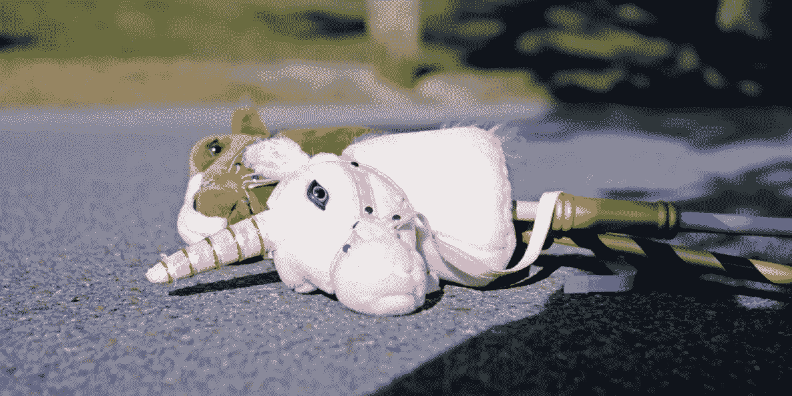
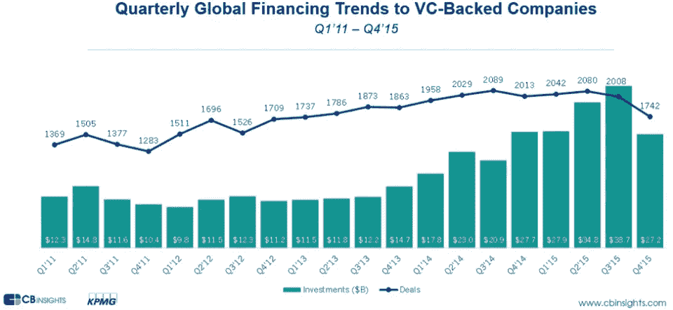
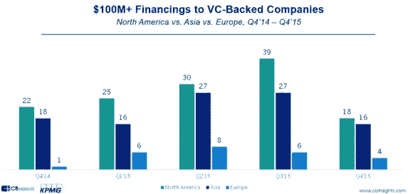
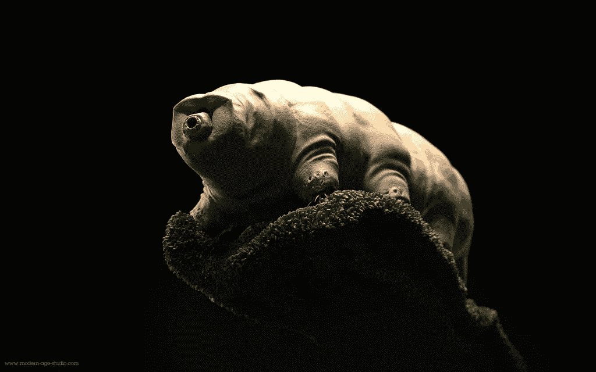
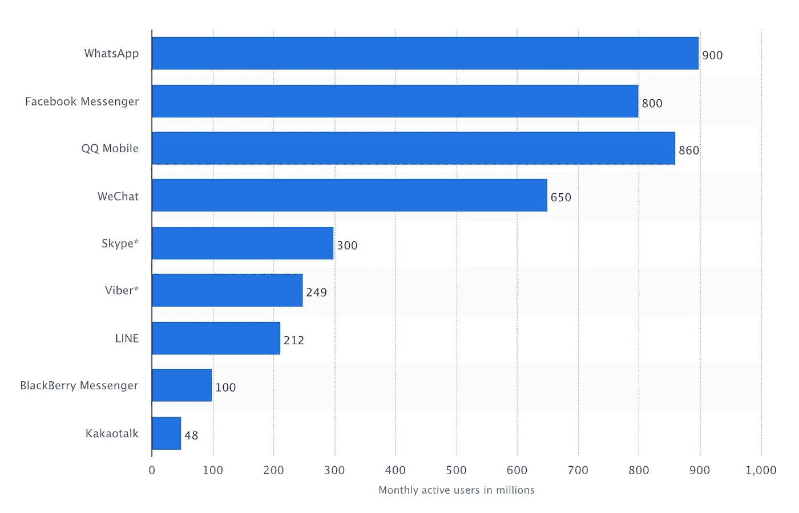
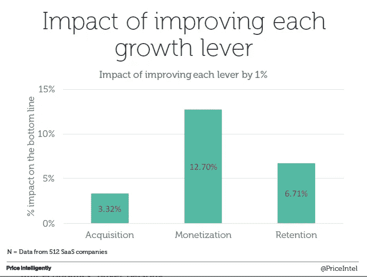
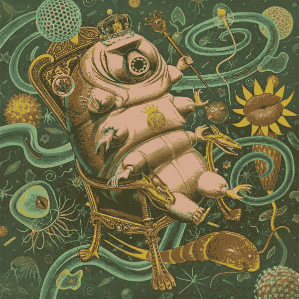

# 抛开独角兽，水熊队正准备大举回归

> 原文：<https://medium.com/swlh/the-fall-of-the-unicorns-brings-a-new-dawn-for-water-bears-a72606125681>

Source: [http://static2.businessinsider.com/image/55f8c0f3bd86ef11008ba8eb-1190-625/evernote-the-first-dead-unicorn.jpg](http://static2.businessinsider.com/image/55f8c0f3bd86ef11008ba8eb-1190-625/evernote-the-first-dead-unicorn.jpg)

对于独角兽来说，2015 年是重要的一年。根据 [Venture Beat](http://venturebeat.com/2016/01/18/there-are-now-229-unicorn-startups-with-175b-in-funding-and-1-3b-valuation/) 的数据，现在有 229 家独角兽创业公司，融资 1750 亿美元，估值 1.3 万亿美元。仅在 2015 年，就有 81 位新人被冠以传奇巨兽的称号。

然而，辉煌并没有持续。

我们开始看到技术放缓的最初迹象。CB Insight 报告称，2015 年第四季度，创业公司在全球范围内筹集了 273 亿美元，比 2015 年第三季度少 114 亿美元。

“Mutual fund valuation write-downs, decreased mega-round activity, a public-private valuation disconnect and some public Unicorn company performance issues resulted in the number of new Unicorns dropping significantly in Q4’15\. This level of new Unicorn births was last seen in Q2’14.” — CB Insights

我们也看到了巨额融资的大幅下降。与 2015 年第 3 季度的 72 笔交易相比，2015 年第 4 季度只有 38 笔交易的融资额超过 1 亿美元。

Source: [https://www.cbinsights.com/research-venture-capital-2015](https://www.cbinsights.com/research-venture-capital-2015)

这些发现都回避了这样一个问题:对独角兽的估值最初是否有意义。这些公司中的许多现在都面临着寻找新的收入来源的压力。

就目前而言，事情有所降温，但大屠杀已经开始。这里有几只受伤的独角兽:

*   Square:之前估值 60 亿美元，估值降至 30 亿美元
*   Snapchat:此前估值 160 亿美元，估值下跌 25%
*   Gilt Groupe:之前估值 11 亿美元，以 2.5 亿美元出售
*   好技术:之前估值 10 亿美元，售价 4.25 亿美元
*   Foursquare:之前估值 6.5 亿美元，估价 3.3 亿美元

当独角兽们舔伤口的时候，一种新型的创业公司获得了广泛的关注。有人叫它们蟑螂，但我更喜欢“水熊”。

Source: [http://www.3dartistonline.com/users/7722/thm1024/1397088190_waterbear_CR.jpg](http://www.3dartistonline.com/users/7722/thm1024/1397088190_waterbear_CR.jpg)

水熊或缓步动物是生活在水中、八条腿、分节的微型动物。它们被誉为世界上最坚韧的动物，因为它们能够在太空中生存，能够承受严寒、长期干旱和高剂量辐射。没有比这更合适的名字来形容那些表现出真正韧性并经受住了全球经济风暴的创业公司了。

水熊是隐形的。目前还看不到他们，但他们正准备大举回归。以下是他们目前关注的三个关键问题。

# **早早跳上新的分销平台**

Source: [http://72gpf1za5iq428ekh3r7qjc1.wpengine.netdna-cdn.com/wp-content/uploads/2016/01/image488.png](http://72gpf1za5iq428ekh3r7qjc1.wpengine.netdna-cdn.com/wp-content/uploads/2016/01/image488.png)

搭载分销平台并不是新策略。我们已经听说 Zynga 如何在早期利用脸书的广告网络，取得了和脸书一样的天文数字的增长。我们还听说了 Airbnb 如何将他们的产品反向工程到 Craigslist，并利用其 1000 万用户。但是这些[增长故事](https://growthhackers.com/growth-studies)中的大多数不再适用，因为机会之窗已经关闭。我们应该关注哪些新平台？

*   Slack:在新的 38 亿美元估值下，Slack 启动了一项 8000 万美元的基金，投资新的应用集成，以扩大其应用目录。凭借超过 270 万的每日活跃用户，该团队通信公司热衷于使开发人员能够创建机器人来帮助用户自动化他们的日常任务，如支出或安排会议。应用生态系统仍处于起步阶段，这使得它成为建立先发优势的成熟机会。
*   **消息应用:**到 2020 年，地球上将有 50 亿人拥有智能手机，他们将使用 Whatsapp(约 9 亿用户)、Messenger(约 8 亿用户)、QQ Mobile(约 8.6 亿用户)、微信(约 6.5 亿用户)和 Line(约 2.15 亿用户)进行交流。消息生态系统为应用程序开发人员创造了无限的可能性，他们可以创建工具来帮助用户在项目上进行合作，支付账单，签署合同，寻找约会，直播，打赌体育，游戏等等。
*   **虚拟现实应用**:在 20 世纪 80 年代，人们的目标是让每张桌子上都有一台电脑。然后是每个膝盖上都有一台笔记本电脑。现在每个口袋里都有一部智能手机。但是，未来有没有可能让我们每个人都有一个虚拟现实耳机呢？目前，虚拟现实将如何重塑我们与信息互动的方式仍是猜测。也许虚拟现实耳机的美学将与我们现在理解的大不相同，但这绝对是一个令人兴奋的新空间。

# **成长黑客客户成功**

黑客客户成功增长需要平衡收购和保留增长杠杆。这需要一些创造力，因为你试图增加客户的终身价值，同时降低你的流失率。如果你过于关注用户的获取而忽视了用户的保持，那么你就陷入了追逐自己的尾巴。反之亦然，如果你太专注于留住客户，你的成长速度就不够快，客户支持就像滚雪球一样越滚越大。这就是为什么成功的黑客攻击需要对谁是你的客户，如何对他们进行细分，以及如何让他们成为你产品的拥护者有深刻的理解。

[后来](http://www.later.com)是一家 Instagram 帖子管理公司，拥有超过 60 万客户，包括 Yelp、GQ、迪士尼、Etsy 和孤独星球等品牌。他们能够在短时间内实现这种增长，是因为他们擅长优化构建-测量-学习周期，并通过个性化服务与早期客户建立持久的关系。

以下是一些像后来这样的公司正在采用的策略:

*   第一印象很重要！通过吸引人的电子邮件、有用的教程、及时的支持或奖励来吸引用户。
*   当客户在你的产品中达到一个里程碑时，奖励他们。提供虚拟击掌、高级功能、折扣、积分或徽章。
*   通过支持轮岗，让团队中的工程师、营销人员、管理人员和设计师都有机会与客户交流并支持他们，从而将客户成功融入公司文化。

# **给价值贴上价格标签**

你把钱放在桌子上了吗？Price Intelligently 的首席执行官 Patrick Campbell 透露，“SaaS 公司平均花费在定价上的时间总共约为 8 小时。”与我们在获取用户上花费的数百甚至数千小时相比，这根本不算什么。

在收集了 512 家 SaaS 公司的数据后，他发现货币化程度提高 1%会产生 4 倍于专注于收购的效果。那么，我们如何提高货币化？

*   **找到合适的人物角色定价**，全面了解您的客户，包括他们最有价值的特征、最无价值的特征、支付意愿、客户获取成本和客户终身价值。
*   **实施定价流程**，通过进行客户/市场调查和影响分析，并形成沟通计划，不断验证您的定价策略。Patrick 建议，您需要每 3 个月评估一次您的定价策略，每 6 个月进行一次更改。
*   **利用多价格思维**让您的定价符合客户的需求，让他们只为对他们最有价值的功能付费。

小型团队盈利良好的一个很好的例子是 [Carb.io](http://carb.io/) ，一家销售生产力工具公司，与 Aaron Ross 的可预测收入合并。Carb.io 早期的大部分时间都在了解如何帮助销售人员提高工作效率，并寻找他们可以产生重大影响的利基市场。直到他们很好地理解了他们的产品带来的价值，他们才踩下油门，现在已经接近 200 万美元的 ARR。

[点击此处观看帕特里克·坎贝尔在牵引会议上关于货币化的精彩演讲](https://www.youtube.com/watch?v=ysQSYBJgx78)。他将于 2016 年 6 月 23 日在温哥华举行的[牵引大会上再次发表演讲。](http://www.tractionconf.io)

# 临终遗言

Source: [https://s-media-cache-ak0.pinimg.com/736x/8f/53/a0/8f53a09c9eaa9565e80341dfc9c779b1.jpg](https://s-media-cache-ak0.pinimg.com/736x/8f/53/a0/8f53a09c9eaa9565e80341dfc9c779b1.jpg)

在我们当前动荡的市场中幸存下来的水熊将会熟练地平衡所有三个增长杠杆(获取、保留和货币化)。它们可能很小。他们可能很安静。但是，不要低估他们生存的顽强精神和制造客户喜爱的产品的动力。

本文原载于 TechCrunch:[http://TechCrunch . com/2016/04/23/the-fall-of-the-the-unicorns-bring-a-new-dawn-for-water-bears/](http://techcrunch.com/2016/04/23/the-fall-of-the-unicorns-brings-a-new-dawn-for-water-bears/)

*//关于作者:*

*亚历克斯·庄是加拿大西部领先的科技孵化器 Launch Academy 的联合创始人兼首席战略官。Alex 对创业、成长和 UX 设计充满热情。*

**你可能还喜欢:**

[2016 年创业快速指南](/swlh/the-quick-and-dirty-guide-to-launching-your-startup-in-2015-7213650e5d8d#.45sc6gh9k)

[千禧一代幸福指南](/@alexchuang72/36-truths-that-i-ve-discovered-about-life-efe4c52f7cf2#.848pyrvce)

[失落的管理艺术](/@alexchuang72/the-lost-art-of-management-42356e258181#.jt4i3fmdc)

[创意领袖的基石](/leaders-of-the-future/the-building-blocks-of-creative-leaders-b135df5b0464#.dvn1fh3mi)

[如何设计自己的工作保障](/life-tips/how-to-engineer-your-own-job-security-b5cb32303628#.hidbyqlxw)