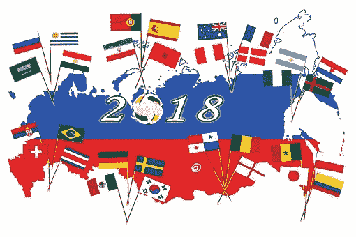

# 国际足联 2018 年世界杯:机器学习预测可能的赢家

> 原文：<https://medium.com/swlh/the-fifa-2018-world-cup-machine-learning-predicts-likely-winners-7bec9521d903>

2018 年国际足联世界杯于 2018 年 6 月 14 日在俄罗斯开幕。全世界的足球迷都欣喜若狂，急切地等待着在为期一个月的体育赛事结束后将被授予梦寐以求的奖杯的球队。

然而，足球虽然很刺激，却是一项很不可预测的体育活动。这场比赛的不确定性是吸引爱好者的主要魅力之一，至少在 90 分钟内，球的方向都是如此。

自从世界杯开始以来，已经设计了几种技术来预测这项世界上最受欢迎的体育赛事的最有可能的获胜者。

虽然大多数早期的预测都依赖于非科学的方法——例如广受欢迎的章鱼保罗神奇地预测了 2010 年世界杯冠军(西班牙)——但人工智能科学家这一次也加入了预测的行列。

来自德国多特蒙德技术大学、比利时根特大学和慕尼黑工业大学的一组研究人员开发了一种机器学习算法，来预测今年世界杯的可能获胜者。

您可以在此找到研究[。](https://arxiv.org/pdf/1806.03208.pdf)

# 这项研究是如何进行的

为了预测最受关注的足球赛事的可能结果，研究人员进行了 10 万次模拟，并采用了三种不同的建模方法:泊松回归模型、随机森林和排名方法。

人工智能研究人员根据团队的协变量信息，使用泊松回归方法将竞争团队的先前分数建模为(有条件的)独立变量。

他们还使用泊松模型来评估一个团队目前的排名，这反映了它的能力。

随机森林被用来创建多个决策树，然后将这些决策树合并在一起，以预测一支球队在世界杯比赛中可以得分的数量。

在使用三种方法进行测试后，研究小组发现，表现最好的预测方法是随机森林和排序方法的结合。

该团队使用了前四届世界杯(从 2002 年到 2014 年)所有比赛的数据以及许多潜在的影响变量。

他们研究的一些变量包括参赛国的经济状况、国际足联排名、主场优势、球队结构和教练能力。

请看看这项研究，了解更多关于模型如何工作的信息。

# 国际足联 2018 年世界杯研究结果

下表显示了今年足球锦标赛中所有 32 支球队达到不同水平的概率百分比:

从上表可以看出，研究人员预测西班牙是最有可能把梦寐以求的奖杯带回家的球队，预测获胜概率为 17.8%。

其他可能表现最佳的国家是德国(17.1%)、巴西(12.3%)和法国(11.2%)。

结果还揭示了其他有趣的预测。例如，据预测，西班牙和德国这两支表现最好的球队进入十六强的概率几乎相等，分别为 88.4%和 86.5%。

然而，两队进入四分之一决赛的可能性相差很大。鉴于西班牙进入四分之一决赛的概率为 73.1%，德国的可能性为 58.0%，因为它很可能会遇到一个更强大的对手，如巴西或瑞士。

随着比赛接近尾声，德国将开始追赶西班牙。最终，两个队会以几乎相同的获胜可能性结束。

# 包扎

机器学习是一种有趣的技术，传统上用于预测事件的结果。

例如，AndreyBu 来自德国，拥有超过 5 年的软件开发经验，他通常构建机器学习项目来加速应用程序的能力。你可以在这里观看和学习他的一个项目。

现在，机器学习的应用已经超越了传统的用例。这项研究的结果表明，机器学习模型可以用来预测重大体育赛事的结果——而不是依赖千里眼的动物、毫无根据的反对者或体育专家。

如前所述，足球比赛是高度不可预测的，这项研究的结果应该持保留态度。

在足球比赛中，任何事情都可能发生，这取决于一个 11 人的球队在至少 90 分钟内成功将球送入对方球门的次数。

你相信这项研究的结果吗？你认为今年谁会捧起奖杯？请在下面的评论区告诉我们。

## 这个故事发表在[的创业](https://medium.com/swlh)上，这是 Medium 最大的创业刊物，有 337，320 多人关注。

## 订阅接收[我们的头条新闻](http://growthsupply.com/the-startup-newsletter/)。

