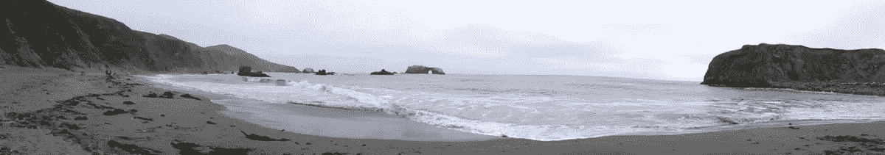

# 我作为初创企业创始人的头 100 天

> 原文：<https://medium.com/swlh/the-first-100-days-of-my-life-as-a-start-up-founder-513969f79705>

> 疲惫和兴奋，耗时和高效，自我怀疑和自我激励…所有这些都在同一时间，所有的时间。这总结了我作为初创企业创始人的头 100 天的日常经历。

2018 年 8 月 23 日，不是出于顿悟或突然迸发的想法，而是出于对我作为一名顾问帮助一家全球生命科学客户建立分析的工作的逐步不满，以及最近一次让我特别失望的求职经历，我开始梦想替代方案可能是什么。

白日梦变成了令人不安的自我反省。我问自己为什么每隔 2-3 年就换一份工作，为什么我打了全垒打却缺乏跑回家的毅力，为什么我这么快就失去了动力并感到没有挑战，为什么我不能学会品尝长期职业生涯的甜蜜果实。在沉思这些想法的时候，我慢慢意识到，一份新工作，无论多么令人惊奇，都不能解决我的困境。如果我是我自己，我找不到适合我的工作，那么

> …我必须让自己为自己工作，我必须成为自己的激励者…

别再找借口了。

我开始了。

开始构思这些想法。开始研究，研究，再研究。煞费苦心地建立和重建商业计划。成立个人独资企业。申请 DBA。申请了营业执照。与初创企业的创始人有联系，不管我是否认识他们。发出了一份谷歌表单调查，以衡量市场兴趣，并为 UAT 征集早期用户。采访离岸网站开发者。尝试设计一个 UI 线框。推销我的想法，被一句冷漠的“嗯嗯”弄得灰心丧气，调整了一下音调，又试了一次。开始搭建球场平台；不是试图获得资金，哦不，完全没有，而是用它作为一种重复的方式来讲述一个故事。顺便问一下，什么是投资意向书，我如何创建一个限额表？我申请了一个种子前孵化器项目并被接受，但是我不确定我是否有足够的韧性去完成它。头晕目眩，双眼交叉…

这是一次孤独的旅程。如果不是因为这些人，我会变得疯狂和沮丧:

**吉恩** : [吉恩](https://www.linkedin.com/in/genedurnell/)是我共事过的最有战略头脑的人。我从一开始就知道，如果我真想创办一家初创企业，他必须是犯罪的战略伙伴。幸运的是，我以某种方式向他推销了这个想法和不成熟的商业计划，从那以后，我们非常努力地完善概念证明和价值主张。

**莉莉**:莉莉是我的朋友，也是前注册会计师。我向她寻求会计指导，结果她成了我最大的道义支持者和传声筒。

**丹尼尔**:我偶然发现了丹尼尔的[博客](https://all-in-project.com/)，他在博客中记录了他创建自己的[初创企业](https://momoback.com/)的历程，并在 LinkedIn 上与他联系，后来还见了面。是丹尼尔的难题让我无言以对，并促使我重新思考构思和验证过程，这导致了我本应更早执行的产品市场适合度调查。

我聘用了，因为尽管有来自小组面试者的反馈，我发现他很聪明。在他回答了产品市场适合度调查后，我们重新联系上了，我很高兴地发现他已经建立了自己的[战略咨询公司](https://www.bingyune.com/)，并向我展示了经营企业的诀窍。

我的丈夫罗恩:你最亲近的人会毫不犹豫地表达他们残酷而诚实的怀疑。我向罗恩解释了我想做的事情后，他说的第一句话是“为什么？”。他是家庭中的稳定者，而我是疯狂冲动的配偶。最后，在我恳求他给我两年时间“考虑这个计划”后，他不情愿地提供了支持。

那么，在过去的 100 天里，我学到了什么？

>我还在爬。

>在这 100 天里，我学到了比过去三份工作加起来还多的商业运作知识。

>还有太多该死的东西要学。

>每天自我怀疑、自我激励的过山车很正常；习惯就好。

>小的里程碑是值得庆祝的成就。

>离目标越来越近，每一小步都很重要。

>我疯狂的想这么做。

> 我人生中唯一的遗憾是我开始做梦太晚了，但我不后悔现在开始构建梦想。

我很清楚也很现实地意识到创业失败率(五周年之前> 50%)，但至少这一次，失败是我自己的命运，也是我自己的梦想。

毕竟，我的丈夫罗恩是这个家庭的稳定者，我总是可以依靠他。

敬那些为梦想而行动的人！

 [## ZRERD.com | LinkedIn

### 一个数字化论坛，将传统的以招聘人员为中心的招聘流程转变为以候选人为中心的体验之旅。

www.linkedin.com/company/zrerd-com](https://www.linkedin.com/company/zrerd-com/) 

## 这篇文章发表在 [The Startup](https://medium.com/swlh) 上，这是 Medium 最大的创业刊物，拥有+395，714 名读者。

## 在此订阅接收[我们的头条新闻](http://growthsupply.com/the-startup-newsletter/)。

