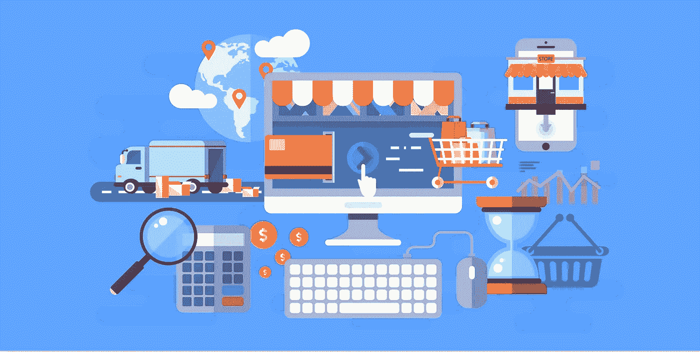
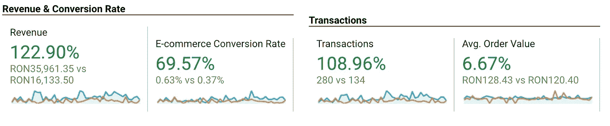
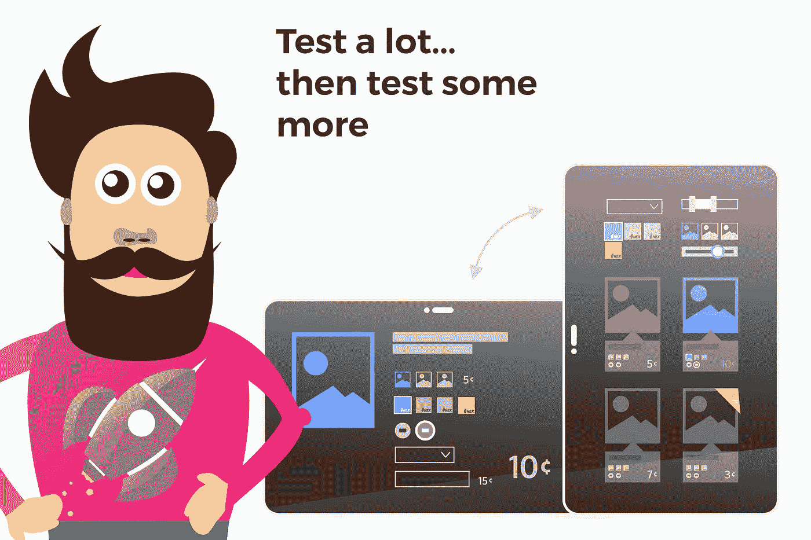

# 优化在线商店的前 7 个步骤

> 原文：<https://medium.com/swlh/the-first-7-steps-in-optimizing-online-stores-c85f790ddf78>

source: envatoelements.com

**在过去的一个月里，收入增长了 120%以上，而这一切都是通过对在线商店进行 7 次简单的优化实现的。**

获得一个新客户似乎需要接受很多。新的商业模式，新的人员和新的挑战。每个人都想要结果，但并不是所有人都明白这需要时间。

如果你迫于压力要交付成果，而你不知道从哪里开始，那么把这 7 个技巧运用到你的电子商务客户身上，你就能马上得到成果。

# 1.花时间了解他们的业务和客户

看起来很正常，对吧？是的，是这样，但是我见过几十个人想直接开始工作，却不知道未来会发生什么，也没有明确的战略。对于一个新的电子商务客户来说，这也是最重要的一步。尽管它们的商业模式可能是相同的，但没有哪两家在线商店拥有相同的客户、买家旅程或销售漏斗。

了解这些，自己做一些测试购买，订阅时事通讯，甚至打电话给客户支持服务，测试他们，看看他们在抱怨一些订单时的反应。

每个小细节都会有所不同。你不必马上处理和解决所有的问题，但是一定要把它们写下来。

# 2.从小处着手，分清轻重缓急

没有必要在前两周对商店的一切进行 A/B 测试。

你会惊讶地发现，一些小小的调整会给整个购买过程和整体转化率带来多么大的变化。

试着看看这些小细节，以便在优化过程的第一时间产生影响，并问自己这些问题:

*   产品最重要的细节是否位于折叠上方？
*   从法律或交付的角度来看，结帐表单是否包含无用的字段？
*   网站加载速度够快吗？你能对图像或代码做些小的改变，但会有大的影响吗？
*   是否允许用户向购物车中添加不可用的产品？—是的，这听起来很疯狂，但我已经经历过很多次了。

从小处着手，做一些容易测试的改变，看看它们如何影响你的转换率。

# 3.移动测试商店和买家旅程的每一个细节

source: envatoelements.com

如果你和我一样，在进行商店审计时，你会使用个人电脑或笔记本电脑。我第一次开始为我的一些客户进行转化率优化时遇到了这个问题，得出了一些结论，结果证明是非常错误的。

如今，大部分流量来自手机。而且这个只会涨。所以，拿起你的手机，开始测试页面、按钮和整个结账过程。

以下是我在手机上遇到的一些事情，这些事情一旦得到改善，就显示出手机的掉线率降低了:

*   **交叉销售高于实际购物车信息。**

购物车页面不应该是这种情况。用户在那里完成购买。如果你立即向他们展示其他产品，而他实际上正在寻找完成购买，你会失去他们。

**提示:**在他们输入账单信息后，进入付款页面前，尝试展示交叉销售。让他们非常容易地将这些产品添加到最终订单中。

*   **手机上没有信任标志**

如果用户在手机上购物，这并不意味着他的思维完全不同。尝试找到一种方法，即使在手机上也能以一种非侵入性的方式显示信任标志。

*   **不同类型产品的不同收银台**

你卖的是实物和数字商品吗？不要让顾客为他们填写相同的表格。如果他们购买的是数码产品，选择更短更简单的结账方式。你不需要他们的地址，邮政编码，国家等。确保从法律角度来看，您删除的任何字段都不会影响您自己。

# 4.明智地推广它

我很确定没有一家网店仅仅通过有机手段来推动销售。你会有付费搜索，程序化，本土和社会运动。

确保在你开始你的活动之前，你已经有了一个好的策略。试着先做这些事情，然后再做:

*   确保你的目标用户没有完成任何购买
*   使用电子邮件营销来推动对现有数据库的交叉销售和追加销售
*   在社交网络或 GDN 上推广时，确保你的商店和广告有统一的视觉风格。

# 5.确保一切都像预期的那样正常工作

我不应该告诉你从一端到另一端有一个功能商店的重要性，但我在这里，因为这真他妈的重要。

*   确保所有的链接都正常工作，并且指向它们应该指向的地方
*   确保按钮可见且易于点击
*   确保搜索功能正常工作

# 6.及时回答你的客户并建立信任

网站上的信任标志是不够的。有时候，他们会给你打电话，发电子邮件，甚至在 Facebook Messenger 上给你发信息。

确保你解决了他们的问题，引导他们购物，了解他们的需求。一个好的客户服务可以带你走很长的路。

# 7 .确保你以正确的方式看待数据

CPCs，CTR，下降和反弹。如果你以错误的方式看待它们，它们会变得令人不知所措。

*   使用 Google Analytics，了解特定优化需要哪些指标，并在第一阶段跟踪这些指标，在下一阶段跟踪其他指标。
*   参加[谷歌分析学院](https://analytics.google.com/analytics/academy/)课程。
*   如果在动手分析数据后你还有问题，谷歌一下。您是第一个遇到特定问题的人的可能性非常非常小。

这 7 个步骤应该足以让你正在优化的电子商务商店有所改观。还有更多，不过还是从小做起吧:)。

如果你有任何其他的改进想法，你认为应该在刚刚开始优化时派上用场，请在评论中告诉我。

## 这个故事发表在 [The Startup](https://medium.com/swlh) 上，这里有 263，100 多人聚集在一起阅读 Medium 关于创业的主要故事。

## 订阅接收[我们的头条](http://growthsupply.com/the-startup-newsletter/)。

