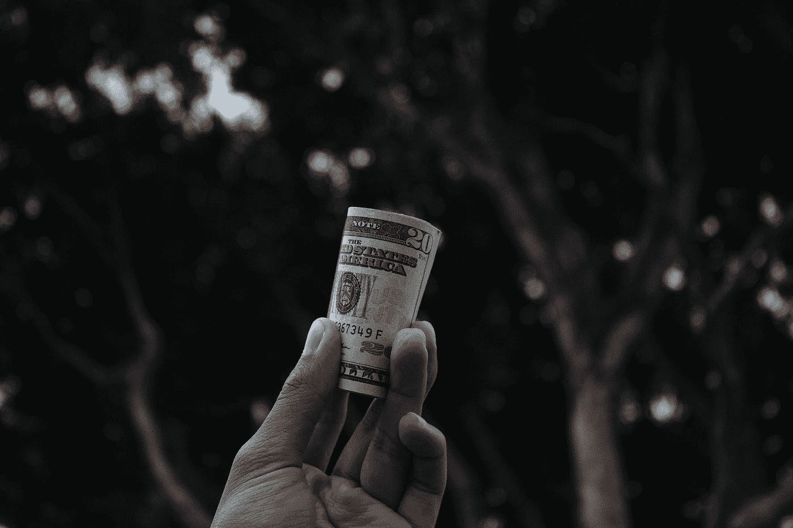

# 企业家精神的第一条规则

> 原文：<https://medium.com/swlh/the-first-rule-of-entrepreneurship-d70142fe66de>

“A person's hand holding up a roll of dollar bills” by [Vitaly Taranov](https://unsplash.com/@gooner?utm_source=medium&utm_medium=referral) on [Unsplash](https://unsplash.com?utm_source=medium&utm_medium=referral)

## 赚钱

我没有年轻时有骗子心态的有趣故事。我没有卖糖果、玩具或柠檬汽水给我的同学。和其他人一样，我喜欢消费，而不是生产。我会玩电子游戏或者看动漫。

我所有的企业家偶像和英雄都有一个关于他们如何一直拥有它的故事。在某种程度上，我有点羡慕他们的生活经历。我多么希望我也能像他一样努力和坚韧地长大。

我二十九岁，感觉聚会迟到了。我有生意的朋友已经在扩大他们的企业。我在这里爬着赚钱。

但是我想告诉我自己，也告诉你，一切都不会太晚。

*现在*总是开始学习创业技能的最佳时机。对过去耿耿于怀是没有用的，我们所拥有的是现在，我们应该抓住每一个机会。

创业的第一条规则来自我在巴厘岛认识的一个熟人。他是一个成功的人，积累了大量的财富，现在正在将他的资产重新分配给房地产。他曾致力于蓬勃发展的在线业务。

我问他关于组建美国有限责任公司、开设美国银行账户和其他法律事务的细节。他打断了我的话，给我上了一课，这一课像刀子一样刺痛了我的心。

**先学会如何赚钱。**

常识，但往往被忽视。在他找到合法经营的方法之前，他的收入已经超过了 10 万美元。他不需要调整所有的变量，他把赚钱作为他的首要任务。

因为我是一个创业迷，所以我寻找赚钱的方法。我允许自己以最小的规模赚钱。

如果我从一笔交易中只获利一美元，那也没关系。

我去了一家商业书店，寻找打折的书。我买了几本，想把它们转卖到另一家卖旧书的书店。

我很紧张，害怕他们会注意到我在向他们转售一家著名书店的书。

但是我不得不卖掉那些书，因为我没有阅读它们的计划。当我走进商店时，他们没有注意到。他们买了书，我做了第一笔买卖。

就这么简单？这太好了，不可能是真的。我什么也没做。

那一刻给了我信心，让我相信我有能力创业。我知道没那么简单，但原理是一样的。

今天早上我在乌布的星巴克，看着他们的商品。他们有各种各样的酒杯。当我逐一检查时，很明显星巴克没有生产这些产品。他们*只是*贴上他们的商标，称之为他们自己的。这和我在书上做的一样，只是少了私人标签。

## 创业的第一条规则是学会如何赚钱。

你想做什么样的生意？要不要打造一个产品？你想提供服务吗？

设计一个能让你赚到最少钱的计划。只要你掌握了窍门，一美元也没关系。这是我们童年时转售糖果或玩具的经历。或者卖我们用原材料做的柠檬水。

这个练习将拓展你的思维，让你像商人一样思考。

将你的思维空间从消费转变为创造。当你看到一个引起你注意的产品时，问问你自己——他们是如何制造的，利润率是多少，我如何才能复制这种模式？

回头见，我的朋友。

## 这篇文章发表在《初创企业》杂志上，这是 Medium 最大的创业刊物，有 333，253 人关注。

## 订阅接收[我们的头条](http://growthsupply.com/the-startup-newsletter/)。

