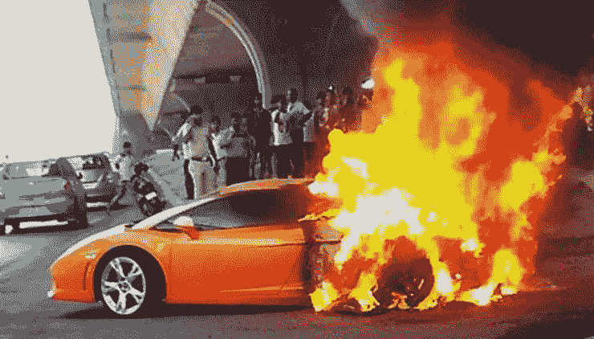
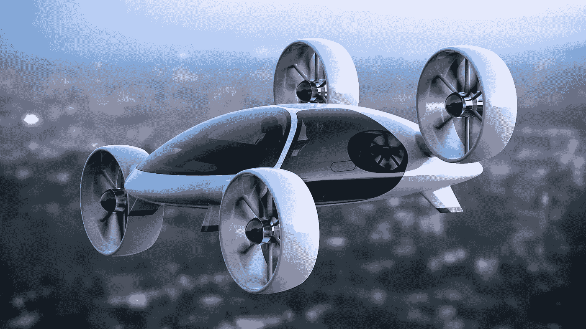
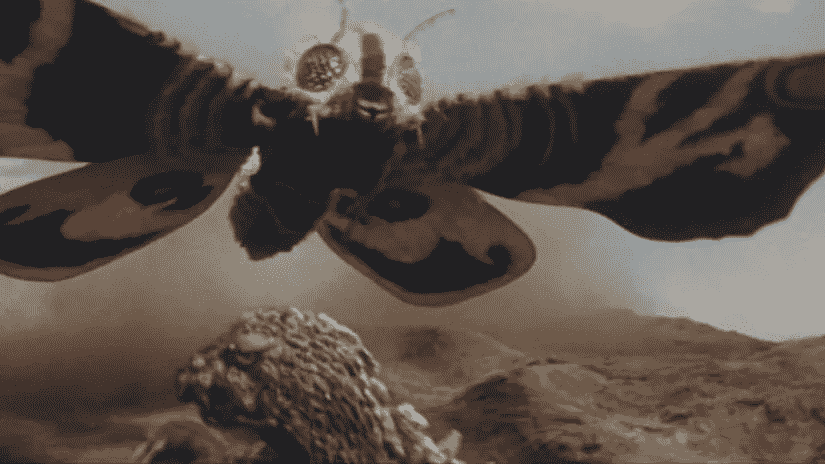

# 我在五年的加密生涯中犯的五个最大的错误

> 原文：<https://medium.com/swlh/the-five-biggest-mistakes-ive-made-in-five-wild-years-of-crypto-93cea948390d>

成为第一是不够的。光快是不够的。仅仅专注是不够的。

什么是足够的？等我自费开了几个玩笑之后就知道了。

让我们从错误一开始。

[Being fast and furious isn’t enough](https://www.cartoq.com/why-do-lamborghinis-catch-fire/)

# 错误 1:创业和网络未来主义不是一回事！

什么是“网络未来主义”？这是我刚刚创造的未来主义的一种新形式，因为它听起来很酷，而且因为我是一个知识分子，我们被允许创造很酷的新词。我还可能因为创造了其他很酷的词而获得荣誉，比如“cryptoequity”和**(实际上那是我的祖父)。**

****问题预警**！写一些很酷的未来现实，制作一些吸引其他知识分子注意的原型，与制作一个吸引足够多用户来维持你和你的创业公司生存的产品是两码事。呜呜呜我组织了第一次非盈利基金会对区块链的投票。这对我有什么好处？可能是一些历史学家对区块链治理的注脚。甚至可能是你从未听说过的某所大学的荣誉学位…**

# **错误 2:永远不要在区块链上赌书呆子乌托邦！**

**如果你第一次听说书呆子钱只适合赌博和投机，你会说什么？它永远不会流行起来…不仅如此，如果你是一个真正的憎恨者，你可以为你最喜欢的书呆子新闻网站制作一个[浏览器插件，让你屏蔽关于书呆子钱的故事。](https://github.com/fractastical/Hacker-News-Filter)**

**直到你意识到银行的钱也是建立在传销的基础上，而书呆子的钱也适合在互联网上交易违禁品。事实证明，这对于资助其他书呆子乌托邦也非常有益…**

**导致…胜利**

****

**[Retro neo niche excitement](https://www.express.co.uk/life-style/cars/901897/VW-Camper-Van-ID-Buzz-update-AI-assistant-Volkswagen)**

# **错误 3:你必须喜欢小众观众**

**全球各地都有嬉皮士，他们会把一天中的所有时间都用来寻找更公平的东西。有些自由主义者会把国家制造的任何东西冲进马桶，仅仅因为。今天长大的孩子永远不会碰法定货币，因为它们又脏又臭。**

**在加密的世界里，你不得不**热爱**而**讨厌**这些古怪的小众观众。[埃里克·沃尔赫斯](https://twitter.com/ErikVoorhees)和罗杰·弗可能是神经病，但你必须**爱**他们，尽管这可能很难。布洛克可能是一个太空牛仔嬉皮士国王，但请请至少喝一次库莱。你可能值得更好的，但更好的还没有建立起来…**

**在那之前，还有闪闪发光的小马和 Vitalik 惊人的 Hello Kitty 收藏品和极其罕见的魔兽世界物品(咳咳，记住错误 2)。**

# **错误 4:不要等待政府成为你的妈咪**

**如果你相信罗杰·弗，国家就是一块邪恶的巨石，等着碾碎你。Bwahaha！事实上，以我的经验来看，政府充满了好人，他们有比阅读网络自由主义者的谴责更好的事情去做。大多数情况下，他们只是想让你缴纳税款，防止奶奶一生的积蓄被某个头发浓密的电话推销员偷走。**

**然而，因为他们没有注意到你在做什么，哦，有远见的书呆子！你不能等着他们关心你，或者给他们留下长长的语音备忘录，询问他们的意见，然后期待他们的回应。你必须做一些真正疯狂的事情。做点创新就好！**

****

# **错误 5:朝着令人敬畏的方向努力！**

**听着，我知道我刚刚贴在上面的东西在任何地方都是非法的。神圣的鳄梨酱！有一次我去了火人馆，然后想做一些很酷的事情，他们告诉我，我必须填写大量的文件，并获得大量的许可，然后这真的太糟糕了，因为这是不可能的。如果火人节被认为是自由主义者的天堂，那么世界的其他地方呢？**

**你猜怎么着？这不重要。如果你正在建造的东西很棒，那就继续建造一点一滴，直到更大的梦想实现。诀窍在于确保愿景是令人敬畏的，各个部分是相辅相成的，并且你是在用一种工程头脑而不是手忙脚乱地进行建设。**

**毕竟，在某个时候，魔斯拉可能会进攻，自由世界将会意识到你秘密建造的哥斯拉机甲岛正是这个世界所需要的。现在起来吧，自由世界的冠军！**

****

**Tell us O Nerd, who will defend the free world from the menaces of Mothra! This may be your hour!**

# **我还需要知道什么？**

**嗯，没什么。呆在你的车库里做些酷的东西，直到魔斯拉来。**

****

## **这篇文章发表在 [The Startup](https://medium.com/swlh) 上，这是 Medium 最大的创业刊物，拥有+396，714 名读者。**

## **在这里订阅接收[我们的头条新闻](http://growthsupply.com/the-startup-newsletter/)。**

****