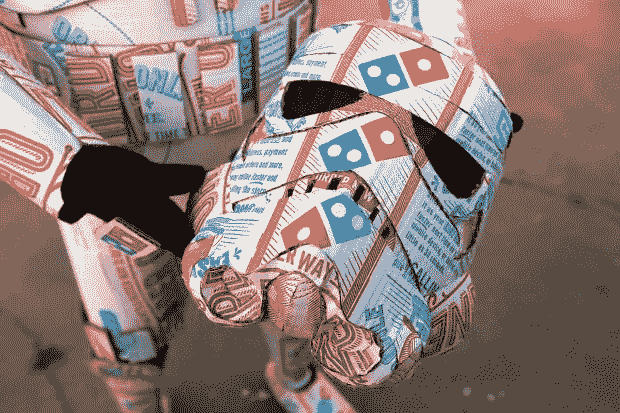
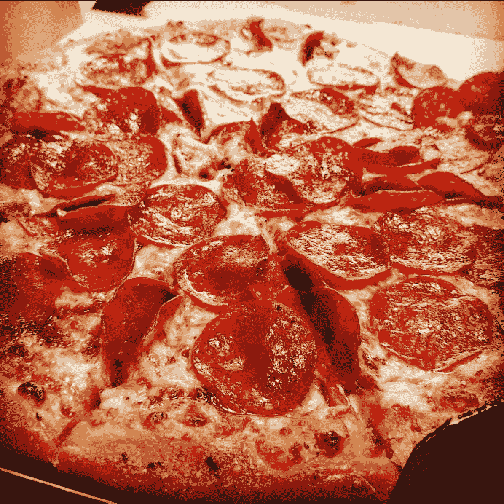

# 今天的力量很大

> 原文：<https://medium.com/swlh/the-force-is-strong-today-1d5158a5c17a>

## 达美乐如何成为我们支持的品牌

在达美乐成为“一家销售披萨的科技公司”之前，它有一个**管道**T2 热点问题需要解决:披萨。

因为尽管披萨外卖一直是这个品牌的核心，但如果披萨饼皮尝起来像硬纸板，酱汁尝起来像番茄酱，那么它以多快的速度送到你家门口也没关系。尽管很多人对达美乐有怀旧之情，但好的感觉并不能代替美食。

他们需要快速重振品牌——让顾客再次信任他们。因此，他们做了一件在当时既非常冒险又真正具有开创性的事情:**公开承认他们的披萨不好，并说他们正在改变它。**

达美乐展示了顾客对披萨的真实反馈:*无聊、平淡、大量生产、加工，比微波披萨还糟糕*。他们没有感受到爱或特别的酱——达美乐把这些评论放在心上。

达美乐表示，现在不仅是做出改变的时候了，也是兴奋地将这些消极因素转化为积极因素的时候了。然后达美乐带着顾客踏上旅程。你看到了多米诺团队成员的脸，听到了他们的声音。你走到幕后，看看人们有多在乎，他们在做什么才能让披萨好吃。

当找到正确的配方时，达美乐惊呼，“哦，是的，我们做到了”——因为这是他们团队和客户共同努力的结果。

这场运动既诚实又自嘲，在 2009 年立刻吸引了人们。**对今天的千禧一代和 X 世代的观众来说，它仍然是完美的，**他们对营销和品牌的容忍度逐年下降。

通过采取这种激进的信息传递方式，达美乐实现了任何老牌品牌都难以企及的目标— **它完全改变了自己的品牌认知。**

突然间，达美乐成了透明披萨公司。一个以前没有脸的公司，瞬间觉得自己是你的朋友。他们是失败者，却有一个人人都可以为之加油的目标。每个人都喜欢失败者。或者在这种情况下是一个不足。

截至上个月，这个一度陷入困境的品牌在全球零售额方面排名第一——这是他们在数字创新、电子商务和社交参与方面投资的结果。

**但如果没有品牌认知的改变，这一切都不可能实现。**

他们从关注顾客最关心的事情开始，专注于此，首先解决第一件事:**烹饪美食。然后，他们完善并推广他们的食谱，使其更快、更容易订购。**

# ⚡️ **小见识** ⚡️

世界的社会联系越紧密，品牌认知就变得越重要。

人们对你品牌的评价比你告诉他们的更重要。拥有对你的产品充满热情并成为你企业的拥护者的客户比以往任何时候都更加重要。

无论你是在改进你的产品，创造更好的客户服务体验，还是试图让你的包装和成分更加可持续，**诚实地面对(1)你现在的处境和(2)你未来的目标是一件非常好的事情。**

它使你的品牌人性化，让今天的顾客能够与之联系起来。因为就像你的公司一样，**你的客户也在努力做得更好，成为更好的人。**

它们也并不完美——所以它们可以与你的旅程相关联，跟踪你的进展并提供建议。这不仅创造了一种联系感，还创造了一种品牌自豪感，就好像你的公司是他们选择支持的候选人一样。

当你兑现承诺的时候🍕这些顾客会很快吃完的。然后他们会回来几秒钟…并带来他们所有的朋友。这就是一个披萨变成派对的原因。

> 像这样？给它一些👏👏👏爱情。
> 
> 关注我，获取每日发布的创业公司品牌洞察: [Instagram](https://www.instagram.com/kimberlybrizzolara/) || [脸书](https://b-m.facebook.com/brandsthatgetyou/) || [LinkedIn](http://www.linkedin.com/in/kimberly-brizzolara-0b95093)
> 
> 你也可以[注册电子邮件](http://kimberlybrizzolara.com)并在媒体上继续关注我[。](/@Kbrizz)

## 这个故事发表在 [The Startup](https://medium.com/swlh) 上，这是 Medium 最大的企业家出版物，拥有 328，729+人。

## 在这里订阅接收[我们的头条新闻](http://growthsupply.com/the-startup-newsletter/)。

