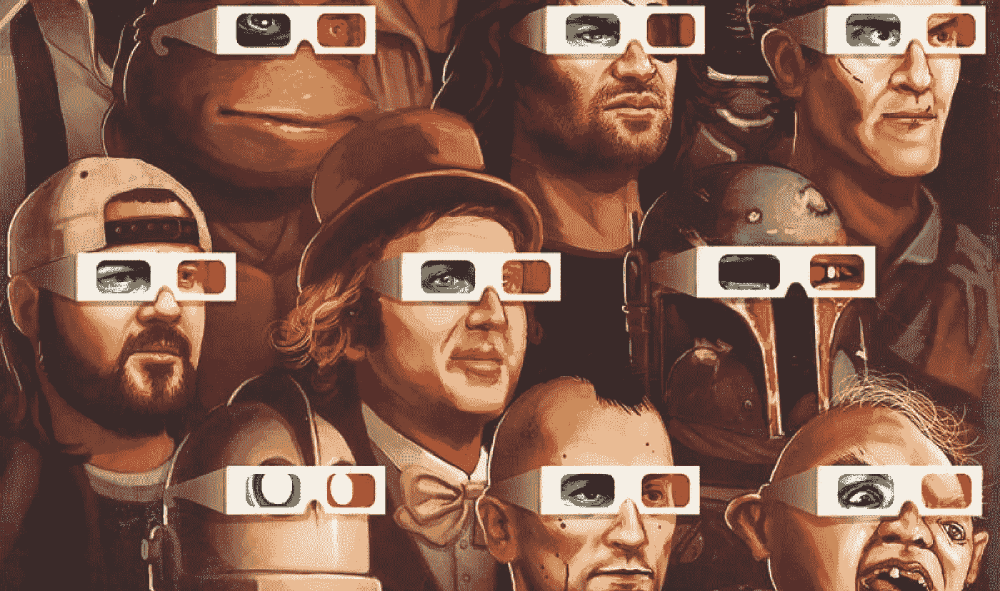
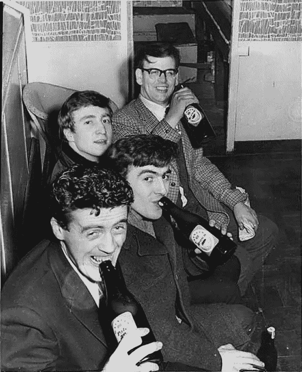
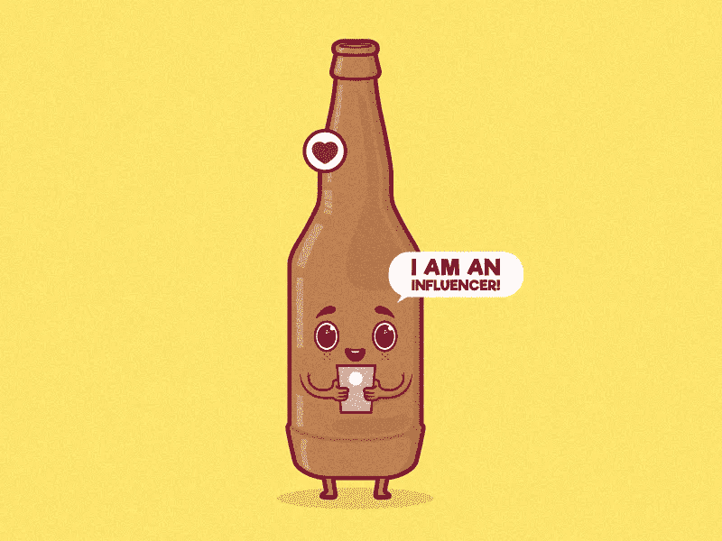
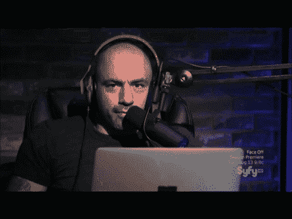

# 影响者营销的力量

> 原文：<https://medium.com/swlh/the-force-of-influencer-marketing-23b181bc07bd>

[nineteeneightyeight.com](https://www.google.com/url?q=http://nineteeneightyeight.com&sa=D&ust=1530168822838000&usg=AFQjCNEZlqA2tLsWEYmlgFTq8i9wncRoHQ)

从来没有比今天更适合购物的时候了。买任何你可能想要的东西不再需要你做任何努力。以前，它是一场战斗，一次获取有价值的东西的冒险，以及到达那里后的满足感。近年来，我们不得不学习如何过滤伴随我们网上每一个行为的信息流。

随着 adblock 的出现，营销人员不得不改变他们的广告方式。一些人走上了超目标广告和个人数据使用的黑暗之路，以寻求点击。一些人开始从 adblock 制造商那里购买放纵。不管是哪种情况，被搞的都是用户。虽然区块链的分散式广告只是获得了牵引力，但社交媒体和炒作文化自己发现了这一点。

# 无意的广告

始于 20 世纪 90 年代的植入式广告运动很快影响到了每个人。在某些时候(大约在《变形金刚 2》或《变形金刚 3》前后)，它变得无法忍受。与此同时，一些名人享受品牌产品的最具标志性的形象看起来一点也不像是在演戏。

Half of the Beatles enjoying Watney’s beers.

There’s not a lot of brands that can benefit from Shia Labeouf’s normcore mastery.
C2O coconut water is probably one of them.

尽管它不一定是一个真实的故事。 [Moleskine](https://www.facebook.com/notes/shakuro/moleskine-under-your-skin/2114110521940375/) 所做的是，他们只是拿走了一堆艺术界的名人，并暗示他们现在将成为为这些名人制作笔记本的人的继任者。全世界都买了。

但是你如何让名人使用你的产品而不用支付你的全部营业额呢？更重要的是，你如何让他们真正喜欢它？良好的..你的产品必须非常好。咄。不过，还有另一种方法。非常简单和怪异。有没有想过，为什么 Instagram 上的一些青少年比那些成就显著的人拥有更多的关注者和关注？因为为出名而出名成为可能。

# 文化引领

与不时出现的明显的付费代言和商业广告不同，影响者是原始的和真实的。如果处理得当，毫无疑问，影响者的推介是可信的。当你试图找出该买哪双鞋或该采取哪种政治立场时，这就像是唯一可信的参考来源。

> *有影响力的人基于真实性和独立性建立他们的追随者。*

这些天人们有他们的狗屁指标，不会接受假的东西。他们拥有独一无二的声音。能够找到一个影响力与他们不相上下的品牌，不仅在数量上，而且在质量上都可以达到四倍，因为影响者的内容没有特别的原因就被消费了。

名人账户的参与度远低于普通优步的原因是，你往往无法判断是名人在运营他们的账户，还是他们的管理团队或其他人在运营他们的账户。Instagrammers 的内容就像你的内容一样，只是它被数百万人观看。

另一个不能造假的是你的发展。如今，社交媒体上的粉丝有些狂热。看看年轻的 Soundcloud 说唱歌手 XXXTENTACION 的悲惨死亡在世界范围内引起的反应吧。你可以清楚地追溯他们的成长史，跌宕起伏。在很多方面，有影响力的人和你说话是因为他们是有机会成功的普通人。这就是为什么他们会成为你的朋友，而不是像神一样神秘的好莱坞明星。这就是信任的来源。还有爱。

# 影响者营销的优势

几乎任何品牌都可以从与特定影响者的联系中获益。大多数初创品牌都在努力提高曝光率，并且常常难以将自己与创始人的个性分开。

> *倾听影响者的叙述有助于采用最适合用户的声音*

另一个问题是，无论一个品牌宣传什么，都缺乏公正和诚实的沉浸感。客户无法获得销售统计数据，但围绕你的品牌的参与度始终是存在的。

> *影响者创造沉浸感*

就像我们上面说的，名人推销的东西不再可信。除了对大多数品牌来说遥不可及之外，这种营销方式已经过时，与大多数目标人群没有关系。

> *一个受欢迎的博客比一个好莱坞明星获得更多的日常互动*

有些行业就是不适合明星广告。有些品牌只对某个用户说话。有一些令人生厌的明星代言，你永远不想成为其中的一部分。

> *另一方面，每个行业都有拥有钻石追随者的影响者*

Image credit: [Pedro Fernandes](https://dribbble.com/pedrorsfernandes)

# 如何吸引合适的影响者

首先，这取决于你对目标受众的熟悉程度。了解他们听谁的话，崇拜谁。如果你知道社交媒体是如何工作的，这并不难做到。一旦找到，你可以直接去做，并提出一个商业要约，或者，像在一个小企业的情况下，你可以发送你的产品或护理包，而不要求任何回报。

有影响力的人通常对此心存感激，如果他们诚实、真诚，而且你的产品很棒，你就会获得流量。影响者的一个很好的例子是乔·罗根。他前所未有的影响力来自于他管理项目的多面性。乔开放的思想和令人难以置信的能力，以喜剧的态度和一定的强度审视生活的各个方面，使他不仅是白人男性的完美影响者，而且是更多的观众。

是的，他有赞助商。他有。但我在听 JRE 超过 6 年的时候所经历的(双关语)，是他能为小品牌带来的个人影响。乔提到一些东西后，我买了一些。来自 [Datsusara](https://www.dsgear.com/) 的 Chris Odell 告诉我们，每当该公司在 Joe 的播客中被提及，他们的数字就会跳得多高。

> *推动影响者营销的是观点的真实性和信任。*

# 平台

现代影响者现象出现在社交媒体泡沫中。没有中间商，没有预算，创立自己的品牌从未如此容易。仅凭你的职业道德加上魅力和远见，你就能成功。在这个领域，作为一个有影响力的人，你在哪里建立你的追随者是很重要的。

事实证明，在 MySpace 上投资不值得，成为脸书的一部分会惹恼很多人。但问题是已经没有不偏不倚和分散的平台了。其中最受欢迎的两个是 YouTube 和 Instagram，但它们确实属于大公司，这使得建立在它们平台上的数字帝国成为它们的。

这就是面向业务的影响者与炒作者的区别。那些寻求建立自己品牌的公司也寻求独立。尽管在商业模式上建立一个吸引人的数字档案充满了失去与受众真实联系的风险，但明智的做法是不要把所有鸡蛋放在一个篮子里。

寻找精通所有平台但只在一个平台上出名的有影响力的人。一些有影响力的人做的一件很酷的事情是他们在不同的资源上产生不同的内容。例如，使用 Instagram 帖子和故事进行日常活动，使用 YouTube 进行较长的视频，使用 Twitter 和脸书进行即时互动，以及使用 Medium 或其他工具进行更有见地的写作和解决更深层次的问题。

这种方法可以使影响合法化，帮助影响者随着时间的推移而发展，而不是依赖于特定类型的内容，在我们的 ADD 时代，这些内容有时具有极短的生命周期。在寻找影响者的品牌眼中，这也有助于验证他们的相关性，尽早切断所有虚假账户和那些无法通过时间考验的账户。

# 谁影响影响者

在这个以如此多不同方式联系和交织在一起的世界里，很难找到源头。人们以前所未有的方式交谈、争斗和相互影响。即使是最有影响力的人也能从别人身上找到灵感。即使是最平庸的人也会有成名的时刻，能否保持这种光芒取决于他们自己。

现在每个人都有一个平台。寻找那些在保持自我的同时改变游戏的人。把你的品牌和正确的人联系起来，和他们一起做出更好的选择。

## 这个故事发表在[的创业](https://medium.com/swlh)上，这是 Medium 最大的创业刊物，有 339，876+人关注。

## 订阅接收[我们的头条新闻](http://growthsupply.com/the-startup-newsletter/)。

