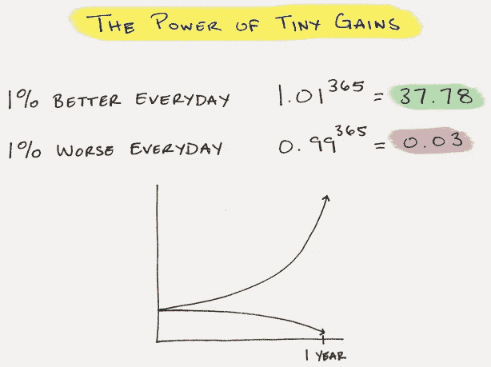

# 人们犯的四个最大的错误

> 原文：<https://medium.com/swlh/the-four-biggest-mistakes-people-make-2332e8dc9350>

[Exhausted](https://ak8.picdn.net/shutterstock/videos/18037618/thumb/1.jpg?i10c=img.resize%28height:160%29)

十八年的华尔街经历教会了我很多关于错误的东西。

有些错误会让你变得更好，有些错误会让你丧命。

**让我告诉你最大的几个:**

# 1.忘记你在努力做什么

> 一个奇怪的事实是，人们从来没有像认真对待自己时那样琐碎。
> 
> 奥斯卡·王尔德

别着急。

我喜欢匆忙。我想要即时的满足。

当我刚开始在华尔街工作时，我需要每天都赢。我希望我的老板告诉我，我每天都做得很好。

我会冲进一个项目，试图尽快完成它，并把它交给他以获得鼓励。

在我第一份工作开始大约三个月的时候，他让我为一个客户电话制作一个交易模型。他给了我一天的时间来做这件事。

我很紧张。我通读了文件和演示文稿，并开始整理。三个小时后，我以为我有好东西了。我检查了一下，然后用电子邮件发给了他，感觉很得意。为什么他认为这会花去我一天的时间？？

这是简单的 3 小时的工作，也许最多 4 小时。我去吃午饭，和一些朋友聊天。我收到了他的电子邮件回复，说“哇，你真快”。我感到非常满意。我得到了我需要的肯定。我现在只是滑行，直到下午 5 点的电话。我已经打印好了。开始了，我的第一个客户电话。

我们开始通话，我的老板看着我的模型。翻几张纸进去。开始看数字。该死的。这毫无意义。客户在打电话，问我们为什么数字看起来这么奇怪。

> 结果我完全搞砸了。

我完全误解了需要什么。

幸运的是，我的老板说“嘿，吉姆，让我们去检查一些东西，我们会回来找你的”。电话被转到了第二天。

这件事发生在差不多十八年前，我仍然记得那种感觉就像是在昨天。

这可能是我职业生涯中最尴尬的事件之一。问题是我们每个人都经常遇到这种情况。

我们正赶着去某个地方。急于致富，急于获胜，急于证明我们成功了。

**但是在匆忙中，我们忘记了我们真正想要达到的目标。我已经忘记了，关键不在于我多快到达那里，而在于我是否真的到达了那里。目标不是冲向终点，而是经历这个过程，让我变得更好。**

当我们急于从老板、朋友、爱人那里得到鼓励时，我们经常会陷入德国哲学家尼采所说的愚蠢之中:

> 人类最常见的愚蠢行为是忘记自己在努力做什么。
> 
> -尼采

**每天退后一步，问自己:你在努力做什么，为什么？**

# 2.躲在你的弱点后面

> 你越是寻找不舒服的地方，你就会变得越舒服
> 
> 康纳·麦格雷戈

我一开始是一个内向的极客——非常害羞和孤僻。

华尔街可能是一个充满活力、喧闹的地方，我不确定自己是否具备融入这个地方的条件。我没有参加过任何运动，没有上过常春藤联盟的大学，说话带有浓重的口音。

一开始，我说服自己前进的方式是做一个格子间的奴隶。长时间工作，被锁在办公桌前，在竞争中胜出。

> 事后看来，我只是一个懦夫

对我来说这是一条简单的出路。对我来说，更方便的是不去社交，不与我的同龄人或任何人互动。

我只是拒绝做让我不舒服的事。

那是个错误。

我的同事们在建立关系，互相了解，还有更高级的人，我想我可以超越他们。

不是这样的。

你必须了解人们，你必须建立关系，你必须建立信任。

> 你认识的人比你知道的更强大。如果你认识合适的人，你总能得到正确的信息，并得到你想做的任何事情。人们给你的影响力比任何体力劳动或信息都要大。

我直到 30 岁才明白这个事实。

我仍然在我的许多朋友身上看到这一点，他们说服自己，精英管理意味着它只是最好的电子表格，最好的分析。

别误会，那东西很重要，但只是整体的一部分。

**我发现越是让你不舒服的事情，你越应该去做。**

> 你的大脑清楚地告诉你，它害怕你的弱点，你需要去弥补那个弱点。

**每天退后一步，问问自己害怕做什么。那就去做吧。不要躲在你的弱点后面。不管是什么？**

# 3.不玩长线游戏

> 胜利是留给那些愿意付出代价的人的。
> 
> -孙子

我看到很多人犯这种错误——但这些人是最有罪的。

华尔街的人总是急于做出重大决定，赚大钱。他们的目标是快速致富。

> 华尔街的薪水很高，但你仍必须进行长期投资，发展自己的事业。

我记得在我职业生涯的第六年，我的一个副总裁同事出价 50%以上的钱去一家欧洲银行。

他拿走了。

他的观点是今天的钱更多了，是的，这是一个更弱的银行，他将是团队和公司的新成员，但钱使它成为一个很好的风险。我的观点是，那是 2006 年，感觉接近市场的顶部，如果他被解雇了，就很难从他原来的位置回到游戏中。

随着时间的推移，2008 年发生了。

> 他的新团队亏了几个亿，他永远离开了这条街。

我还有一个朋友，他在 2003 年离开了银行。他曾是一名初级外汇交易员，有机会成为一名对冲基金股票交易员。虽然这份工作最初很棒，但我们都知道，他在 25 岁离开街头时失去了很多选择。

2012 年，他的对冲基金倒闭了。杰夫作为交易者很棒，但是除了做流量交易者，他没有花足够的时间建立网络和培养技能。

对冲基金关闭了，杰夫六年后仍然失业。

我从中吸取了一些教训。

> 首先，决策至关重要。

一路上你会有很多工作机会，猎头会在你面前晃来晃去。

> 这并不意味着你遇到的每个机会都是好机会

事实上，在华尔街，当有人在你面前晃来晃去的时候，一定要问他们的动机是什么。

> **其次，投资我们自己。**

你可以享受生活在此时此地的美好时光，你可以跳过学习、阅读和进化。它会赶上你的。

**明智地选择和投资——要长期贪婪。**

我生活的模式是每天 1%——无论你做什么，每天都保持 1%的进步。

JamesClear.com

> "如果一个人做的比他得到的报酬多，他很快就会得到比他做的更多的报酬。"
> 
> 拿破仑·希尔

# 4.没有管理好你的自我:

> 在住宅中，住在靠近地面的地方。思考时，保持简单。在冲突中，要公平和慷慨。在治理中，不要试图控制。在工作中，做自己喜欢的事。在家庭生活中，完全投入。
> 
> ——道德经

自负是一个杀手。

我有一个朋友叫杰森。杰森是一家大银行的副总裁，事实上，几周前他刚刚获得了从一家欧洲银行调到一家美国银行的保证。杰森在他所做的事情上很有天赋，但是杰森也有一个大问题。

> 他已经工作了 11 年，没有一分钱存款，事实上他欠了 50 万美元的赌债。

当杰森 25 岁时，他决定过上纽约银行家的生活。

派对，酒精，周末出游开始了。起初，他只是花他的工资，但很快他用他的一些奖金聚会，然后他决定他想赌大学篮球。几次赌错了，他欠了 50 万美元。

这是一个反复无常的行业，奖金有升有降，但你的债务利息只会上升。我告诉你这个故事，因为当你在银行赚了 10 万美元，变成 30 万到 50 万美元，你就可以轻松地开始过上更好的生活。

你很快就会想知道你刚开始时是如何靠 10 万美元生活的。

> 我的建议是不要让你的生活方式随着你的收入而增长。如果你让这种情况发生，你将永远被困在办公桌前。

我给你讲一个我以前认识的一个董事总经理的故事。

弗兰克是个很棒的销售员。他一直在银行工作。客户喜欢他，他总是为他们服务。

弗兰克工作非常努力，以至于他的前两任妻子都和他离婚了，在办公桌上做预算、支付赡养费和子女抚养费的压力让他每天要抽一包烟。

每当弗兰克不在办公桌旁，你就会知道他在哪里。弗兰克如此沉迷于这种生活方式，几乎没有时间休息。他不仅需要现金，而且他在银行的身份决定了他的整个身份。

几年前，该银行向所有员工发送了一封电子邮件，让他们知道弗兰克在工作时坐在办公桌前去世了，他们感到非常难过。

你不会想那样出去的。

**保持你的自我和身份的渺小。你不是你的头衔，你的工作或者你为谁工作。不要困在享乐的跑步机上，因为它不会慢下来。**

> 对财富的专注比任何其他东西都更能阻止人们自由而高尚地生活。
> 
> 伯特兰·罗素

# 行动号召:

我们是一群来自最好公司的华尔街老手，肩负着与下一代分享我们智慧的使命。如果你想了解更多关于变得更聪明、更富有和更快乐的知识(并获得我们的免费电子书)，请点击这里查看我们的。

## 这篇文章发表在 [The Startup](https://medium.com/swlh) 上，这是 Medium 最大的创业刊物，拥有 277，994+读者。

## 订阅接收[我们的头条新闻](http://growthsupply.com/the-startup-newsletter/)。

