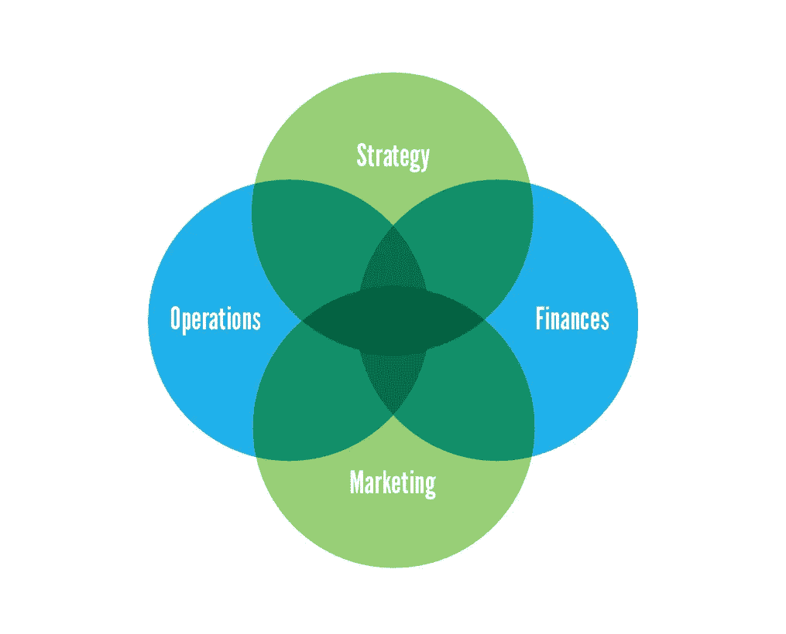

# 商业的四个关键维度

> 原文：<https://medium.com/swlh/the-four-key-dimensions-of-business-5dbd63ba45db>

## 商业有四个关键维度:战略、运营、财务和营销。即使你是一个人做生意，你仍然必须戴上这些维度的帽子。

当我们从整体上看待企业时，有四个不同的维度可以解释每一个决策和行动。

这四个维度是:

1.  **策略**
2.  **作战**
3.  **营销**
4.  **财务**

虽然它们是不同的维度，但它们紧密相关。你的财务状况通常会指导你的经营决策，而你的经营决策通常需要对照你的财务状况进行检查。你的战略举措将影响你的营销决策，你的营销活动往往会揭示出新的战略机遇，否则你不会看到。更多的例子很容易找到，但是我们不需要列出每一个相互依赖的东西来感受它是如何工作的。

以这种方式看待商业并不是什么新鲜事。我们已经有了跟踪这些维度的既定立场。首席执行官(CEO)负责战略和发展，首席运营官(COO)负责运营，首席营销官(CMO)负责营销，首席财务官(CFO)负责财务。需要考虑的重要一点是，所有这些职位要么是传统企业中的高级管理人员，要么是中高级管理人员——他们职位如此之高的原因是他们的职能和视角非常关键。

许多人没有考虑到的是，上面列出的四个职位对任何企业都是必要的，即使一个人身兼数职。它们不仅是必要的，而且不能不做:它们要么做得好，要么做得差。

在整篇文章中，我将使用首席执行官、首席运营官、CMO 和首席财务官来说明哪个帽子或领域在起作用。较大的企业可能会有专门负责这些职位的人，但如果你在一家微型企业，你应该以一种不同的方式来阅读这篇文章。

让我们依次处理每个维度。

# 战略与发展

你的企业为谁服务？它的核心竞争力是什么，你将如何利用它们？你今年的业务目标是什么？你的企业愿景和使命是什么？今年你打算开发什么样的产品？你将如何定位、区分和发展你的品牌？

诸如此类的问题都属于战略的范畴。它是所有其他维度的基础和枢纽，一个薄弱的战略核心往往会导致许多企业本末倒置。

例如，我遇到过不少企业，除了卖东西赚钱之外，他们无法将营销活动与任何策略联系起来。当我们看到有人创造了与他们的核心业务基础没有真正联系的东西时，我们也感觉到了薄弱的战略。

我们不理解战略的原因之一是，它可能是复杂和微妙的。战略也很难推销，所以人们经常有意放弃以战略为基础的提议。尽管如此，仅靠策略和技术很难成功。

# 操作

我们将如何执行这个计划？谁应该参与哪个项目？这个星期我们应该做这些项目中的哪一个？我们的新基础架构迁移进展如何？每个人都接受过培训来完成我们业务的关键任务吗？

运营的维度是执行力和生产力的领域。简而言之，它涵盖了完成工作。

很多企业都有不错的战略意识，在运营上苦苦挣扎。这位首席执行官的愿景似乎永远不会实现。或者也许营销计划变成了另一份浪费了更多资源的文件。这里的一个长期存在的问题是创意人员非常了解的——我们的想象力总是超过我们的操作能力。

另一方面，有些业务在运营上大放异彩，在其他维度上苦苦挣扎。在这些企业中，往往会出现大量的超负荷工作和推诿，而在涉及到业务的三个方面(T2 和 T3)时，实际进展却很少。这里的另一个症状是不断变化的新倡议，迫使每个人处于持续的压倒性状态；对于业务团队来说，在最后一个项目完成之前，他们的优先级转移到一个新项目是很常见的，只是因为决定转向不同的方向。

短期规划通常也属于操作层面。在一个运营良好的企业中，首席执行官和首席运营官会与 CMO 和首席财务官一起共同制定中长期计划，因为制定一个可靠的计划需要方方面面的考虑。短期规划属于运营领域，因为大部分战略方向和财务参数已经由长期规划设定；首席运营官有不值得羡慕的责任，用太少的资源做很多事情。(是的，这在各种规模的组织中都会发生。)

**许多优秀企业与伟大企业的区别在于执行力。**把事情做好的企业比难以执行的企业发展得更快、更稳定。

# 营销

如此多的商业大师是营销人员或销售人员是有原因的:好的营销意味着更多的钱。我们都知道现金流是任何企业的脉搏，而营销是让你获得现金流的手段。

至少，这是我们相信的故事。

这个特殊的维度通常会在业务中带来最快的结果。将糟糕的宣传材料转换成更好的宣传材料通常会带来更多的客户，并为企业带来商机，从而建立足够的财务利润，使企业可以做出其他选择。当前产品和服务的成功推广可以在几天内发生，而回到战略、研究和开发可能需要几个月，短期内的收入可以很好地解决这个问题。

虽然我们在谈到营销时经常谈论增加收入，但同样正确的是，**有效的营销确保企业的资源以可能的最佳方式得到利用**，从而使其成为*在企业中保持*资金以及*赚取更多*的好方法。许多企业努力工作，精心制作一个美妙的报价，只是有一个薄弱的营销活动抵消了他们的努力可能得到的回报。花一个季度的时间去开发一个产品，仅仅是为了获得一个月的收入，这比花一个季度的时间去开发一个产品，然后从中获得一个季度的收入，这种资源利用效率要低得多。

虽然有效的营销对大多数企业来说都是一个挑战，但对有创意的微型企业来说尤其具有挑战性。出于各种原因，有创造力的人很难掌握营销和自我推销。梦想的领域本身就是一个梦想——仅仅因为你建造了它并不意味着它们会到来。你必须去他们那里并在那里建造它，才有希望卖出你的商品。

# 资产

你上个月赚了多少钱？其中，利润是多少？你的日常开支是多少？你需要在下个季度赚多少才能让你的收入增加 10%？你需要为税收节省多少收入？

我们大多数人不能不假思索地回答这些问题。我们中的许多人根本无法回答这些问题，因为 a)我们没有做过自己的会计，b)我们不理解这些术语。这些问题——以及它们所代表的观点——都属于金融范畴。

**令人惊讶的是，你对自己的财务状况了解得越多，你就越清楚自己的企业已经做了什么，还能做什么。许多人持续恐惧，因为他们不知道自己上个月和这个月赚了多少，也不知道未来会发生什么。这使得每一天都像是一场骗局，每一次胜利都是因为没有足够的钱支付账单而不可避免的崩溃的暂时拖延。**

这个特定维度的一个挑战是理解有效决策所需的粒度级别。大多数人不需要有每日销售报告，但每月销售报告可能不会给你足够的时间来反应或计划。此外，总销售报告可能不会告诉你哪一个收入流是养家糊口的人，哪一个是你需要减轻的负担。由于每项业务的组合略有不同，您可以从财务维度获得的洞察力需要进行调整，以符合您的业务运作方式。

你可能会迷失在业务中的财务数据和问题中，这是千真万确的。同样真实的是，没有他们你会完全迷失。

# 这项工作必须完成——但不一定由你来完成

我在上面提到过，这些维度中的每一个都必须解决，也不可能不解决，但这并不意味着*你*必须自己解决每一个维度。

例如，如果自己记账的想法让你患上了荨麻疹，有很多专业人士就是这么做的。如果你需要一些操作上的帮助，也许雇佣一个新员工或助理是个不错的选择。有一个教练，顾问，或顾问可以帮助你单独或整体的维度。

随着你的业务增长，你可能会决定雇用专门的人来处理这些责任。我建议你先雇佣一些人来帮助你最薄弱的领域，这样你就可以避免重复你自己的优势，并让一些人对你不想处理的领域感到愤怒。

尽管如此，对于许多处于早期阶段的[企业](http://www.productiveflourishing.com/the-business-lifecycle-an-overview/)来说，招募更多的人员根本就不是一个选择，这意味着，与此同时，你必须覆盖你在这些方面的基础，直到你有能力获得一些帮助。这里的好处是，由于你的业务处于早期阶段，它不像更成熟的业务那样复杂，因此管理起来容易得多。

毕竟，如果你只有一个报价，你就不需要有一个比较每个收入流盈利能力的报告。你可能没有足够的时间来支持运营经理或助理，所以即使你有能力这样做，雇佣一个也没有意义。您的业务的管理需求足够小，您可以处理它，直到它超出您可以管理的范围。

换句话说，不要仅仅因为其他公司或酷小孩雇佣人。许多大企业和酷小孩在这方面做出了错误的决定，并有足够的收入来弥补，但同样的决定会把你生吞活剥。我曾经有一个客户，由于她过去的收入和储备如此之高，她没有意识到她所有员工和助理的成本导致了几个季度的整体业务亏损。只是在我们与首席财务官进行了一些讨论后，她才明白了这个事实。在净亏损 2000 美元的情况下，你的企业可以运营几个月？

# 随你怎么称呼它们——只要确保涵盖了所有功能

这四个维度及其各自的功能是任何组织的组成部分。通过一些上下文上的修改，我们可以为非营利组织、政府机构、军事组织、宗教组织等等画出同样的线。框架是通用的；它的应用是特定的。

您可能不喜欢每个维度的名称。那也行；说出能引起你共鸣的东西。只要功能被覆盖，你就是黄金。

**我将用几个问题来结束这篇文章:**

1.  你在这四个维度中的哪一个维度最强？
2.  在这四个维度中，你最弱的是哪一个？
3.  你如何改变你的业务，以便在你的优势领域开展更多的业务？
4.  你可以在业务中做哪些改变，以使你的弱点不会阻碍你的业务增长？

这篇文章最初在 ProductiveFlourishing.com 发表，名为[商业的四个关键维度](http://www.productiveflourishing.com/the-four-key-dimensions-of-business/)。