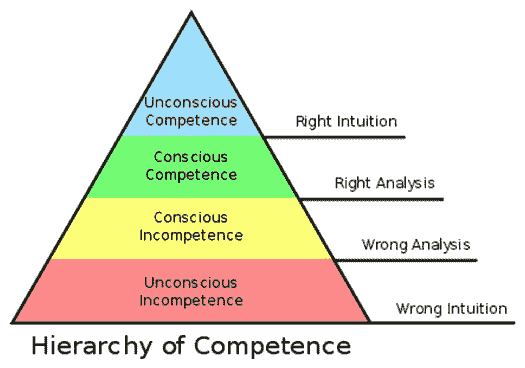

# 了解这四个阶段如何能让你成为你想成为的任何技能的专家

> 原文：<https://medium.com/swlh/the-four-mandatory-stages-to-becoming-an-expert-in-any-new-skill-d493ab0d94e>

Photo by [Olloweb Solutions](https://unsplash.com/@olloweb?utm_source=medium&utm_medium=referral) on [Unsplash](https://unsplash.com?utm_source=medium&utm_medium=referral)

> "学习不是偶然获得的，必须用热情和勤奋去追求."
> 
> ~阿比盖尔·亚当斯

在人类心理学中，有四个学习阶段可以使一个人从无能状态过渡到胜任任何技能。

Noel Burch 在 1970 年提出了“学习任何新技能的四个阶段”的理论，从获得新技能的角度来看，该理论也被称为“T2 能力阶梯”。

该理论解释说，最初**当我们开始学习任何东西时，我们甚至不知道我们不知道什么**。是的，我们甚至不知道我们不知道什么，这让大多数人像井底之蛙一样被困住了，他们不知道海洋是什么样子的。在这种能力水平下，甚至很难理解一个不同世界的想法，因为我们无法与那个世界联系起来。

但是当我们意识到自己的无能时，我们会努力提高这些技能，很快我们就会学习并有意识地以胜任的方式行动。

经过足够多的练习，我们变得如此能干，以至于我们甚至意识不到自己的能力，这是能力的最后阶段，在这里，能干的行为成为你的第二天性。

**让我们试着详细了解这些级别:**

**(Image courtesy: wikipedia)**

**1。无意识的无能**

在这个阶段，个人不理解或不知道如何做某事，也不一定认识到自己学习中的不足。 ***他甚至可能会否认*** 这个技能的用处。这个阶段要求个人在进入下一阶段之前认识到自己的无能和新技能的价值。

一个人在这个阶段花费的时间长短取决于学习刺激的强度。要么他要有学习的动力，如果是自愿的学习，或者是工作要求，那么就要有对惩罚的恐惧作为刺激。

在这个阶段，没有或很少有机会运用直觉来处理任务。

**2。有意识的无能**

进化的下一个阶段是通过对主题的深入了解来提高意识。 ***在这个有意识无能的阶段，尽管个人不理解或不知道如何做某事，但他确实认识到自己学习中的不足，以及新技能在弥补不足方面的价值。***

意识到自己的无能和对技能的要求，个人开始努力学习。在这个阶段，犯错可能是学习过程中不可或缺的一部分，这意味着学习者在这个阶段很可能无法正确地分析正确的行为。

**3。自觉能力**

在下一阶段，个人理解或知道如何做某事。 ***通过努力，在早期阶段犯错误，个人现在在这个阶段是有能力的，但展示技能或知识需要专注。***

它可以被分解成几个步骤，并且在执行新技能的过程中需要大量的有意识的参与。学习者能够对情况做出正确的分析，这要归功于他或她的努力和对过程的专注。

> “专家是在一个狭窄的领域里犯了所有可能犯的错误的人。”~尼尔斯·玻尔

**4。无意识能力**

这是掌握任何技能的最后阶段。当达到这个阶段时，个人已经在练习一项技能上投入了如此多的时间，以至于它已经变成了“第二天性”,可以很容易地完成。 ***因此，该技能可以在执行另一项任务时执行。这是因为技能已经成为潜意识的一部分，它不需要你的大脑积极参与。***

在这里，你变得如此能干，以至于你甚至意识不到自己的能力。现在，你已经到了专家的范畴，你凭直觉知道在任何给定的情况下应该采取什么样的正确行动，因为你已经处理了大量类似的情况。

你可以从你的生活中举任何例子，在那里你认为自己是专家，你会意识到在你掌握那项技能之前，所有这些阶段都需要转变。

让我们举一个简单的例子，当你学习如何驾驶汽车时，经历这四个阶段。

最初你甚至没有意识到自己不知道的东西( ***无意识无能*** )。只有当你有强烈的学习动机时，也就是说，如果你想独自旅行或享受乐趣或冒险，那么只有你会努力学习如何驾驶汽车。你在驾驶中犯了错误，也许你的车辆上有一些轻微的划痕或凹痕是你在这个阶段学习的代价( ***有意识的无能*** )。

然后你到达能力的下一个阶段( ***有意识的能力*** )，但是你积极地专注于什么时候踩刹车或者什么时候踩油门——你在这里是有意识的能力。

最后，你到达最后一个阶段，你甚至不需要注意汽车的功能。你甚至不会想到把钥匙插进点火装置。你甚至不会意识到汽车已经在高速公路上超速行驶，而你正在舒适地与你的随行同事或朋友聊天，不需要任何有意识的努力来驾驶汽车。这是你达到学习阶段顶点的阶段——你已经达到了 ***无意识能力*** 。

弗农·霍华德的下面这段话恰当地总结了学习和跨越所有学习阶段的正确方法。

> "永远像你有新东西要学一样走过一生，你会的."

# 希望你喜欢这篇文章。

*你介意为此鼓掌吗？*

# 如果你喜欢上面的，你也可以看看我下面的其他文章:

[**将你的恐惧转化为兴奋的简单技巧**](/@sombathla/a-simple-technique-to-transform-your-fear-into-exhilaration-68c4e82ea02f)

[**一个简单的想法让你从消极的想法转变为充满力量的状态**](/@sombathla/one-simple-idea-to-shift-from-negative-thoughts-to-empowering-state-17e4c75eb4e3)

# 想提高你的表现(和结果)吗？

# [点击此处下载免费报告，了解 5 种心态转变，在短短 30 天内提升你的表现](https://sombathla.com/mentalshifts/)

Photo by [Quino Al](https://unsplash.com/@quinoal?utm_source=medium&utm_medium=referral) on [Unsplash](https://unsplash.com/?utm_source=medium&utm_medium=referral)

# [Master 5 心态转变，在短短 30 天内提升你的表现——下载你的免费报告](https://sombathla.com/mentalshifts/)

## 这篇文章发表在 [The Startup](https://medium.com/swlh) 上，这是 Medium 最大的创业刊物，拥有 340，876+的读者。

## 在这里订阅接收[我们的头条新闻](http://growthsupply.com/the-startup-newsletter/)。

