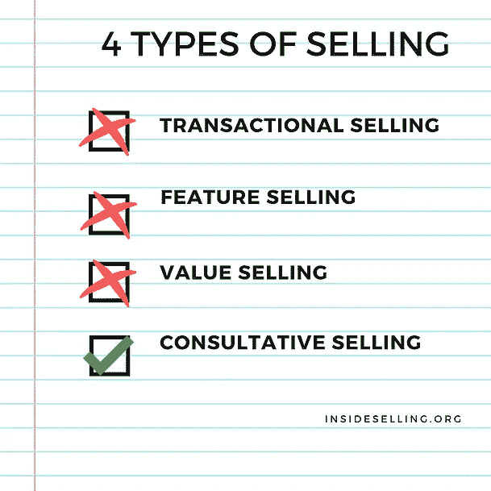

# 销售的四种类型及其重要性

> 原文：<https://medium.com/swlh/the-four-types-of-selling-and-why-they-matter-23bdd8f5c510>

内部销售在过去 20 年中不断发展。从旋转销售的引入、价值销售的出现和挑战者销售的引入，内部销售发展迅速。每种销售方法都在销售人员中创造了明显的“区别”。这篇博文将讨论当今内部销售世界中存在的 4 个销售层次。

The 4 types of selling

**交易型销售**

销售的最低级是交易销售(相信我们，当我们说它是勉强销售的时候)。交易销售正是这个名字所概括的。客户问问题 A，销售人员回答问题 A。客户要求折扣，销售人员给 10%。你明白了。最少的主动性和希望是这个系统的主要策略。

交易型销售只是销售的一种，因为它试图结束业务。不用说，交易型销售是销售人员职业生涯的起点，如果他们不摆脱这种销售方式，他们的职业生涯也将结束。

**特色销售**

遗憾的是，我们在一段时间内采访过的许多销售人员都停留在功能销售领域。特色销售就是用特色来回答顾客的问题。

例如:

顾客:我想买一部手机。

销售人员:太好了！你想要什么样的手机？

顾客:有好相机的东西。

销售人员:我正好有你的电话，这是 XYZ 的电话。它有一个 1600 万像素的摄像头，一个非常响亮的扬声器电话，最重要的是…

我们确信你在过去也经历过这种推销。这种方法只有在你运气好，或者你所说的一切完全或者很大程度上符合客户的需求时才有效。更不用说，这种比较通常会以价格比较告终。

特色销售也是在潜在客户成为顾客之前让他厌烦的最好方法。无论你的潜在客户有多耐心，你的推销有多好，不停地和客户谈论与他无关的产品特性都会让他厌烦。

**价值销售**

在很长一段时间里，价值销售处于销售的顶峰。能够重视销售的人是成功的，可以毫不费力地做成生意。即使在今天，大多数重视销售的销售人员都是成功的。

在 InsideSelling.org，我们真的相信价值销售没有错，它有很多用途。价值销售唯一失败的时候是在大型 B2B 交易中。较大的交易很复杂，仅仅展示价值并不能确保成功。在销售周期不是很长的小额门票交易中，价值销售毫不费力地发挥了作用。

然而，根据 CEB 的详尽研究，在一次标准的 B2B 销售中，有近 5.4%的股东参与其中。这意味着，要达成交易，不仅仅需要价值销售。我们想澄清的是，如果不先了解价值销售的基础知识，就不可能进入销售的下一个阶段。

**顾问式销售**

目前，咨询式销售是销售的最高层次。就是卖禅。我们确信，新的销售水平不会到来的日子不远了。咨询式销售涉及价值销售的所有内容，但在等式中加入了行业洞察、咨询(而不是销售)等元素。换句话说，咨询式推销不仅仅是推销价值。

例如:

销售人员:你可能知道，目前有 5%的用户在用他们的手机制作这些视频。我知道您已经在桌面业务方面进行了投资，但我们的研究表明移动才是未来。我将发送一份白皮书供您阅读。

上述推销来自一位主要销售台式机产品的销售人员。我们想说的是，顾问式销售者不仅仅是想介绍他们的产品，还想成为他们潜在客户的真正顾问。虽然以上是咨询式销售领域的一个小例子，但它应该指出实现它所需的成熟度。

如果您希望我们帮助您了解您作为销售人员在销售方面的地位，请发送邮件至@insideselling。

## 这篇文章发表在[《创业](https://medium.com/swlh)》上，这是 Medium 最大的创业刊物，有 282，454+人关注。

## 订阅接收[我们的头条新闻](http://growthsupply.com/the-startup-newsletter/)。

