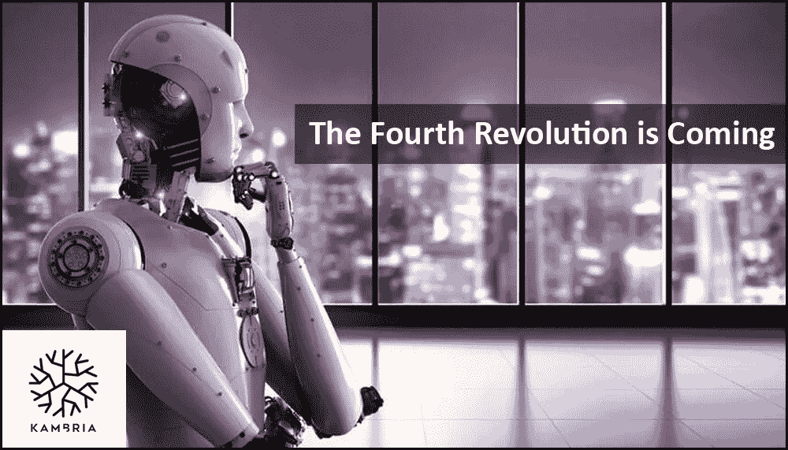
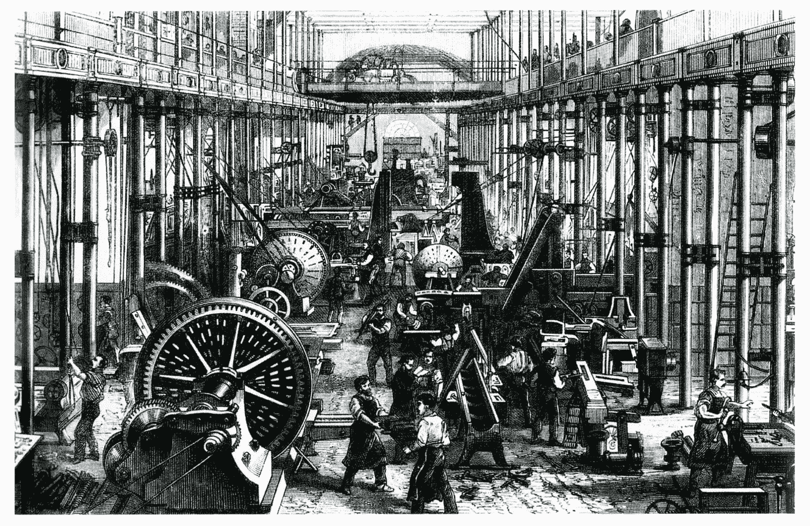
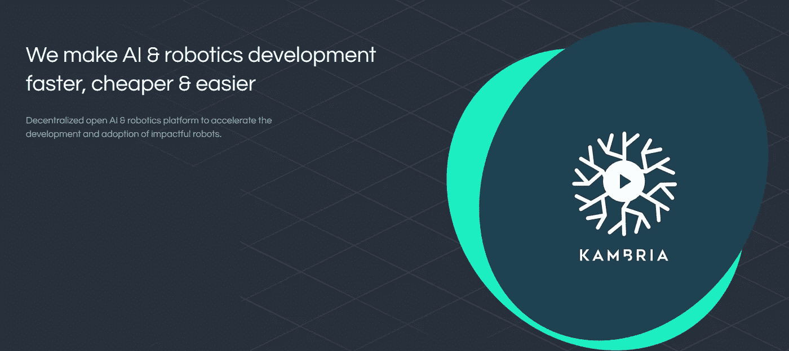

# 第四次工业革命来了！

> 原文：<https://medium.com/swlh/the-fourth-industrial-revolution-is-coming-d7901e54eb90>

创新在人类进化中一直扮演着重要角色，并对整个社会产生了巨大影响。是否是轮子的发明让旅行或交通变得更便利；印刷机使报纸和信息大量提供给大众；蒸汽机是第一次工业革命的推动力；或者机器人和人工智能的高科技进步，它们都彻底改变了，或将改变人们的生活。

# **第一次和第二次工业革命**

第一次工业革命于 18 世纪末在英国开始，19 世纪初迅速蔓延到全世界。第二次工业革命(通常被称为美国工业革命)开始于 1820 年和 1870 年之间。前两次工业革命的特点是蒸汽机的发明，它大大缩短了生产产品的时间。由于更有效的制造过程，产品可以制造得更便宜，导致更低的价格。此外，低价钢材刺激了铁路等新基础设施的建设。不言而喻，第一次工业革命对那段时期人们的生活和经商方式产生了深远的影响。那个时期发生的创新为我们今天所知的资本主义和现代工厂的产生奠定了基础。

Image depicting one of the first factories

因为工厂变得更有生产力，对雇员和经理的需求增加了；因此提供了许多额外的就业机会。此外，越来越多的创新刺激了研究和教育，为革命性的发现扫清了道路，如电话、灯泡和 x 光。在这方面，第一次工业革命最初改善了人们的生活，特别是在教育、保健和营养方面。

然而，第一次和第二次工业革命也导致了农业的减少。许多农民在城市里碰碰运气，因为当工厂工人比当农民能挣更多的钱。工厂的大量增加也导致了污染的急剧增加，可以说这是我们当前环境问题的基础。随着时间的推移，增加利润变得越来越重要。这引发了一连串的工作条件恶化(如工作时间长、休息时间短、工资低)，导致大多数工厂工人出现健康问题。最终，在第二次工业革命的余波中，经济不安全成为一种基本的生活方式，19 世纪 70 年代的大萧条让数百万人失业。

# **第三次工业革命**

第三次工业革命(也被称为[数字革命](https://en.wikipedia.org/wiki/Digital_Revolution))带来了从模拟电子和机械设备到我们今天所知的数字技术的技术进步。第三次工业革命开始于 20 世纪 60 年代，采用了数字计算机，标志着 T2 信息时代的开始。数字革命的核心是所谓的[数字逻辑](https://en.wikipedia.org/wiki/Transistor-transistor_logic) [电路](https://en.wikipedia.org/wiki/Integrated_circuits)及其衍生技术的大规模生产和广泛使用，如计算机、手机和互联网。这些创新彻底改变了我们的生活和经营方式。只要看看当一个人丢失了他/她的智能手机，或者无法获得像样的互联网连接时，他/她会感到多么恐慌。

第三次工业革命给我们带来了允许更大程度的互联、更容易的通信手段以及在过去(互联网出现之前)很难获得的信息。人们甚至可以说，它增强了我们获取信息的自由，因为如今政府很难规定我们可以或不可以查看哪些信息。此外，计算机和互联网提高了做生意的效率，促进了全球化和外包，甚至当地的小公司也是如此。

Interconnectness thanks to the development of the Internet and smartphones

虽然第三次工业革命带来了许多积极的方面，但也有一些问题令人担忧。例如，现在的新闻和媒体变得越来越不可靠。这主要是因为每个人都可以在万维网上发布他们的新闻文章，无论他们是一名认证记者还是一名不熟练的业余爱好者。近年来，假新闻的例子越来越多，读者很难判断这些信息的真实性。

另一个大问题是高度匿名。在互联网上伪装成其他人是相当容易的，这使得恶意行为者很容易通过互联网欺骗人们或成为互联网掠夺者的猎场。共享或复制受保护作品的广泛可能性也大大增加了版权和 T2 商标的问题。现在很容易下载你喜欢的歌曲、电影或电子游戏的非法拷贝。所有这些问题仍然是敏感的话题，并清楚地表明，技术的进步有积极和消极的一面，应该加以考虑。

# **第四次工业革命**

随着数字革命的继续，甚至比最初开始时的速度更快，我们现在正处于所谓的第四次工业革命的阶段。这场革命代表了技术融入社会甚至人体的新方式。标志着第四次工业革命的新兴技术创新包括:[生物技术](https://en.wikipedia.org/wiki/Biotechnology)，[纳米技术](https://en.wikipedia.org/wiki/Nanotechnology)，[人工智能](https://en.wikipedia.org/wiki/Artificial_intelligence)，[机器人技术](https://en.wikipedia.org/wiki/Robotics)，[自动驾驶汽车](https://en.wikipedia.org/wiki/Autonomous_vehicles)，[量子计算](https://en.wikipedia.org/wiki/Quantum_computing)， [3D 打印](https://en.wikipedia.org/wiki/3D_printing)，[物联网](https://en.wikipedia.org/wiki/Internet_of_Things)。

这第四次工业革命可能会对人类产生最大的影响。这场革命的社会影响可能是有史以来最大的，因为许多人可能需要从每天工作，每周工作 5、6 或 7 天，转向寻找其他方式使自己有用，并以富有成效的方式为社会做贡献。

美国前总统奥巴马警告那些每小时挣 20 美元或更少的人，在不久的将来，他们很有可能被机器人夺走工作。据报道，目前正在改进的自动化将使 50%的美国人口在 2030 年左右失业。只要说随着自动化发展的继续，其他发达国家也可以预期类似的数字就足够了。

## **前沿科技**

> *根据* [*世界经济论坛*](https://www.weforum.org/agenda/2016/01/the-fourth-industrial-revolution-what-it-means-and-how-to-respond/) *的说法，第四次工业革命是:*“以技术融合为特征，模糊了物理、数字和生物领域之间的界限。”

这些特征完全符合前沿技术。前沿技术不断改变创新的技术进步，提供突破性的现实世界的解决方案。我想简单强调一下正在产生突破性创新的科技行业的几个例子:物联网、3D 打印、机器人和人工智能。

## **物联网**

根据[维基百科](https://en.wikipedia.org/wiki/Internet_of_things)的说法，物联网是物理设备、车辆、家用电器和其他嵌入了电子设备、软件、传感器、致动器和连接的物品的网络，使这些东西能够连接、收集和交换数据。由于物联网产品具有互联网连接性，因此通常被称为智能产品。

## **3D 打印**

1988 年，S. Scott Crump 为他的公司 Stratasys 发明了今天用于三维打印的技术。熔融沉积成型(FDM)通过分层沉积材料来使用附加原理。通过使用塑料细丝或金属线(将从线圈上展开)，可以通过对 3D 打印机进行编程来生产零件。Stratasys 有限公司是第一家制造并推出 FDM 三维打印机的公司。3D 打印在工业上被大规模使用。例如，远程呈现机器人制造商 [OhmniLabs](https://ohmnilabs.com/) ，使用 3D 打印机制造 [Ohmni](https://store.ohmnilabs.com/) 。同样，[食物墨水](http://foodink.io/)是世界上第一家 3D 打印餐厅，里面所有的食物、器皿和家具都是完全通过 3D 打印生产的。

3D-printed candy (I wonder how they taste … )

## **机器人技术和人工智能**

[机器人学](https://en.wikipedia.org/wiki/Robotics)是研究机器人的设计、建造、操作和应用的技术分支。在被装配线上的工厂广泛采用后，机器人行业已经开发了新的令人兴奋的领域来进一步发展，如人工智能(AI)。人工智能为机器人提供智能。这使企业能够自动化其仓库和工厂，它将发出预测性维护信号，它允许更好的供应链管理，并提供更准确的故障检测和隔离。

[Kambria Network](https://kambria.io/) ，是一个专注于加速机器人和人工智能行业的项目，旨在创建一个行业专业人士社区，在机器人和人工智能相关产品上进行合作。

# 坎布里亚

Kambria 的目标是通过开发一个开放的创新平台来颠覆机器人和人工智能行业，该平台允许开发者、制造商和公司合作并发展该行业。Kambria 集成了一个奖励系统，用 KAT 令牌来激励平台的贡献者。KAT 令牌是 Kambria 的原生令牌，将用于:为平台访问付费、奖励参与，以及为整个生态系统中的所有利益相关者提供激励。

Kambria 由母公司 OhmniLabs 创建，该公司因成功制造名为 Ohmni 的远程呈现机器人而闻名。通过利用 3d 打印技术和简化迭代设计，OhmniLabs 可以为全球范围内的客户提供一种负担得起的远程呈现机器人。在开发 Ohmni 时，团队注意到他们正在研究已经被研究过的技术。他们推断，如果他们能够事先获得这些知识，而不是自己重新发明轮子，他们将会节省大量的时间和金钱。因此坎布里亚的想法诞生了；在这个平台上，用户可以分享思想、想法、研究和设计，贡献者可以通过公平的生态系统得到激励。这样一个平台的存在将使机器人产业更加高效和廉价。

# **五大支柱**

坎布里亚网络由以下[五大支柱](/swlh/kambria-creating-a-new-paradigm-by-launching-an-open-innovation-ai-and-robotics-platform-39cc0980dc25)组成:

-KDNA 代码库:该平台的基础是 Kambria 代码库(KDNA)。代码库包含建造机器人所需的所有信息、软件、固件、硬件和人工智能。

-制造联盟(KMA):代码库将由制造联盟加强，它允许用户使用 KDNA 代码库制作原型和制造机器人。

-价值捕获:这一层将使用 KAT 令牌为平台带来价值。各种价值点将被创造出来。例如，当机器人被制造时，在价值点发生后，费用将被强制执行，并且收集的 KAT 令牌将被支付给制造商并进入社区储备。本质上，这保证了坎布里亚平台的寿命，并确保该项目不依赖于捐赠。

-创新奖金市场，是制造商提供机器人零件以换取奖金的地方。此外，感兴趣的各方可以发起众筹活动，招募愿意根据他们的需求制造一个机器人的开发者。

-法律保护:社区合作保护平台的完整性。例如，用户可以通过创建一个案例(智能合同)来标记可能的违规行为，该案例能够跟踪投票和捐款，以处理潜在的法律违规行为。此外，还将出台公平使用政策，以适当的方式处理平台上的免费搭车者。

在即将到来的第四次工业革命期间，新的前沿技术将如何展开将是一件有趣的事情，但 Kambria 平台有可能通过促进研究人员、开发人员和制造商之间的合作来加快下一步的发展。

## **坎布里亚社交媒体**

网址:【https://kambria.io/ T3

白皮书:【https://bit.ly/2y7eckC 

电报(英文):[https://t.me/kambriaofficial](https://t.me/kambriaofficial)

推特:[https://twitter.com/KambriaNetwork](https://twitter.com/KambriaNetwork)

中:[https://medium.com/kambria-network](https://medium.com/kambria-network)

***免责声明*** *:本文不作为投资建议。这只是我个人对坎布里亚的看法。你应该总是做自己的研究#DYOR。坎布里亚鼓励我写这篇文章，并鼓励我表达自己的观点。*

如果你喜欢我的文章并希望了解区块链、加密货币和新闻，请订阅我的频道: [Medium](/@cultcrypto) 、 [Twitter](https://twitter.com/CryptoShowdown) 和 [Steemit](https://steemit.com/@cryptoshowdown) 。也可以在 [LinkedIn](https://www.linkedin.com/in/donjohanson/) 上看我的文章。

如果你对这篇文章有任何问题，请在下面的评论区评论。掌声也欢迎，谢谢！

## **密码摊牌**

## 这篇文章发表在 [The Startup](https://medium.com/swlh) 上，这是 Medium 最大的创业刊物，拥有+383，719 名读者。

## 在此订阅接收[我们的头条新闻](http://growthsupply.com/the-startup-newsletter/)。

