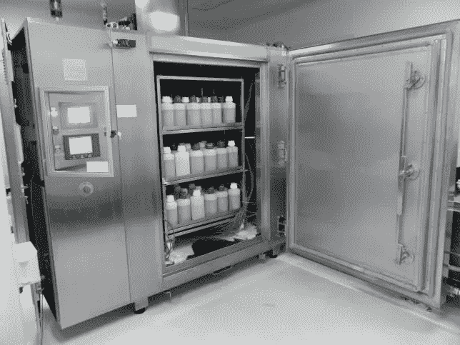

# 冷藏室还是停尸房:创新快速入门

> 原文：<https://medium.com/swlh/the-freezer-or-the-morgue-a-quick-primer-on-innovation-3b3977030dc6>

作为一个新项目的一部分，我被要求就我选择的一个与商业相关的话题做一个 10 分钟的简短介绍。

我选择了创新。毫无疑问，现在这是一个时髦的词，但是我们真的了解创新意味着什么，以及我们应该如何、何时以及为什么应用它吗？像许多概念一样，它可能过于复杂和神秘，通常是由那些想看起来比其他任何人都聪明的人(并让你相应地付钱给他们解释)造成的。

在我向小组介绍了我准备的东西(下面有幻灯片)后，有一个简短的问答。问题涉及到当普遍的文化背道而驰时，企业如何创新，以及如何快速轻松地测试想法。

一个突出的问题是，知道什么时候扼杀创意。杀死你的宝贝是很难做到的。创业和创新文化倾向于迅速扼杀创意。我相信这样做通常是很重要的，但我的想法现在已经转向了冷冻室，而不是停尸房。

把我们的想法放在冰箱里(也许是某种低温冰箱)意味着它们仍然活着，可见，而不是被埋葬或火化。

我们可以选择在晚些时候将它们恢复到目前的状态，或者使用它们的一部分来加强我们未来的努力。

也许有他们在身边也只是让我们记住他们最好的特点和他们的缺点——都是我们探索邻近可能性的好燃料。

在很多场合下，我会想到我想要参考或重新利用的旧想法的一部分，并责备自己我已经埋葬了它们——它们已经分解或完全变成了灰尘。

所以，与其杀死你的宝贝，不如把它们放在冰箱里——你永远不知道下一次你会在哪里需要它们。

*原载于 2018 年 3 月 7 日*[*【howardgray.net】*](https://howardgray.net/2018/03/07/the-freezer-or-the-morgue-a-quick-primer-on-innovation/)*。*

## 这篇文章发表在 [The Startup](https://medium.com/swlh) 上，这是 Medium 最大的创业刊物，有 303，461+人关注。

## 在这里订阅接收[我们的头条新闻](http://growthsupply.com/the-startup-newsletter/)。

