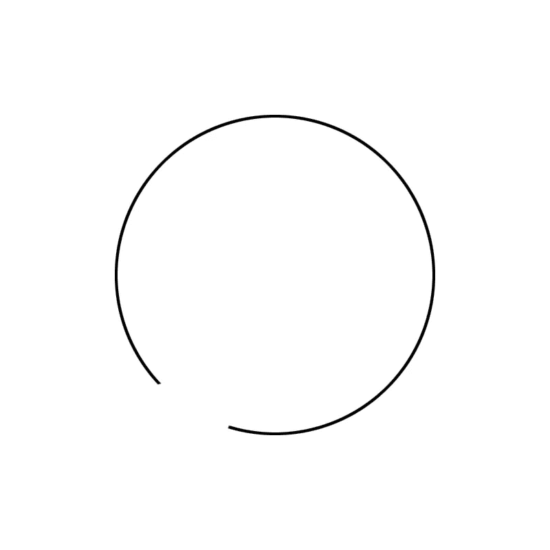
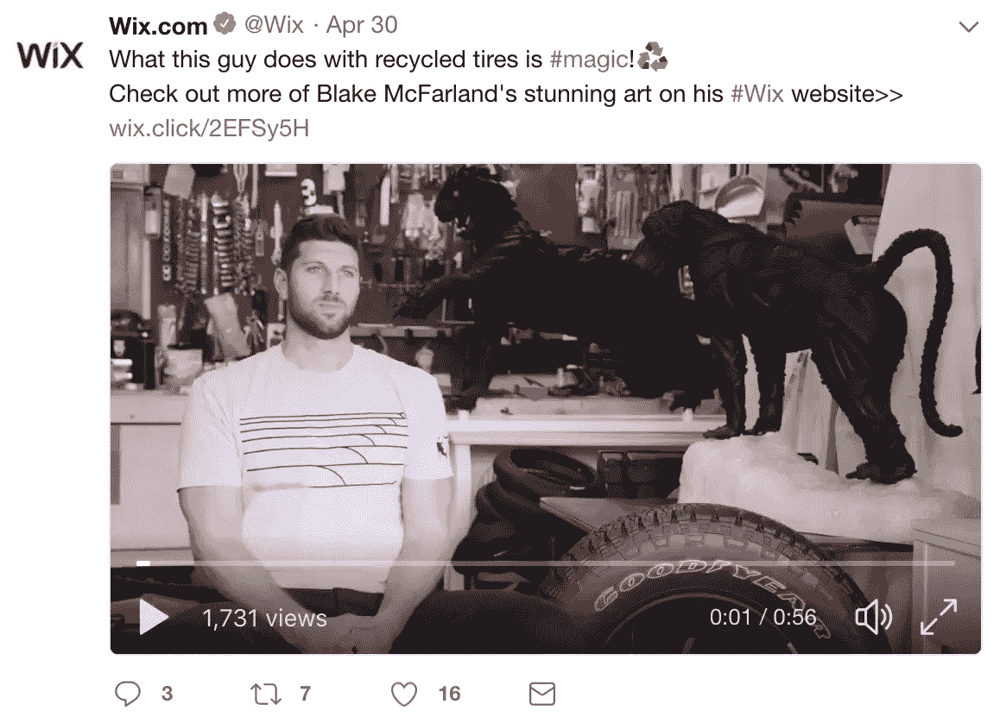
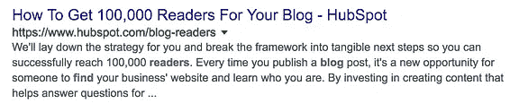
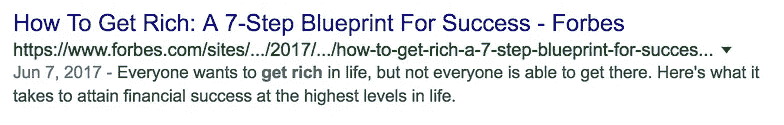
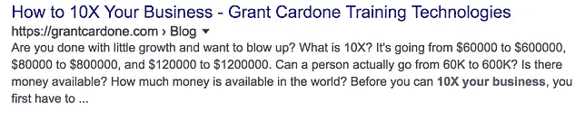

# Clickbait 背后的可怕数据:揭秘。

> 原文：<https://medium.com/swlh/the-frightening-data-behind-clickbait-revealed-6817229a1b2>

首先，让我直截了当地告诉你这篇文章的标题…我没有关于 clickbait 的数据。

我也没有什么可怕的事情要透露。

但是我的文章吸引了你的眼球！

是啊！

关键绩效指标完成了，孩子。

Me when I hit my KPIs (giphy.com)

你感觉如何？

被重视？

好像我尊重你生命中剩下的有限时间？

没有吗？

没错。这对生意没什么好处。

然而，我们在整个互联网上都看到了这种标题超过承诺和交付不足的情况，当你考虑到企业首先拥有社交媒体账户(或任何账户)的唯一原因是改善他们的底线时，这真的没有意义。

那么我们是怎么到这里的呢？

以下是我对 clickbait 发展至今的最佳猜测。

老板:*“戴夫，我们需要谷歌注意到我们，马上”*

戴夫:*“太棒了，我们应该开个博客。”*

[过了一段时间]

老板:“*戴夫，你开博客了吗？”*

戴夫:*“是的，老板，这可能是我创作过的最好的博客了。”*

老板:*“我相信你的话，但是没有人在看，戴夫。”*

戴夫:*“好吧，让我们利用好奇心间隙来设计一些点击诱饵，这样人们就可以把他们正在做的事情留在社交媒体上，转而阅读我们的博客。”*

老板:“*哇，戴夫，clickbait 的东西增加了 15%的读者，继续努力！”*

戴夫:*“是的，老板，我发现如果我花更少的时间写有意义的内容，而花更多的时间想办法欺骗人们点击我的链接，我们的读者群就会不断增加——这太神奇了！”*

[虚构的尴尬沉默]

随着对内容创作和分发历史的彻底了解，公司开始关注最糟糕的事情的原因就变得很清楚了:印象。

印象不会建立品牌亲和力。

印象不增加底线。

“印象”是一个虚荣的指标。

Vanity-metric-face (giphy.com)

但是印象让我们感觉良好。*“如果你做好了，他们就会来”*这种说法早就被否定了，而且分发是一个真正的问题，尤其是对于那些没有足够预算将内容呈现在大量观众面前的初创公司来说。

结果呢？

内容分发的原始增长黑客。我喜欢称之为空点击诱饵。

现在不要误解我，我是 clickbait 的坚定信徒。

让我快速后退一步，解释一下 clickbait 到底是什么。

Clickbait 利用了一种叫做好奇心间隙的东西。好奇心缺口和很多事情一样，是一种心理工具，源于人类对封闭的需求(格式塔心理学)。

例如，当你看这个的时候:

头脑完成了这个循环。

同样的原则也迫使好莱坞电影制作人确保每部电影都有一个合适的结局。那个结局越幸福越具体，我们就越幸福。

进入好奇心间隙。

好奇心差距本质上提出了一个问题，*“这个圈的其余部分实际上看起来像什么？”*

*“我得看看这部电影的结局！”*

看看这个来自我最喜欢的社交媒体播放器 [Wix](https://www.twitter.com/wix) 的完美 clickbait 例子

当你读到这里的时候，你脑海中一直在尖叫的问题是什么？

***“他用回收的轮胎做什么？!"***

本质上，这个问题的答案就是上述圆圈中缺失的部分。

如果圆圈中缺失的部分是以这样一种方式设计的，你不能再多走一秒钟而不发现，或者以一种方式让你足够好奇以点击链接或观看视频——你就有了 clickbait。

问题是，创建一个“点击诱饵”的社交媒体帖子比生成真正有价值的内容要容易得多。

这是空的 clickbait 所在的地方。

想象一下，如果你点击观看这个视频，而他们从未真正向你展示他用轮胎做的东西，你会有多恼火？

(比如我的文章实际上没有披露关于 clickbait 的令人恐惧的数据，你一定很恼火。)

空洞的 clickbait 会让用户感到沮丧，并破坏观众对你的信任。

没有印象总比有印象导致与你的观众之间的信任和亲和力崩溃要好。

所以，这是我的演讲时刻:

生成由研究支持的内容。研究告诉你你的目标市场实际上对什么感兴趣和关心。

为客户解决问题。帮助他们。即使这与你卖的东西没有直接关系，但从长远来看，当他们*确实*有相关问题时，你建立的亲和力会把他们带回你的商店。

有许多聪明的营销公司建立在博客上，他们只是寻找他们的客户，直到时机成熟。

引诱客户点击这样的链接:

不是建立信任的方法。

信任对你的底线有好处。

又及:我每周发一封邮件(周四下午 2 点),名为《周四重击》。如果你喜欢以上内容，只需给 thethursdaythump@gmail.com 发邮件说“是”，你就会被录取，直到你想退出为止。

如果你喜欢这篇文章，做个好人，给我们鼓掌。

## 这篇文章发表在 [The Startup](https://medium.com/swlh) 上，这是 Medium 最大的创业刊物，有 323，238+人关注。

## 在这里订阅接收[我们的头条新闻](http://growthsupply.com/the-startup-newsletter/)。

