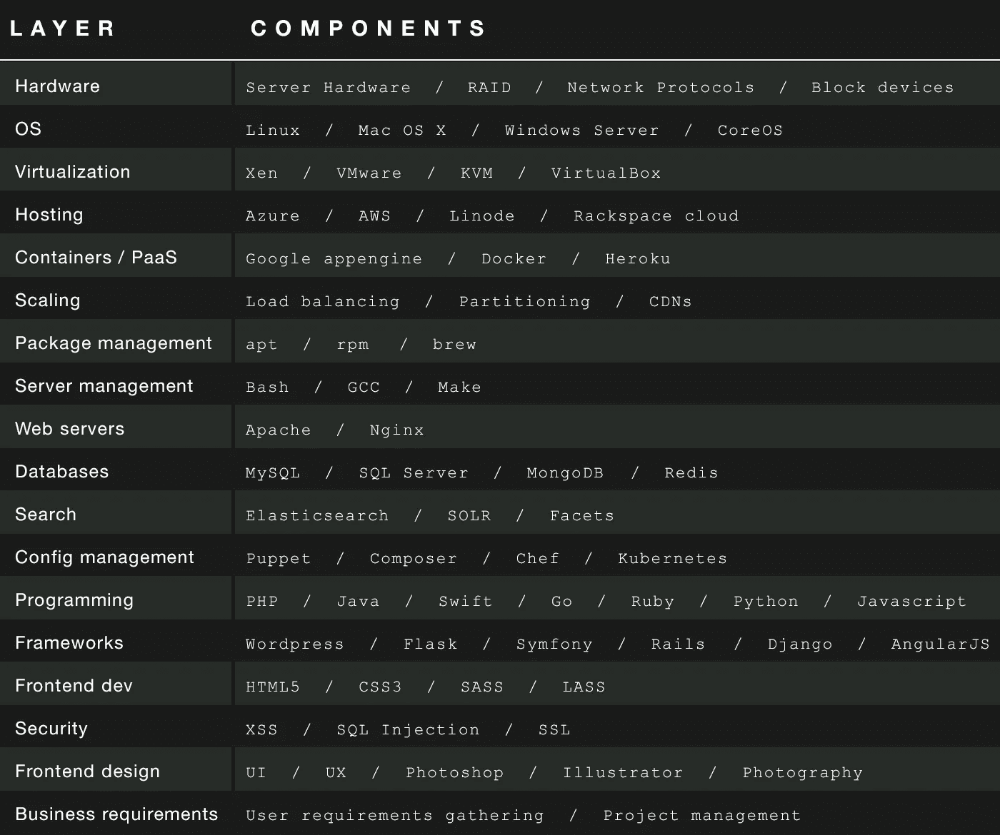

# 全栈开发者是一个神话

> 原文：<https://medium.com/swlh/the-full-stack-developer-is-a-myth-4e3fb9c25867>

## 嗯，那不完全是真的，但是你永远也找不到。“真正的”全栈开发人员是存在的，但是天才和从 12 岁就开始编程的人也是存在的。

## 我看了太多这个职位名称/描述，你找到你要找的人的唯一方法就是挖走他们。除非你非常幸运，否则每一个能为你填补这个职位的人都已经被愉快地雇佣了。

这份工作描述了我认识的几个人，但拥有“全套”技能的少数人非常受欢迎，只会进一步传播你的初创公司能够找到这样一个人的神话。

就像“天才”或“在[此处插入所需领域]无所不能的人”这样的职称一样毫无意义。

为了进一步解释这一点，下图显示了“堆栈”的非穷举版本。请注意，通常您的技能集只需要包含每一层中的一个或两个组件。有些技能可以在几个小时内学会(GCC 或 VPS 的基本用法)，有些需要几年才能掌握。

Non-exhaustive list of a technical stack layers and components

对“全栈”开发人员的期望远远超出了普通人的能力。他们需要了解如何扩展应用程序，以处理一天(或一小时)数百万次的点击？)、“宠物与牛”是什么意思以及为什么它很重要、他们应该选择 MongoDB 而不是 MySQL(反之亦然)的原因、CAP 定理、PaaS、IaaS、十几个配置管理工具、在 Rails、Django、Wordpress、Swift 或基于需求的组合中构建应用是否有意义、微服务与单一应用以及二十几个其他东西。

这意味着完整的堆栈开发人员至少需要对堆栈的每个组件有足够扎实的理解，以便能够就它们的使用做出明智的决定，并能够向管理层解释，最好是用简单的英语解释。没错，在这个堆栈的最顶端是一个期望，即整个堆栈的开发人员具有很强的英语技能，能够与其他人很好地合作，并且能够向中/高层管理人员解释高度技术性的概念。

每年都会有新的组件添加到每一层，每隔几年就会有一个新的层添加到每一层。发布招聘全栈开发人员的申请真的合理吗？这不仅不合理，而且很愚蠢。尤其是当你开始寻找一个在安全、web 开发、UX 和服务器方面的专家时；这并不是一个不寻常的期望。

最重要的是，因为它通常是一个寻找全栈开发人员或工程师的初创公司，这个人也经常被要求进行项目管理和收集用户需求。

哦，对了，然后当首席执行官在办公室时，让他的打印机和文件共享在他全新的 Windows 笔记本电脑上再次工作。

正如我提到的，有些人有这种能力，我认识其中一些人。但是我知道更多令人惊讶的开发人员、设计人员和项目经理，他们甚至没有接近全栈，甚至更多的人自称为全栈，但几乎不能定义我在上面发布的栈中的六个以上的单词(可以说甚至错过了层，例如 JRE 或 Node.js 将位于哪里),更不用说判断两个或更多组件之间的交互。这就是问题所在。

> 在我看到的几乎所有案例中(尤其是在招聘广告中)，公司寻找的实际含义仅仅是“一个了不起的人”。

全栈和全栈工程师的最早定义似乎是[脸书工程师卡洛斯·布埃诺](https://www.facebook.com/notes/facebook-engineering/the-full-stack-part-i/461505383919)的一篇帖子，他将其定义为对性能含义有深刻了解的多面手。

全栈工程师或开发人员可能根本不应该编写代码，而应该更多地扮演系统架构师或集成工程师的角色。了解整个堆栈的人能够在集成中的问题和低效发生之前识别并避免它们。

即使这样，您仍然需要定义您正在谈论的“堆栈”。web 堆栈、移动堆栈、本地应用？即使如此,“全栈”也不是一项技能，它是一套技能，更重要的是，低层次的*和高层次的*对整合栈中每一层的所有概念的理解，以及一层中的动作对其他层的影响。

全栈开发人员是一个神话，不是因为不存在，而是因为这个术语毫无意义。这与编码忍者或摇滚明星没有什么不同，但至少每个人都知道这些术语实际上没有任何意义。

你是在寻找一个多面手，一个集成工程师，一个性能专家，一个能快速掌握新技能和技术的人吗？或者你有理由期待找到一个能熟练地做所有这些事情的人吗？真的吗？

*发表于* **创业、旅游癖和生活黑客**

-