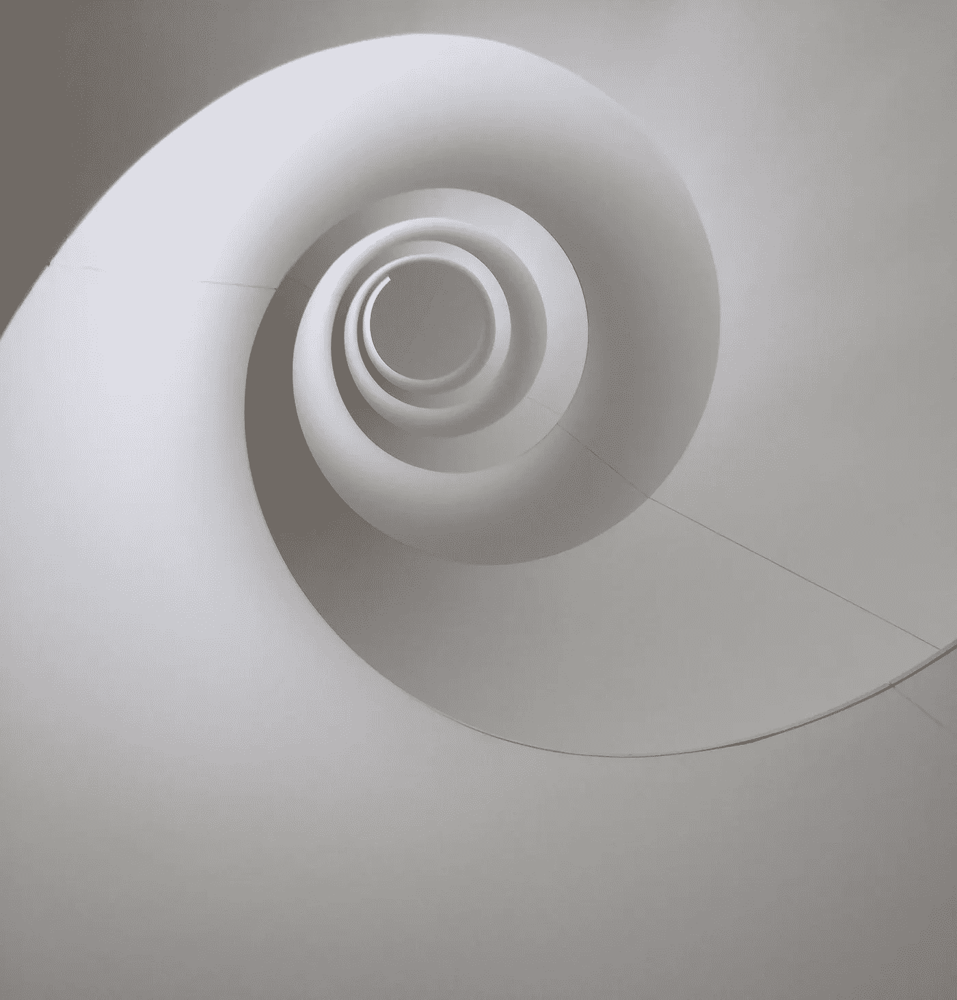
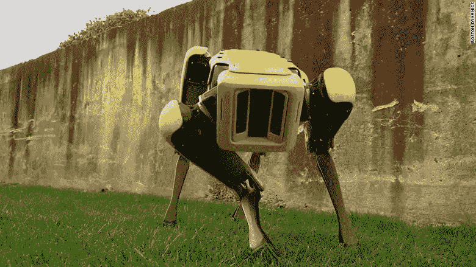

# 未来已经不是过去的样子了。

> 原文：<https://medium.com/swlh/the-future-is-not-what-it-used-to-be-a501ee1f0523>

系好你的安全带。

DNA inspired staircase design @SAHMRI, Australia. Photo by Ezgi

未来总是充满未知、希望和焦虑，但它比以往任何时候都更近…而且具有破坏性。2015 年，吉尔出版社在《福布斯》上发表了一篇文章，试图预测未来不同于过去的 3 个原因，他向更广泛的公众介绍了*“无缝智能，一切都通过无处不在的网络和接口连接起来”*。

Photo credit: [CNN](http://money.cnn.com/2018/05/11/technology/boston-dynamics-robot-spotmini/index.html)

无缝智能让一群人欢呼雀跃，他们不耐烦地等待着未来变得更聪明、更互联、更指数化以及理想的不朽。然而，当 [Boston Dynamics](https://www.bostondynamics.com/) 最近在他们的 [YouTube 频道](https://www.youtube.com/user/BostonDynamics)上发布了他们令人难以置信的令人印象深刻的工作成果，引起了病毒般的轰动——灵巧的机器人毫不费力地跳跃、四处漫游、在雪地上行走、后空翻、在它们之间无声地交流以用它们的手柄开门——空气中的恐惧和惊愕肯定多于惊讶。一些反应暗示，一个敏捷的开门机器人可能是一个很好的宠物，但不久之后，互联网上到处都是可怕的迷因。推特上的普遍共识是“可怕的”。脸书上成千上万的人分享了这些视频，并不断收到关于“那些恶魔般的机器”的歇斯底里的评论。许多人声称，这是我们所知的世界末日，也是机器人统治人类的开始，我们将被食物链中位于智人之上的一种新物种所奴役:人工智能。

Boston Dynamics 开始广告的时机 [SpotMini](https://www.bostondynamics.com/spot-mini) 是不可思议的，因为它恰逢《黑镜》第四季的上映( [*这是一部探索扭曲的高科技不久的未来的科幻选集系列，在那里人类最伟大的创新和最黑暗的本能碰撞*](https://www.netflix.com/ch-en/title/70264888)【ndlr】)。SpotMini 与《MetalHead》这一集里凶残、令人厌恶、残忍、超级聪明、超强的机器狗有着极强的相似性，拥有超越人类的能力(和传感器)。剧情是黑暗的，非常黑暗，正如你可能已经猜到的，人类再次处于危险之中，这是天启。虽然波士顿动力公司希望“*改变你对机器人能做什么的想法*”，但许多人只是希望它们停下来，在它们和其他硅谷极客/程序员进一步开展研究之前，在它们为了有所作为(和盈利)而毁掉我们的未来之前。

我不是悲观主义者。我是对未来持乐观态度的人之一(或许有些天真)。我相信个人和有良好意愿的高技能的梦想家群体(用美国真人秀的语言来说，那些出于正确的原因而加入其中的人)将塑造一个更美好的未来。我相信人工智能和其他颠覆性技术在解决不断增长的人口的需求方面的力量&在解决我们最大的挑战方面，如全球变暖、不平等、医疗保健、清洁水、能源……我相信人工智能将改变我们进化的范式，并对人类产生比电或火更深远的影响。

我相信同理心、同情心和所有使我们成为我们的人的美德将成为我们进化的基石。在不久的将来，以人为本、情商、人际关系和经验将比你的自动驾驶电动汽车更有价值。我还知道，由于人工智能，我们将大大增强自己，并将最终通过[脑机接口融合我们的智能，因此，如果**我们**让人工智能朝着正确的方向发展，人工智能是否会主宰我们的问题可能会变得无关紧要。](https://www.neuralink.com/)

我们的未来之旅每一天都在加速。我们正在努力做得更好，以维护地球这个资源丰富的家园，在太空探索中寻找 B 计划家园，在 DNA 改造中治疗无法治愈的疾病，在量子计算中，在增强/虚拟现实中，在靶向给药中，在 3D 打印中，在先进的机器人技术中，在可再生能源中，在万物互联中，在一切事物中。目的地是一个拥有无缝智能的世界，但如果我们知道我们要去哪里，那么我们也需要知道将带我们去那里的路径。最好是一条充满智慧和善意的道路，而不是那些看起来非常像原力黑暗面的道路。

埃兹吉·塔斯德米尔

如果你觉得这个故事有趣，请随意鼓掌一次、两次或五十次👏👏👏👏👏

如果你看不够，请在[媒体](/@ezgitasdemir)和[推特](http://twitter.com/ezgitasdemir4)上关注我🤗

这里还有一些你可能会感兴趣的文章:

*   [艾:开饭了](/swlh/if-i-could-invite-9-important-figures-and-a-robot-over-for-dinner-and-ask-them-about-ai-7c12c2502572)
*   你真的想长生不老吗？
*   [从疾病护理到医疗保健](/@ezgitasdemir/from-sickcare-to-healthcare-3e939a88f12a)
*   [医疗保健领域的物联网革命](/@ezgitasdemir/iot-revolution-in-health-care-901fec5459cf)
*   [真实性](/swlh/oath-to-authenticity-b60d761fa904)
*   [用心的领导](/swlh/the-mindful-leader-an-interview-with-michael-bunting-901c38742cff)
*   [领导](/swlh/leadership-n-capacity-to-lead-eb05c9253698)

*Ezgi Tasdemir 博士是诺华肿瘤公司的员工。本文由 Ezgi Tasdemir 创作。观点、分析和观点不一定代表诺华或任何其他公司或组织的观点或意见。作者没有从诺华或任何其他制药/非制药公司获得任何资助或支持。*

## 这篇文章发表在 [The Startup](https://medium.com/swlh) 上，这是媒体最大的创业刊物，拥有 325，521+人关注。

## 在这里订阅接收[我们的头条新闻](http://growthsupply.com/the-startup-newsletter/)。

