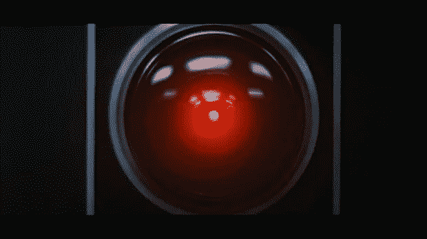

# 苹果和增强现实的未来

> 原文：<https://medium.com/swlh/the-future-of-apple-ar-aad3db66db67>

“蒂姆·库克不是史蒂夫·乔布斯。”

“自 iPhone 以来，苹果没有发布过任何有趣的东西。”

“苹果的时代已经结束了。撕苹果。”

当它们第一次出现时，前面的标题看起来像是未经过滤的点击诱饵。

然后，就像在排队一样，苹果陷入了一场小混乱:一连串令人失望的发布以苹果手表的发布为高潮，随后几位高管辞职。几乎每天都有黑体字的公告出现:

苹果已经干了。创新不再存在。

扯淡。

尽管标题带刺，创新仍然是苹果的主要名片。

个人计算正处于向增强现实巨大转变的边缘，苹果公司最近的一系列[收购](https://en.wikipedia.org/wiki/List_of_mergers_and_acquisitions_by_Apple)和[专利](http://www.patentlyapple.com/patently-apple/augmented-reality/)表明了他们开辟道路的意图。

众所周知的神秘，蒂姆·库克最近的声明进一步揭示了苹果的道路:

> “AR 将会大规模发生，当它发生时，我们会想没有它我们是如何生活的。就像我们想知道今天没有手机我们是怎么生活的一样。”

库克的评论展示了苹果建立一个增强的未来的意图，嵌入他们现有产品阵容的技术在这条道路上加倍努力。

如果 AR 眼镜要取得成功，它们需要与一台功能强大的计算机(iPhone)绑定，并且它们需要无缝地做到这一点，同时引入与计算机交互的新方式(Airpods + Siri)。

苹果正在慢慢建立一个产品生态系统，AR 可以与之集成，以实现强大、身临其境、最小化，从而实际工作。

除了极其笨拙之外，谷歌眼镜缺乏有机、自然体验所必需的电力和无线集成。

幸运的是，像 Apple Watch 这样的产品已经证明，一个小小的包装可以容纳大量的能量，并且可以与各种设备无缝连接。虽然苹果的硬件肯定还有增长的空间，但坚实的基础已经奠定。

这就是苹果第二个高明的战略举措发挥作用的地方。

这些年来，个人电脑已经从桌子上转移到我们的膝上，现在还在我们的口袋里。随着我们的技术不断进步，它不仅在尺寸上缩小，而且离我们的身体越来越近。

到目前为止，可穿戴技术对眼睛来说很难接受(寻呼机、手机皮带夹、蓝牙耳机)。把电脑戴在脸上将是一个挑战。

谁能比苹果更好地应对这一挑战呢？

前面提到的 Apple Watch，无论有多么大的问题，都朝着正确的方向迈出了一步。它不仅功能强大，还能直接与我们的皮肤互动，监测身体功能，而且不会引人注目。

同样有争议的 AirPods 也同样令人印象深刻:一对微型声控电脑，当它们滑入我们的耳朵时就会打开，它们提供清晰的音频，同时保持与智能手机的无线连接。

更重要的是，*每一个豆荚都轻轻地放在一个小孔里，轻描淡写，几乎看不见*。想象一下 HAL 9000 的计算能力缩小到珍珠大小。

苹果公司有重新思考个人电脑领域几乎每一个重要步骤的历史:台式机、鼠标、mp3 播放器、笔记本电脑、手机。

接下来，增强现实。

> 如果你喜欢读这篇文章，请点击页脚的♥按钮，这样更多的人可以欣赏伟大的设计！

大家好，我是[丹尼尔](http://www.danieleckler.com)。我创办了一些公司，包括 Piccsy (acq。2014)和 EveryGuyed (acq。2011).我目前对新的职业和咨询机会持开放态度。通过[电子邮件](mailto:hi@danieleckler.com)联系。

本文由[肖恩·朗肯](http://www.shaunroncken.com)合著。

# 你可能也会喜欢:人性化设计

我写的一篇互动文章，探索了拟人化设计的过去、现在和未来。也可用作会议、活动等的演讲。