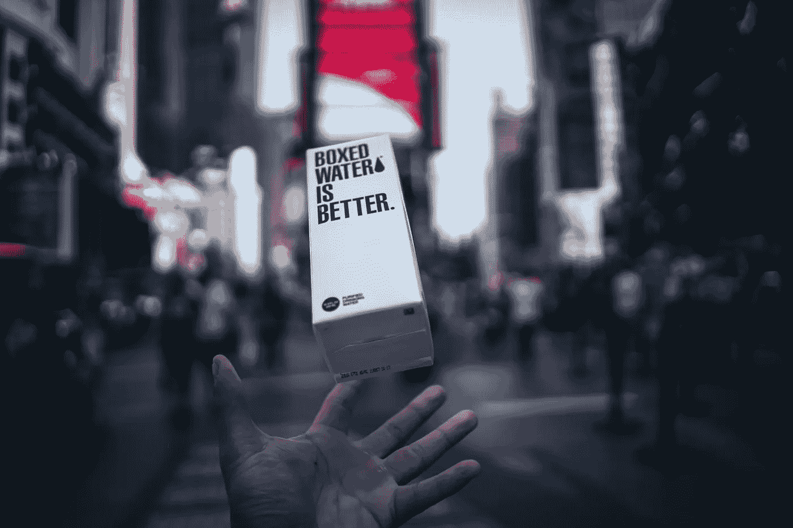

# 商业的未来

> 原文：<https://medium.com/swlh/the-future-of-business-ed27141ae7fe>

## 产品差异化变得更加困难，广告也不再奏效。

Credits: [Unsplash](https://unsplash.com/?utm_source=unsplash&utm_medium=referral&utm_content=creditCopyText)

一家银行接待了一位客户，她感到头疼。

在她去看医生之前，一名受雇于银行的医生被请来给她看病。

另一个走进来，她累了。

这位女士在进行交易前被亲切地带到银行的按摩师那里。

两位顾客离开银行时都面带微笑。

**进入未来的商业！**

尽管这有些夸张，但未来的商业并没有太大的不同。所有的企业都会模糊他们的界限，以取悦他们的顾客。平衡是为了确保盈利而达到的。

但是仔细观察，你会发现许多企业已经开始向这种模式转变。他们正在成为“情感企业”——疯狂地提供与其核心业务无关的服务和津贴——他们正在窃取人心！

任何不跟风的竞争对手都将自食其果。公司会预算更多的资金来取悦顾客。这场求爱中谁会赢呢？客户和公司。顾客很高兴得到无价的爱和关怀，她乐意掏空钱包给公司。

[Unsplash](https://unsplash.com/?utm_source=unsplash&utm_medium=referral&utm_content=creditCopyText)

# 产品差异化能挽救什么？

在人山人海的模仿产品中，寻求产品或服务的差异化可能完全是浪费时间。相反，专注于你的品牌会更有益——做出别人没有的承诺。让这个承诺要求一块感性的领土。

你的承诺必须唤起让你的品牌脱颖而出的情感。

[纽约市领先的 B2B 品牌代理公司](https://www.forbes.com/sites/forbesagencycouncil/2017/08/25/how-to-differentiate-your-brand-in-a-sea-of-me-too-competitors/#738826635d1e) [DeSantis Breindel](http://www.desantisbreindel.com/) 的联合首席执行官 Howard Breindel 说:

> 我们最近对一家营销技术公司进行了更名，此前我们进行了彻底的研究，但最终没有发现任何有意义的差异化之处。的确，该公司因其优质的产品和优质的服务而受到 CMO 客户的好评。但是围绕着“我的比你的好”很难创造一个可持续的品牌
> 
> 幸运的是，研究显示，首席执行官中离职率最高的首席营销官非常关心展示他们对公司成功的贡献，并渴望获得数据来证明他们的价值。我们围绕着对 CMO 的情感承诺——本质上是“我们支持你”——而不是任何特定的产品功能来打造品牌。

Breindel 解释说，埃森哲已经能够在管理咨询领域脱颖而出。尽管大型跨国公司之间存在细微差别，但它们本质上做的是同样的事情。

该公司围绕“高性能”打造了一个强大的差异化品牌。已交付。”这一令人难忘的陈述既做出了承诺(“高绩效”)，又定义了埃森哲竞争的类别(实施而非纯粹的战略)。

德勤或普华永道可以做出同样的声明——它们都做了和埃森哲一样的事情——但它们没有！

埃森哲通过它的承诺，而不是它的所作所为，开拓出一片可防御的品牌领地。

[Unsplash](https://unsplash.com/?utm_source=unsplash&utm_medium=referral&utm_content=creditCopyText)

# 大多数形式的广告已经不起作用了。现在怎么办？

是的。确实如此。

样张？让我们计算一下这些数字。

在一项调查中，三分之二回忆起看过本土广告的人完全不记得它，95%的人不记得赞助商是谁。

原生广告(和其他品牌内容)[不起作用](https://digiday.com/publishers/copyranter-native-advertising-editorial-websites-doesnt-work/)——没人[记得这个品牌](https://digiday.com/agencies/copyranter-native-advertising-useless/)。

我们每天都充斥着的网络广告呢？

2014 年，《大西洋月刊》发表了一篇令人不安的文章，[互联网广告到底有没有用？简短的回答是:很可能不会！最长的答案是:没人知道。](http://www.theatlantic.com/business/archive/2014/06/a-dangerous-question-does-internet-advertising-work-at-all/372704/?utm_source=atlfb)

这一点今天也没有改变。

社交媒体广告？结果同样糟糕。根据 2014 年盖洛普[美国消费者状况](http://products.gallup.com/171722/state-american-consumer.aspx?utm_source=Homepage&utm_medium=Ad&utm_content=State%20of%20the%20American%20Consumer&utm_campaign=Report)报告，只有 5%的人说社交媒体对他们的购买决定有“很大的影响”;30%的人只承认“有些影响”如果你想了解更多的细节，你可以去这个网站。

只有一些非常规的参与形式才能产生更好的效果，比如非广告。等着吧，它们很快就会成为陈词滥调。

# 爱你的顾客

为未来做准备，你的企业必须与她的顾客建立信任的友谊。当然，高质量的产品、客户支持和速度是必须的。

所以问问他们刚上大学的女儿的情况吧。邀请他们过来吃饭。承诺你的公司会支持他们。送他们去度假。

如果你喜欢这篇文章，请随意点击那个按钮👏帮助其他人找到它。

## 这篇文章发表在[《创业](https://medium.com/swlh)》上，这是 Medium 最大的创业刊物，有 277，994+人关注。

## 订阅接收[我们的头条新闻](http://growthsupply.com/the-startup-newsletter/)。

