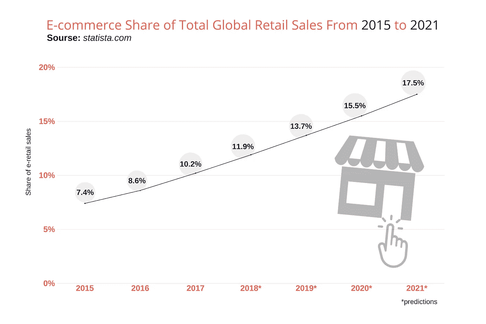
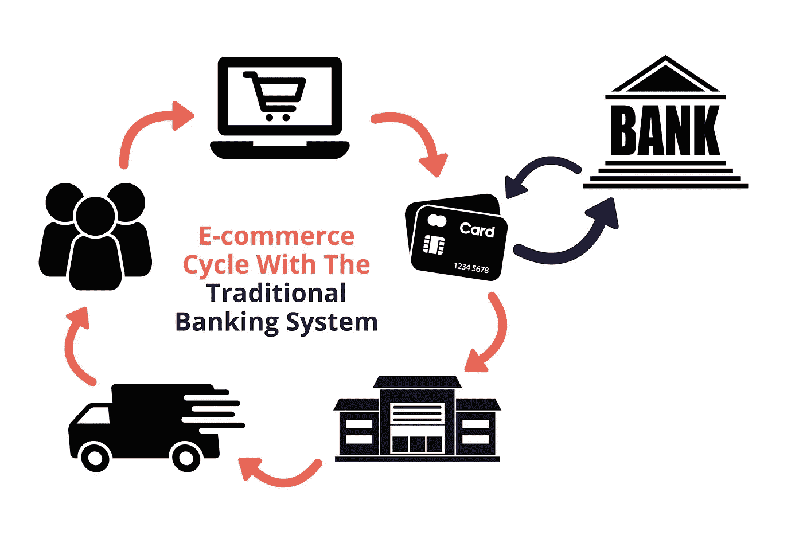
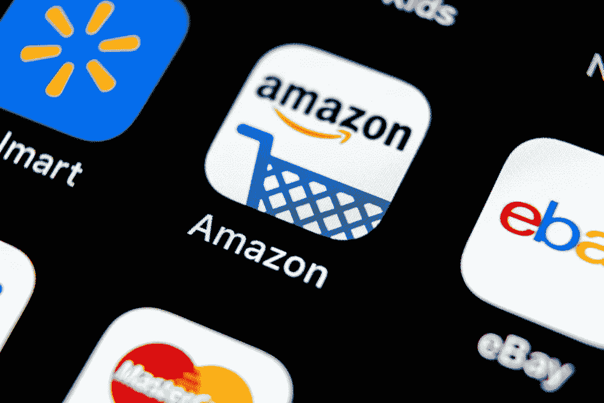
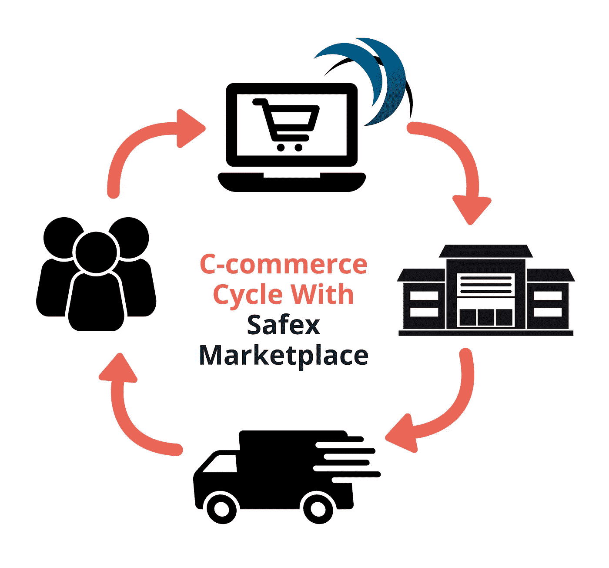

# 加密货币的未来:为什么电子商务是答案

> 原文：<https://medium.com/swlh/the-future-of-cryptocurrency-why-e-commerce-is-the-answer-822e62ba12f5>

自从 10 年前比特币出现以来，人们一直在问一个关键问题:**我们能用它做什么？**

一些狂热分子预计到现在加密货币将取代法定货币。一些怀疑论者说比特币只是极客们的 T4 货币，它永远不会成为主流。现在， [10 年后](https://cryptpresso.com/10-years-of-bitcoin/)，真相**在中间**的某处。比特币蓬勃发展，许多其他**替代币已经上市**，但加密货币的未来仍然模糊不清。

虽然大多数人在日常生活中仍然不使用比特币，但你可以用 crypto 购买的**东西的数量正在增长。根据 CoinMap 的数据，[目前全球有 14418 个场地](https://coinmap.org/#/world/1.36217635/108.36914063/2)接受比特币**。显然，这不足以达到主流采用。也许永远不会，由于比特币的 [**供应量小，分配不均**](/decentralized-commerce/bitcoin-might-not-be-the-future-of-cryptocurrency-but-what-is-c242ea5abfec) 。

我们需要一种特性更好的**新硬币**和一种最适合加密货币的**新用途**。为了找到这枚硬币，让我们来看看可能最适合使用密码的行业:[电子商务](https://en.wikipedia.org/wiki/E-commerce)。

# 为什么是电子商务？

我不知道有谁在某个阶段没有在网上买过东西。事实上，电子商务近年来发展迅猛，而且在未来几年还将继续增长。

> 看看这些数据:

> 2017 年，全球电子商务零售销售额达 2.3 万亿美元，预计到 2021 年电子零售收入将增长到 4.88 万亿美元。

根据这些估计，全球零售电子商务销售额**将在短短四年内翻一番**。此外，电子商务零售额占全球零售额的比例**逐年上升**。为什么？因为越来越多的**人是在自己家里** **舒适地购买而不是出门。**

受益的不仅仅是客户；许多品牌在网上提供他们的产品以降低成本。电子商务对各方都有利的事实表明**这种趋势将会继续。**

> 下图清楚地表明:

> 2017 年，电子零售占全球零售总额的 10.2%。这一数字预计到 2021 年将达到 17.5%。

如你所见，电子商务的**潜力很大**，而且每天都在增长。但是这个**如何融入加密货币**的未来 **？**

*让我们来看看。*

# 为什么是加密货币？

尽管电子商务正在增长，过时的全球金融体系是其扩张的最大障碍。目前，银行在互联网上充当买卖双方的中介。对于已经在网上购物的人来说，这不是什么大问题。然而，有许多人**可以**从网上购物中获益，但**却不能开立银行账户**。

我说的是来自银行系统不发达的第三世界国家的人，以及来自发达国家的弱势群体。根据一些估计，全世界有超过 20 亿人属于这一类。

加密货币可以将这些人与电子商务世界联系起来。毕竟，他们只需要一个互联网连接就可以开始了。没有下载钱包和使用数字硬币作为支付手段的要求清单。你甚至不需要提供你的个人信息。

当然，还有其他好处。加密货币旨在取代银行等中央系统，消除对中介的需求。这将大大简化购物过程，并降低所有相关费用。

## 权力下放对电子商务的一些好处:

*   没有中介——银行不能强加他们的规则。
*   商人享有更大程度的自主权。
*   没有被冻结的账户。
*   不像易贝或 Etsy，没有中间人费用。
*   为客户提供更高水平的隐私保护。
*   没有汇率的国际交易。
*   防范假冒和欺诈购买的新级别保护。

# 关键在哪里？

我们需要一个**工作平台**，允许买家和卖家使用加密货币进行交易。但不是任何加密货币。正如我上面提到的，**我们需要一种新的硬币**，具有专为电子商务设计的特征。

换句话说，我们需要一枚专门为这个平台创造的硬币**，并嵌入其中。这只有通过全新设计的加密货币**来保护买家**才有可能。**

所以，**当你听到**亚马逊或任何其他网络零售商[进入区块链业务](https://coincodex.com/article/1316/a-cryptocurrency-by-amazon-would-be-a-game-changer/)时，那不是答案。将任何随机加密货币与一个已建立的电子商务平台合并可能是有前途的，但从长远来看，它不会有效。

这不是我们所希望的加密货币的未来。只有通过创造一个**分散的市场**和它自己的嵌入硬币，我们才能真正做出重大改变。

# Safex:电子商务中加密货币的未来

几个不同的项目正在为这个问题提供解决方案。但是，据我所知，只有**[**Safex**](https://safex.io/)看起来能提供真正可行的解决方案。Safex 的开发团队正在构建一个平台，它使用一种叫做 Safex Cash 的**可开采硬币来购买商品和服务。****

**它有点像亚马逊和 UpWork 的组合，但它使用自己的嵌入式硬币进行交易。这将使购买**更加容易，更重要的是，更加私密。毕竟 Safex Cash 是个**隐私币**；没必要让任何人知道你在网上买了什么。****

****

****Safex marketplace** 预计将于 2019 年夏季推出，但 Safex Cash 已经**抵达**。事实上，任何人都可以直接开始挖掘 Safex 现金。考虑到**大规模采用**，Safex 团队创造了一个任何人——任何电脑——都可以使用的矿工。**

**这个矿工专注于 **CPU 挖掘**。这意味着你不需要任何笨重的机器或昂贵的采矿设备来开始；你可以用你的台式机，甚至笔记本电脑**挖掘硬币**。矿工在 UX 方面得分也很高；**这么简单**一键**就能上手。****

# ****从电子商务到电子商务****

****Safex 的**想法是把电子商务变成 c 商务，其中 **c** 代表 *crypto* 。在这一新的推动下，在线零售业的增长速度可能会比上面图表中的预测还要快。******

****

**专家预测，明年电子零售销售额将达到全球零售业的 13.7%。随着 Safex 市场的**推出，这一比例可能会更高。尽管电子商务无疑会从现有的电子商务销售额中抽取一定比例的份额，但我们也可以预计它会吸引到迄今为止还无法在网上购物的新客户。****

**毫无疑问，密码行业将对电子商务世界产生重大影响，尤其是像 Safex 这样的项目。我们还没有看到加密硬币能给网上购物带来的所有好处。**

**但是有一件事是肯定的:加密货币的未来在于为买卖双方提供更容易交易的在线平台(T21)。**

****

## **这篇文章发表在 [The Startup](https://medium.com/swlh) 上，这是 Medium 最大的创业刊物，拥有+395，714 名读者。**

## **在这里订阅接收[我们的头条新闻](http://growthsupply.com/the-startup-newsletter/)。**

****