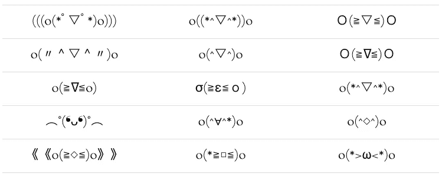

# 情感机器

> 原文：<https://medium.com/swlh/the-future-of-emoji-accced8e7108>

想象一下，在不太遥远的未来，你可以在沙发上休息，在智能家居中享受一个轻松的夜晚。你的智能电视被连接到一个智能音响系统，这个系统是为你 70 年代的古怪品味量身定做的。你的智能 LED 灯为你配偶的脸增色不少，就像在斯皮尔伯格电影中一样。当炖菜在你的智能厨房里炖好的时候，你的智能手表就会发出嗡嗡声。

当你坐下来品尝你的杂货应用程序推荐的 100 年前的食谱时，你的电视会启动，让你知道你最喜欢的节目即将开始。你礼貌地要求它“关机并录音”你称赞你的配偶，并把一勺杂烩送到嘴边，却被你手腕上嗡嗡的通知吓了一跳。你的勺子掉到了桌子上。当你拿起它，用餐巾擦去脏污时，你瞥了一眼你的表盘。是食品店应用程序 Gus，他对你还没开始的饭菜很好奇:“杂烩怎么样？”

随着我们开始依赖这些工具，他们建立情感联系和获取社会线索的能力将与他们破译数据的能力一样重要。Gartner 预测，到 2020 年将有 250 亿台联网设备，从可穿戴设备和汽车到电视和家用电器，包括家用机器人。

理想的设备是能够感知环境的——能够识别社会状况并做出相应调整的设备。想象一个四分卫能够走到争球线，阅读防守，并在瞬间阅读的基础上发出声音。

如果食品店应用程序 Gus 真的想用他的直觉行为给我们留下深刻印象，他会在我们情绪达到顶峰时，或者当我们有一些休息时间时，等一会儿，问问我们的饭菜怎么样。与我们的情绪保持一致不仅令人愉快，还能鼓励用户活动，从而将更多数据输入我们的设备，创造一个不断进化的效率循环:我们甚至可以称之为“关系”。

这已经开始发生:情感计算是一个不断发展的领域，它试图给电子设备注入情感智能，使它们能够对我们的感觉做出反应。情绪信息通过传感器进行解释，传感器分析一个人的身体状态，特别注意与不同情绪相关的身体变化。

随着该领域的不断发展，摄像机、麦克风和可穿戴设备的组合将考虑到从身体语言(面部表情、海报、手势)、言语模式到生理变化(温度、心跳、肌肉紧张、瞳孔放大)的一切。所有收集到的数据将有助于描绘出我们情感构成的详细画面。

就像 GPS 显示我们的位置一样，替代设备可能很快就会配备一个情绪芯片，可以检测你的情绪和其他高级情绪状态。一旦我们的设备意识到我们的情绪，它们就可以运用它们获得的智能来帮助我们过上更好的生活。

在工作中，当你筋疲力尽时，你的智能手机可能会阻止你安排一个重要的会议，当你感到不安时，你的笔记本电脑可能会鼓励你休息一下。在你回家的路上，你的汽车已经根据你的心情编排了一个播放列表，你的智能冰箱将根据它的内容向你展示一些晚餐创意。我们的机器甚至可能合作实现最佳效率:想象一面镜子，当你的倒影表明你感到害羞时，它可以调节浴室的照明，提振你的情绪。

尽管上述技术今天已经存在，但要将其正确集成到我们所有的设备中还需要一段时间。与此同时，我们有一个现代工具来暗示我们与计算机的情感之旅可能会如何发展，它看起来像这样:)

## 你在读《人性化设计》

[*人性化设计*](http://designforhumanity.danieleckler.com) *是一篇探索拟人化设计的过去、现在和未来的互动散文。您目前正在阅读第 5 部分，共 7 部分。*

## 表情符号:表情符号的曾祖父

尽管失败主义者对书面语言的衰落耿耿于怀，但许多专家对表情符号的效果及其丰富文本交流的能力持乐观态度。通过简单的面部表情和暗示性的符号，它们点燃冲动，表达情感，远比标点符号更有效。在表情符号出现之前，问号和感叹号是我们的情感守门人，它们都有一套有限的钥匙:好奇心和兴奋感使这个领域变得更加完整。

人们通过短信以非正统的方式表达情感的时间比你想象的要长。1857 年，在莫尔斯电码中，数字 73 被用来表达爱意。不到三十年后，前四个表情符号发表在讽刺杂志 *Puck* 上，它们表达了喜悦、惊讶、忧郁和冷漠。不久之后，安布罗斯·比尔斯提议我们用‿来结束戏谑的句子，意思是像一张微笑的嘴。他认为这将使我们的写作更有条理，并帮助我们避免误解。

## 表情符号的诞生

大约 100 年前，帕克给了我们一个表情符号的蓝图，斯科特·法尔曼把互联网介绍给了一对情绪截然不同的朋友。1982 年，:-)和:-(出生。

Posted to the Carnegie Mellon University computer science general board on 19 September 1982

仅仅几年后，在 1986 年，日本 kaomoji 出现了一个更清晰的风格。kaomoji 没有像他们的西方表亲那样倒向一边，而是保持直立——这也允许更多有趣的细节和细微差别。

1999 年，栗田茂隆创造了第一个表情符号。它有助于在只能容纳 48 个字符的微型手机屏幕上进行对话。栗田的创作融合了日本汉字(在一个单一的字符中表达“爱”等广泛概念的能力)和漫画(使用股票图像来表达情感)的灵感。一个灯泡在角色头顶闪烁来表达一个好主意是一个常见的例子。

此后，表情符号慢慢扩展到多个平台，并于 2011 年成为 iOS 的正式组成部分。到 2015 年，字符集已经增长到 800 多个，牛津词典命名为😂(喜极而泣)年度词汇。

## 表情符号:远距离拥抱

手机变得越来越强大，屏幕尺寸也越来越大，但我们仍然通过 Twitter & SMS 进行简短的交流，这些平台鼓励快速、简洁的思维。

在 20 世纪 50 年代，心理学家阿尔伯特·梅拉比安确定，交流有 7%是口头的，38%是口头的，55%是非口头的。既然我们的大部分交流都是通过文本进行的，他的建议表明我们 93%的交流工具多少有些低效。在很短的一段时间内，人类只能在没有手势或语调的情况下解读大部分对话的情感包袱。

> 人类被留下来在没有手势或语调的情况下解释大部分对话的情感包袱。

随着基于文本的交流继续主导我们的社会生活，另一个问题出现了。研究表明，作为社会人，我们在生理上需要重新评估和衡量我们的关系。不幸的是，包括短信在内的数字通信无法提供必要水平的生物反馈来正确评估我们与他人的社会关系。

然而，通过使用表情符号、贴纸和照片，社交网络和其他数字平台下意识地试图填补缺乏语气、情感和背景留下的空白。当我们将这些工具集成到基于文本的对话中时，我们可以在享受这些平台的便利的同时更明确地表达情感。

## 反应和情感标记语言

当面对面说话时，人类会下意识地模仿对方的面部表情。这种现象被称为情绪传染，它有助于人际关系的发展。最近的研究表明，同样的框架也适用于基于文本的交流。旨在模仿人类表情的表情符号实际上已经开始影响人类的情绪。

表情符号并不是影响我们情绪状态的唯一技术。2012 年，近 70 万脸书用户不知不觉地参与了一项研究，该研究让他们的新闻订阅比平均水平更积极或更消极。在实验结束时，研究表明，被操纵的用户更有可能分享与他们的新闻源上的帖子相匹配的帖子。就像情绪可以通过情绪传染传播一样，用户的新闻反馈可以产生潜意识的情绪反馈，即使没有直接的互动。

像[情感排名](http://kt.ijs.si/data/Emoji_sentiment_ranking/)和[表情追踪](http://emojitracker.com/)这样的网站监控着网络上表情的使用。一旦推出，表情分析将根据你用过的表情符号来评估你的情绪状态。

同样，脸书的最新开发“反应”将帮助开发者更详细地了解用户的情绪和偏好。这些微妙的反应正在催生一种脸书体验，这种体验将根据每个人的情绪触发而量身定制。

这也可能有助于脸书处理好自己的一些失误。想想 2014 年的一个用户，他收到了一个“这是你这一年的样子”的通知，上面有他已故女儿的一张照片。这位不幸的收件人说:“年度回顾广告不断出现在我的提要中，在不同的有趣和精彩的背景中循环，就好像在庆祝一个死亡，没有明显的方法来阻止它。”

这种算法上的错误将很快被纠正，但它让我们想知道还有哪些微妙的互动可以被挖掘出来，以确保这些体验迎合我们的情感福祉。

我们已经在几个平台上有了一套一致的表情符号，植根于 unicode:在计算机上无处不在的编码、表示和处理文本的标准。

如果我们也有一个解释表情符号的统一标准会怎么样？

随着技术公司开始更加感同身受地解释数据，一种标准化的语言来注释这些数据，识别用户的情绪状态，并产生感同身受的反应将会很有帮助。事实上，这是在差不多 10 年前提出的，作为一种情感标记语言，可以用来增强人和机器之间的交流，提高机器的效率，简化用户的生活。

所有这些发展意味着我们与 CUIs 的关系将不可避免地从功能性发展到友好性。使用从表情符号使用和其他基于文本的交互中挖掘的数据，过渡应该是平稳的。随着我们越来越依赖文字，有趣的是看到如此有趣的东西(表情符号)可以发挥多么重要的作用。事实证明，表情符号是一种真正的表达形式，可能很快就会成为 Cui 采用的有效 EML。

# 人性化设计

探索拟人化设计的过去、现在和未来的互动文章。**亦作** [**可作为说话的**](http://designforhumanity.danieleckler.com) **。**

.

.

## 1: [人性化设计](/swlh/the-future-of-design-is-emotional-5789ccde17aa#.7sqgnt32y)

## 2: [苹果，原始人类](/user-experience-design-1/the-design-secret-apple-stole-from-volkswagen-66a20d17a609#.usddbpwou)

## 3: [对话式用户界面](/life-learning/the-future-of-cui-isn-t-conversational-fa3d9458c2b5#.aat7yx6ei)

## 4: [更智能的未来](/swlh/how-to-design-a-cui-59f1fb3f35fc#.n1o4necvk)

## 5:你来了！

## 6: [电脑也会哭](/the-mission/siri-will-you-ever-understand-me-e5747ab73b08#.sv5wccxk0)

## 7: [你成为电子人的那一天](/@danieleckler/d7f5abf88be2)

.

.

# 感谢阅读

这是一篇互动+进化的作文。如果您对新内容、对当前内容的修改或其他任何事情有想法，请[联系](mailto:hi@danieleckler.com)！

> 如果你喜欢读这篇文章，请点击页脚的♥按钮，这样更多的人可以欣赏伟大的设计！

嗨，我是丹尼尔。我创办了一些公司，包括 Piccsy (acq。2014)和 EveryGuyed (acq。2011).我目前对新的职业和咨询机会持开放态度。通过[电子邮件](mailto:hi@danieleckler.com)联系。

本文由[肖恩·朗肯](http://www.shaunroncken.com/)合著。