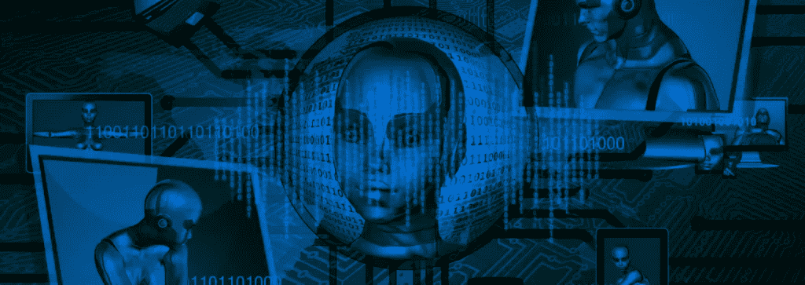

# 营销人工智能的未来是人

> 原文：<https://medium.com/swlh/the-future-of-marketing-ai-is-human-e56ba7f1d1e4>

现在是 2018 年，对于我们许多从事社交广告的人来说，未来就在眼前。品牌正在使用强大的人工智能(AI)工具为目标受众和客户构建丰富的体验。

人工智能正迅速成为一种主流解决方案——但人工智能不仅仅是将其插入到你现有的战略中。人工智能在数字营销和广告中最强大的用途必须由熟练的人来指导。

# 跟上算法

社交媒体一直在变化——例如，对脸书算法的调整可能会让你更难接触到目标受众。这使得雇佣或雇佣一名专注于社会营销和广告的熟练数字营销人员成为必须。你不仅会有一个不需要接受社交媒体营销培训的人(使用社交媒体不会让你成为专家)，你的团队中也会有一个人的工作是跟踪算法更新。他们可能还会负责创建社交内容策略。这种专业知识的价值不仅仅是关注社交渠道人工智能的变化。

# 艾不知道这一切

与普遍的看法相反，人工智能并不是全知的。至少，现在还没有。而且，许多内置于原生应用广告构建器的功能在受众培养和目标定位方面存在盲点。这就是为什么用人类智能增强人工智能如此重要——你可以搜索人工智能可能不会向你展示的更小、更集中的受众和垂直行业，并相应地调整广告。

# 保护您的投资

将人工智能与人类配对非常划算。这听起来很奇怪，但是你有多少次为一个采用率很低的产品付费，结果是浪费金钱和资源？无论你如何使用人工智能，确保它被正确和经常地使用是至关重要的。你的营销团队在使用人工智能方面做得越好，它就越能为品牌带来更多。

2018 年将是人工智能成为主流的一年。但如果没有合适的人来补充，品牌就有浪费这个强大工具的风险。

想了解更多关于我们如何帮助您充分利用社交广告和人工智能的信息吗？注册 [Constellation Scorecard](http://constellationscorecard.com/signup) ,看看你的广告与行业基准相比如何。

## 这篇文章发表在[《创业](https://medium.com/swlh)》上，这是 Medium 最大的创业刊物，有 291，182+人关注。

## 订阅接收[我们的头条新闻](http://growthsupply.com/the-startup-newsletter/)。

