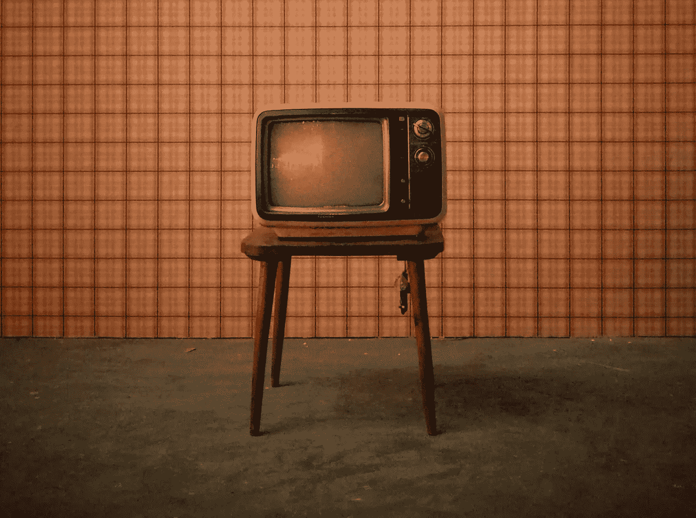

# 营销的未来已经成为过去

> 原文：<https://medium.com/swlh/the-future-of-marketing-is-in-the-past-db72cb96bf7a>

Originally published on [**JOTFORM.COM**](http://jotform.com)

他喜欢谈论工作。他喜欢抱怨他的老板。

> “已经快 2018 年了，但他仍然认为营销我们洗发水品牌的唯一方式是在电视上投放昂贵的广告。”

喝杯冰啤酒放松一下，我不介意花一晚上时间讨论我们的工作。