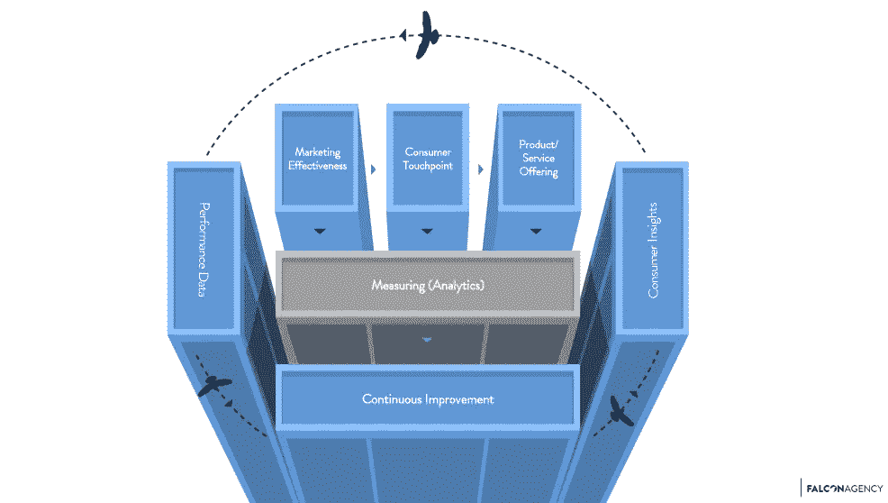

# 如何扩展你的电子商务业务:应用转换框架

> 原文：<https://medium.com/swlh/the-future-of-marketing-or-how-to-scale-your-ecommerce-company-1b93fd3cacd8>

在过去的十年里，我们与欧洲和 APAC 的 20 多家电子商务公司合作。我们的目标之一是创造一种方法，一种可以应用于任何电子商务公司的方法——独立于他们的行业。

多年来，我们开发并成功应用了一种叫做**猎鹰** [**转换框架**](https://entrepreneurship7.com/2018/08/09/how-to-scale-your-ecommerce-business-conversion-framework/) **的模型。**作为首席增长/营销/数字官，这个框架将帮助你发展业务。它已经在全球范围内帮助了多家其他高增长公司。

Figure 1: FALCON Conversion Framework

转换框架举例说明了营销效果、消费者接触点、产品和服务是如何相互联系的。如果你改变一个领域的一部分，它将对另一个领域产生计划内(或计划外)的影响。基于正确的衡量框架(通过性能数据和消费者洞察)，您可以应用转换框架来实现持续改进的目标。

我在 daily deal(2011 年 9 月被 **Google Inc.** 收购)工作期间，我们第一次开始发展这种思维，但在 [**FALCON**](http://www.falcon-agency.com) 公司，我们才开始完善并将其应用于多个客户。

通过研究许多成功的(和不太成功的)公司和品牌，我们了解到**没有单一的银弹**，但是有**无数的小改进**会累积成一个大的**胜利**。

**转换框架的力量**

首先，为什么我们认为转换框架如此强大？因为它有助于团队和部门向一星 KPI 看齐:**转化**。更多的转化。但是要达到这个目标，你必须知道为什么，尤其是你在哪里面临挑战。

在我们进入转换框架之前，让我们深入了解一下为什么我们需要一个新的模型。典型的(营销)模型通常是简化的或有缺陷的。他们只关注营销效果。或者查看用户界面(UI)或用户体验(UX)。或者从产品/服务的角度来看，我们如何通过更好、更快、更便宜的服务和产品来提高竞争力。因此，大多数模型没有一个整体的衡量标准或框架。

正如你所想象的，这些模型错过了消费者旅程中的重要部分，或者他们只看到了其中的一部分，而没有考虑依赖性和后果。你可以在你现有的营销模式上运行一个简单的例子，并检查你是否能立即找到所需的数据点:活动 A 对通过平板电脑/应用程序浏览但通过桌面转换的用户群 B 有什么影响，该用户群 B 对周二正在销售的 30 分钟内交付的产品提供折扣？如果你没有立即的答案，那么你应该考虑使用 **FALCON 转换框架**。

转换框架是一个基于定量和定性数据点的工具，旨在持续改进。重点是提高转化率。最终目标是使组织与此 star KPI 保持一致。

当你开始从一个更全面的视角看待消费者之旅时，转换框架会提高你的绩效。如果没有一个整体的分析框架，你会把它过于简单化。或者只关注旅程的特定部分(例如，我们如何改进入职流程中的第 4 步到第 5 步)。不要误解我。这些事情很重要。但是，孤立地工作，不从整体的角度来看，要理解你的消费之旅中的瓶颈在哪里是非常具有挑战性的。

让我们跳进**猎鹰** **转换框架**:

1.基础:要做到最好，你必须让每个人都明白这是一个分析性的、数据驱动的框架。我们的方法应该是‘你不能测量的，就不存在’。很有可能你总能追踪到与一个品牌的互动。是的，它可能不会总是 100%准确，但总是有(创造性的)方法来跟踪一些东西。或者至少考虑一下‘我们如何追踪这件事’。

a.例如:在 DailyDeal，我们能够跟踪我们的电视节目表现及其对 SEM 广告的影响，因为我们在电视节目的情节中使用了 3 个主要关键词来构建电视节目的内容。当有电视航班时，我们在我们的搜索量中看到这 3 个特定关键字(和/或其组合)的峰值，我们能够确定哪个用户群对哪个电视活动(在哪个电视频道和时间)的反应最好。那时候不可能把电视性能和 SEM 性能联系起来(现在可以了)。因此，我们进行了测试，发现我们可以跟踪一些我们认为“有价值”的信息(并且还可以根据调整后的客户获取成本确定正确的电视频道和电视航班组合)。

2.**人员**:你需要在组织中有一个“**拥有**这个模型的人。这通常是首席数字官**。他将确保您每周与相关的 C 级或主管举行会议，并确保会议有适当的准备和跟进。他还将记录应该运行的测试/活动。在这个周会上，你还需要负责营销效果( **CMO** )、消费者接触点(你的**首席产品**或**体验经理**)和服务/产品供应(你的**首席运营官** ) **)的人。**获得他们对每个测试/活动的认可不仅重要，而且重要的是他们知道你为什么运行某些测试或计划，并且他们可以将它带回他们的团队来执行。在最好的情况下，你可以让每个人都一致起来(例子 a)。在最糟糕的情况下，你会彻底沮丧(例子 b):**

**a.例子:在 FoodRunner(已被 foodpanda 收购)，我担任了 CMO 的临时职位，负责与我们的首席运营官(首席运营官)和首席产品官(CPO)召开每周**转换框架**会议。我在周一之前收集了所有相关的数据点(或者要求更多的定性数据点)，我们将会议安排在 TUE 的早晨，首先查看了我们上周活动的影响，并根据我们确定的一个瓶颈，为下周定义了 2-3 个新的测试或活动。最不被重视但实际上价值很高的一项活动是查看某件事情成功或失败的原因。并记录下来:)**

**b.这也可能是非常痛苦的:我们与一家餐饮连锁店和他们的电子商务部门合作，以扩大他们在 APAC 的业务。不幸的是，我们有一个非常慢(而且看起来不称职)的网络开发伙伴。实际上花了几个星期才运转起来。当我们运行测试或实验时，有 50%的问题是因为这个 web 开发合作伙伴。因此，三个部门(营销效果、消费者接触点和服务/产品供应)的“联合”是**关键**。**

**3.**收集**:**测量&分析**部分是本次活动的基础。如果你的跟踪和/或数据集是坏的。是的，那么围绕它的一切努力都将一文不值。因此，请确保您设置了跟踪工具，使用了正确的命名约定(这是每个内部&外部营销人员和合作伙伴必须使用的)!)并使您的 BI/数据仓库系统成形，这样您就不需要几天(甚至几周)来收集特定的数据点。除了性能数据(通常比较容易收集)，另一个重要部分是定性输入/数据点。**

**a.例证:在 **FALCON** ，我们帮助拓展了一家发展最快的 F & B 连锁电子商务商店。除了大部分营销效果和消费者行为数据外，我们还进行了每周一次的定性“神秘购物”测试。这帮助我们多次发现了消费者体验和/或运营中的瓶颈，并直接解决了这些问题，从而提高了转化率(尤其是通过更好的服务级别来提高客户保留率！)**

**4.**流程:**现在有趣的事情开始了，首先，你会看到消费者的旅程，并开始确定**在哪里**减缓了转化。你开始关注营销效果(你的用户获取、激活和保留活动)，深入研究特定的用户群，观察他们的行为。目标是识别模式:您想要识别特定细分市场(甚至是微细分市场)的模式，并考虑您提议的行动方案。这个提议的行动方案将是你下周的第一个考验。这个过程一直重复，直到你为接下来的一周开发了 2-3 个测试，并**记录**它。文档是关键，因为你不仅参考这些测试，而且知识开始具体化。每个人都可以很容易地参与以前(和即将到来的)活动。**

**a.例如:在 FoodRunner 上，我们看到一个特定的群体表现得很奇怪(也就是没有转变)。他们浏览了很多网页，看了一些餐馆，甚至把不同的食物放在他们的篮子里，但最终他们没有改变。经过测试，我们意识到马来西亚特定地区的经度设置是错误的，他们自动获得了 15%的运费。(在某些地区较高的交付费用背后有一个运营和财务逻辑)。这阻止了他们点餐。通过改变这一特定领域的要求，我们看到该群体的转化率提高了+50%。回想起来，这听起来很合理，但实际上，我们需要产品(改变交付算法)和运营(能够在 30 分钟内交付)的支持。我们在共享的经验教训文档中记录了这一学习，并在我们的跟踪工具中添加了注释，记录了引发这一提升的变化。**

**我个人最喜欢转换框架的一点是——随着时间的推移——你开始更多地理解和欣赏 3 个部门(营销、产品/技术和运营),尤其是它们的依赖性(以及一个变化对另一个变化的影响)。**

**因此，**猎鹰转换模式**最好的部分在于，它是**而不是**一个注重结果的**模式。因此，对每一个洞察采取行动(和测试)，反之亦然，关注**持续改进**。****

**这就是我们扩展电子商务业务的[框架:通过应用**转换框架**](https://entrepreneurship7.com/2018/08/09/how-to-scale-your-ecommerce-business-conversion-framework/) 。**

**有不同的型号吗？下面[连线](https://www.linkedin.com/in/max-f-scheichenost-1981733a/)让我知道你的想法！**

****

## **这个故事发表在 [The Startup](https://medium.com/swlh) 上，这是 Medium 最大的企业家出版物，拥有 352，974+人。**

## **在这里订阅接收[我们的头条新闻](http://growthsupply.com/the-startup-newsletter/)。**

****