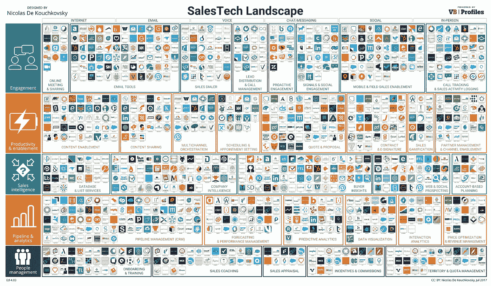
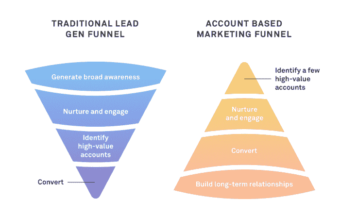
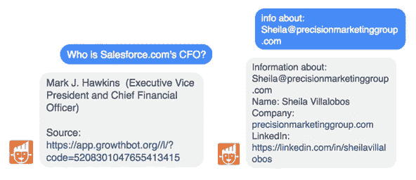

# 销售的未来:每个 B2B 销售代表需要的 6 项技能

> 原文：<https://medium.com/swlh/the-future-of-sales-6-skills-every-b2b-sales-rep-needs-f762e8f54726>

> “那么接下来发生了什么？”

上周六在地铁上，发现自己无意中偷听到了对面那群陌生人的谈话。正在讲述的故事是如此引人入胜，以至于我(几乎)错过了我的站，试图听到结尾。

故事对我们有这种影响。它们吸引我们，集中我们的思想，激发我们的情感。我们感受到个人的投入，并推动自己走向结果。

所以一个伟大的销售代表需要成为[一个伟大的讲故事者](https://www.tenfold.com/sales-performance/storytelling-in-sales)是有道理的。他们知道这是一个闪闪发光的叙述，而不是枯燥的，背诵的事实，为达成交易铺平了道路。

这是因为一个精彩的故事会引发“信任荷尔蒙”催产素[的释放。尽管我们对自动化](https://www.scienceofpeople.com/the-science-of-trust/)[痴迷](https://business.linkedin.com/sales-solutions/b2b-sales-strategy-guides/the-state-of-sales-report)，**信任** [**仍然是**](https://business.linkedin.com/sales-solutions/b2b-sales-strategy-guides/the-state-of-sales-report) **购买决策的头号驱动因素**。

但是 B2B 的格局正在呈指数级变化，仅去年一年就有超过 700 项 SaaS 销售技术发布。

公司拥有唾手可得的数据世界，不再依赖销售代表来启发他们。评级和在线评论主宰了互联网上的 T21，因此也主宰了决策者的选择。

但是今天成功的销售代表正在适应这些变化。在技术的支持下，而不是遮蔽下，他们正在创造新的和改进的故事。

以下是 2018 年值得关注的一些关键策略和趋势。

# 第一幕:了解你的观众

并非所有的前景都是平等的。知道瞄准谁、如何瞄准、何时瞄准至关重要。

> 如今，高度个性化的方法是一个先决条件，75%的潜在客户更有可能购买定制服务。

## 基于客户的销售

基于客户的销售/营销(ABS/ABM)是一种相对较新的策略，在技术的推动下，最近开始加速发展:Gartner [预测](https://blogs.gartner.com/todd-berkowitz/20161217-fearless_predictions/)ABS 将成为收入超过 500 万美元的科技公司的标准销售框架。

要点如下:在传统的销售/营销体系中，你撒下一张“大网”，捕捉许多小鱼。有了 ABM，你就可以用鱼叉——是的，去抓大鱼。

ABS 拒绝一刀切的思维模式。不是将每条线索都视为值得同样的投资，而是根据潜在的成功来评估客户。

然后，销售和营销(以及产品、财务和开发)将调整目标客户，以获得高度个性化的体验。

这种协作方式不仅有助于更全面地了解客户，还能统一各部门，简化销售流程。

这就是为什么 TOPO 首席执行官 Scott Albro [提出](https://www.heinzmarketing.com/2016/04/whats-in-a-name-account-based-marketing-vs-account-based-everything/)术语“基于账户的一切”。

总而言之，ABS:

*   **生成最佳前景**(低价值的销售线索被过滤掉)
*   **获得最高的投资回报率**(当客户信任你时，他们更有可能选择交叉销售和追加销售)
*   **创造成本效益**(不浪费资源)
*   **建立和培养长期关系**
*   **减少 PPC 支出**
*   **易于追踪**

你可以开始通过像 [Datanyze](https://www.datanyze.com) 或 [LeanData](https://www.leandatainc.com) 这样的平台收集见解和衡量参与度。

## 数据分析

只有 53% 的快速增长的公司声称在利用分析进行决策方面是有效的。这表明拥有数据分析知识的销售代表有巨大的未开发潜力。

> “在开始漫长且可能毫无结果的对话之前，你可以知道谁会购买——通过了解你的买家采取的行动，”
> 
> -约翰·谢勒，Appcues 的销售总监。

数据分析至关重要，因为它能带来直截了当、切实可行的见解。

*   你的决策者对什么感兴趣，他们是如何操作的？
*   他们在买什么，在哪里做广告？
*   *什么曾经对他们有效，什么却一落千丈？*
*   他们的预算是多少？

这些问题的答案打开了一个充满机遇的世界。

在这方面，今天的客户关系管理变得越来越复杂；通过提供对潜在客户数据的共享访问，像 [HubSpot](https://www.hubspot.com/) 这样的软件成为团队(超越销售)合作使用的关系中心。

[越来越多的聊天机器人](https://www.hubspot.com/stories/chatbot-marketing-future)也赋予了未来成功的销售人员力量。

以我们的数字助理 [GrowthBot](https://growthbot.org) 为例，它可以帮助你找到潜在客户(以及[竞争对手](https://blog.growthbot.org/how-to-make-competitive-intelligence-your-competitive-advantage))的关键信息。

试着问“什么是软件？com 使用？”或者“在点击付费上的花费是多少”？

预测你的潜在客户的下一步行动提供了真正的战略价值(并可以防止董事会的失误)。反过来，这些知识会让你展示(而不是列举)一个产品对他们有多么独特的价值。

# 第二幕:吸引他们

千禧一代(别忘了 Z 世代)正式接管，带来了一系列全新的期望。在他们花费时间的所有渠道上建立存在是关键。

对于这些数字原住民来说，持续的连接是必备的:

> [84%](https://www.salesforce.com/blog/2018/01/sales-trends-for-2018.html) 的千禧一代商务买家期望与公司进行实时互动。

## 全渠道和社交媒体

适用于 B2C 的[全渠道](https://blog.hubspot.com/customer-success/omni-channel-experience)策略同样适用于 B2B:领先的零售商在网上、在 Messenger 上、在收件箱里——以及在社交媒体上。

社交销售划分了销售世界:一些人认为这只是一个时髦词，另一些人认为这是未来。

但如果你认为社交应该留给营销人员，那就再想想吧:

> 78%使用社交销售的销售人员表现优于他们的同行。
> 
> 通过员工社交媒体活动开发的潜在客户转化的频率增加了七倍。
> 
> 四分之三的 B2B 买家依靠社交媒体与同行讨论购买决策。

是的，社交媒体有助于建立联系和潜在客户网络。

B 但这也让销售代表能够更好地了解和联系他们的客户，获得行为数据和购买信号:*潜在客户在哪里遇到了痛点，他们的公司发生了什么，他们在工作中的职责是什么？*

这些[信息](https://blog.growthbot.org/why-chat-should-be-part-of-your-b2b-or-b2c-marketing-strategy)增加了对话的价值，并引导销售过程一直到购买后。

最后但同样重要的是，客户经常使用社交媒体来分享他们的观点和发泄不满。

越多的销售代表能够密切关注市场，他们就越有能力减少客户流失。

它也不需要耗尽你的工作日:

> B2B 代表只需要投入 [5%的时间](http://cdn2.hubspot.net/hub/166003/file-25222284-pdf/docs/social_media_sales_quota.pdf)就能在社交方面取得成功。

在这种情况下，有数百种工具。

*   像 [Hootsuite](https://hootsuite.com) 和 [Buffer](https://buffer.com/app/profile/59fb11c8cfb44b360ea59991/schedule) 这样的平台是安排内容和跟踪分析的必需品。
*   [Linkedin 销售导航](https://business.linkedin.com/sales-solutions/sales-navigator#)是对外销售的关键，而 [BuzzSumo](http://buzzsumo.com) 是追踪趋势的绝佳工具。
*   欲了解更多信息，Saleshacker 的[社交销售指南](https://www.saleshacker.com/social-selling-guide/)中有一个完整全面的工具和技巧列表。

# 真实的对话

这是 lead generation 过去的样子:放弃一条有价值的内容…以换取大量的个人数据，这些数据被埋在一个永无止境的表格下。

基本上，用赎金来挟持潜在买家，而不是简单地交付价值。

[漂移](https://www.drift.com)的丹尼尔·墨菲解释道:

> “在给潜在客户提供答案之前问他们一大堆问题，感觉不太好。所以我们不做。”

内容门控的替代方案？[实时聊天](https://blog.growthbot.org/why-chatbots-will-change-marketing-as-we-know-it)。

促进实时的双向对话可以让客户在合适的时候以他们自己的方式与你联系。

通过自动化简单的查询，销售代表有更多的时间来处理关系建立的复杂方面。查看[自动机](https://www.automat.ai)或[对讲机](https://www.intercom.com)开始使用。

# 第三幕:给他们惊喜

我们的大脑[通过四个简单的原则运作](https://www.amazon.com/dp/B004H4XL7E/ref=dp-kindle-redirect?_encoding=UTF8&btkr=1):

1.  如果不危险，就忽略它。
2.  如果不新鲜，不刺激，就忽略它。
3.  如果*是*新的，尽快总结一下，忘记细节。
4.  除非真的出乎意料，否则不要把它送到大脑皮层去解决问题。

显然，要吸引我们的注意力需要付出很多——尤其是在推销和寻找潜在客户方面。

买家可以通过 5 分钟的谷歌搜索找到他们需要了解的关于产品的一切。为了吸引他们，你需要用未知和意想不到的东西来诱惑他们。

## 挑战者销售

你可能已经听说过[挑战者销售](https://www.amazon.com/dp/B0052REP7K/ref=dp-kindle-redirect?_encoding=UTF8&btkr=1)，但是由于它的[辉煌的](https://www.cebglobal.com/insights/challenger-sale.html)历史记录，这款车仍然和以前一样重要。

> “我们将在 2018 年看到的最重要的销售技能再次是挑战销售。
> 
> 关系构建者的方法正变得越来越低效:潜在客户想要可操作的洞察力。"
> 
> -本·科顿，EMEA 销售支持高级经理。

基本上,“挑战者”代表会教育他们的潜在客户，挑战他们的假设，并迫使他们以不同的方式思考。

虽然有些人不同意挑战者模型对关系建设的忽视，但核心信息是至关重要的:发现颠覆性的想法和独特的见解会创造无与伦比的价值，并将重新吸引买家的注意力，使其与你的产品保持一致。

为了更轻松的阅读体验，请查看[挑战者销售总结](https://cdn2.hubspot.net/hub/250707/file-1162462172-pdf/offers/Challenger-Sale-Summarized.pdf)。像 [Revegy](https://www.revegy.com) 和 [CEB](https://www.cebglobal.com/insights/challenger-sale.html) 这样的平台提供基于挑战者销售的见解、软件和解决方案。

## 视频勘探

电话推销似乎很古老。看起来冷邮件也是如此，平均打开率为 1%。

另一种选择？通过个性化的潜在客户视频使流程人性化。

在我们不断收到大量文本邮件的环境中，视频确实很突出。我们看到的不是打开电子邮件看到的复制粘贴工作，而是一个真人。这很有效:

> [59%](https://www.forbes.com/sites/forbesagencycouncil/2017/02/03/video-marketing-the-future-of-content-marketing/#34058f326b53) 的公司决策者宁愿看视频，也不愿看文章或博客。

当 [Wistia](https://wistia.com/solutions/sales) A/B 对有视频和无视频的电子邮件进行测试时，他们发现有视频邮件的点击率提高了 300%。

eps 可以使用视频连接新的销售线索，说服决策者并抢先回答他们的问题。视频允许大规模的令人敬畏的产品演示，并能为无聊的提案注入激情。

没人期待导演级别的技能。有很多为没有技术知识的营销和销售团队设计的简单视频平台，比如 [Vidyard](https://www.vidyard.com) 、[、](https://wistia.com)、 [Soapbox](https://www.soapbox.co.uk/about/) 、 [Loom](https://www.useloom.com) 。

在视频发布后，您可以使用这些工具来记录、编辑和跟踪视频的性能。

# 只要记住…

虽然技术是重要的一章，但对销售故事来说，没有什么比人才更有价值。事实上，[销售成功故事播客](http://top1.fm/)主持人斯科特·英格拉姆认为，未来我们会看到*更少的*自动化。

> “经过几年的自动化和规模化，我认为钟摆将开始摆回基于相关见解和价值的更多人类互动。”

讲故事可能听起来很老套，但这正是它的强大之处。

一个好的故事依赖于人类独有的特质:同理心、情商和信任。正如 HBR 的[哈里森·莫纳斯](https://hbr.org/search?term=harrison+monarth)完美地[总结](https://hbr.org/2014/03/the-irresistible-power-of-storytelling-as-a-strategic-business-tool)的年代:

> 数据可以说服人，但不能激励人行动；要做到这一点，你需要用一个激发想象力和触动灵魂的故事来包装你的愿景。

感谢阅读。

> 如果你喜欢这篇文章，请随意点击那个按钮👏帮助其他人找到它。

【blog.growthbot.org】最初发表于**。**