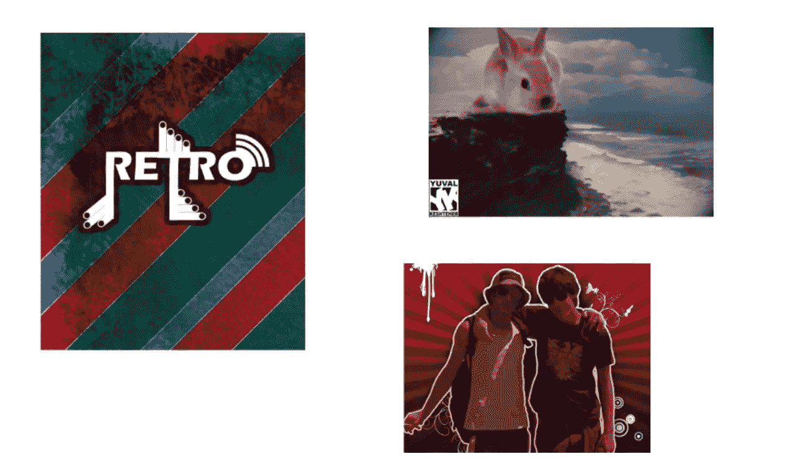
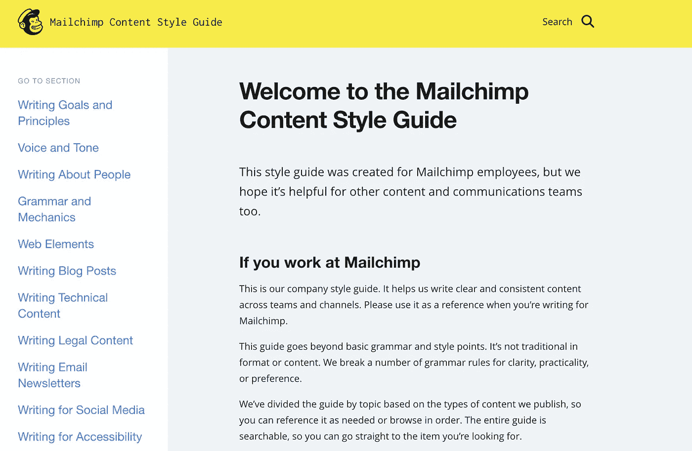
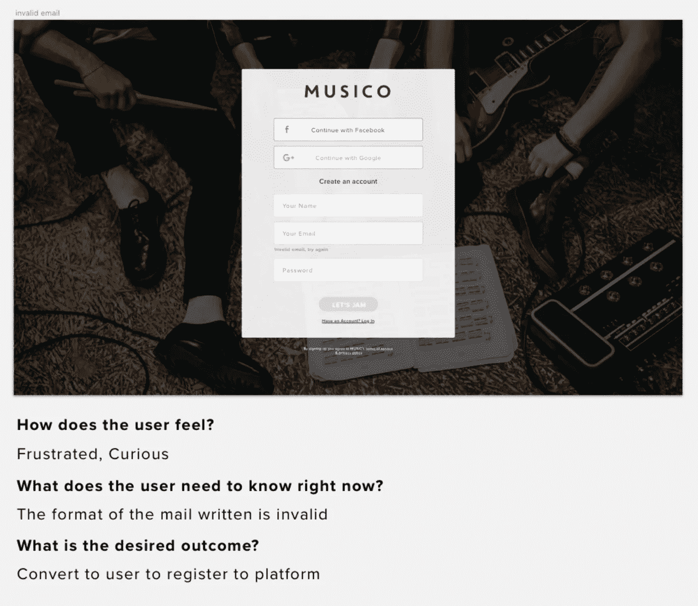
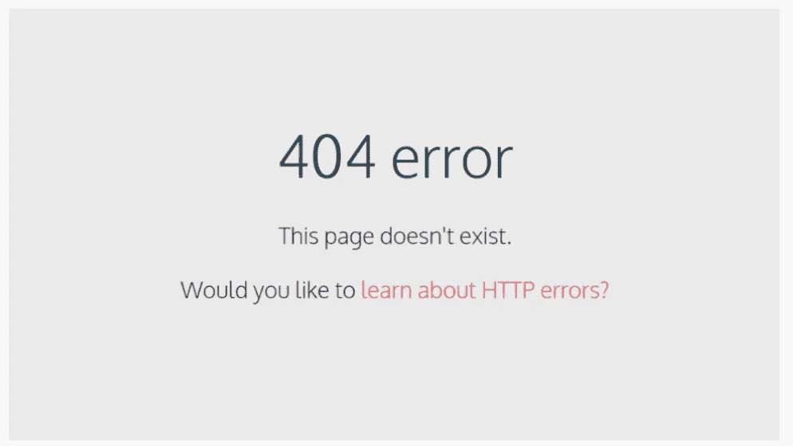

# UX 写作的未来——UX 写作中心创始人尤瓦尔·凯什彻访谈

> 原文：<https://medium.com/swlh/the-future-of-ux-writing-interview-with-yuval-keshtcher-founder-of-the-ux-writing-hub-5669e41a44a1>

缩微复制现在绝对是个时髦词。我不相信没有沟通的设计，对我来说，沟通意味着文字+图像+互动。

我真的很好奇如何提高写作和交流，你有机会看到一个采访，UX 设计师问一个 UX 设计师关于 UX 写作的问题。认识一下 UX 写作中心的创始人尤瓦尔。

# **你是如何接触到 UX 设计和 UX 写作的？**

当我 14 岁的时候，我下载了 photoshop 来创作各种各样奇怪的图形，同时跟随大概所有的在线教程，这些教程是 20 世纪早期的互联网必须提供的。

只是在我服完兵役后(是的，在以色列这是强制性的，我在特种部队服役过)，我才把它严肃地放到职业道路的高度。我在一家酒吧当酒保，这家酒吧正在寻找一名平面设计师来制作海报。

我的报酬只有 10 美元，但那是我第一次意识到人们真的会付钱让我做那种事情。

我做了一段时间的平面设计，爱上了一个女孩，和她一起走遍了世界，回到了以色列的家乡，我想通了，如果我要成为一名设计师，我必须追求一个对人们的生活产生影响的设计师职业，让世界变得更好。

在某个时候，我得到了一个关于创建在线教育平台的项目。就在那时，我意识到我对创造体验一无所知，所以我决定深入 UX 领域。

我参加了所有可能与 UX 相关的课程，甚至在某个时候学习了前端编程，这增加了我的设计操作技能。用像素和文字设计和解决问题是我在这个世界上最喜欢的事情。

作为一个焦虑的人，我总是考虑最坏的情况。在其中一个场景中，我想象了一个未来，用户界面设计将不再是一个东西，将被人工智能所取代。

**然后它击中了我。**

在这种类型的未来，我们的大多数界面将是语音界面。完全隐形，就像电影《她》中乔阿金·菲尼克斯爱上他的操作系统一样。

> 然后我意识到，为了创造这种数字体验，可能需要有人来写，并围绕它创造一个完整的主题和故事。

不再有像素完美的推动者，设计的未来属于叙事的创造者，那些讲故事的魔术师，这些人必须是完全的语言大师，或者换句话说，我发现用户体验的未来属于作家。

# 你使用过 UX 的研究方法吗？

UX 研究是任何产品团队的支柱。这是我们创造数字体验时所依赖的数据。即使你根据直觉设计一个产品，你也会使用一些基于你作为一个人的过去经历的数据。

例如，Airbnb 的 UX 人会跟踪旅行者“穿他们的鞋走”,并为他们创造尽可能好的体验。一个很好的例子是，在他们的搜索过滤器中，在便利设施部分出现的第一个参数是“洗发水”。

作为一名产品设计师，我永远不会想到让用户通过洗发水参数来过滤他们的公寓，当然我也不会把它设计成 Airbnb 搜索栏的第一个参数之一。

我的猜测是，Airbnb 的团队进行了非常好的研究，以找出很多人关心洗发水的参数，所以他们包括了它。一个辉煌和意想不到的设计！现在关心它的人可以很快找到它，甚至不用考虑它。

这就是研究的力量，而且是不可替代的！

正在开发新兴市场应用程序的优步人，实际上是去了印度，坐了一整天的出租车，为了弄清楚那种体验是什么感觉。

您可以创建数百万个角色、用户旅程、假设和设想。

> 最终，如果你不能解决现实世界中人们的现实问题，你就是一个糟糕的设计师。在你的研究中投入时间和金钱。

# 现在一个理想的 UX 设计师——你能描述一套技能吗？

我会稍微改变一下 UX 设计师的术语。

最好的产品团队是由许多具有不同专业水平的产品设计师创建的。

一个产品设计师是文字大师，一个是研究专家，另一个可以创建漂亮的屏幕，还有一个可以用前端代码编写他们的逻辑。所有这些都由首席产品设计师管理，也就是我们今天所说的产品经理，他负责在用户需求和利益相关者的目标之间建立一座桥梁。

所有这些专业人员都有一个共同的能力，那就是知道用户需要什么，这基本上意味着他们最终都会负责产品的体验设计。

# **你认为什么样的设计流程可以获得最好的缩微拷贝？**

在我的 [UX 写作课程](http://uxwritinghub.com/)中，我教授内容优先的方法。

Lorem ipsum 已经死了，我们应该在早期阶段研究语言，并在设计线框之前，根据我们的内容创建产品的所有信息架构。

很多产品团队用基于不同方法论的设计系统来设计他们的应用，比如 Brad Frost 的[原子设计](http://bradfrost.com/blog/post/atomic-web-design/)。
就像设计师定义适用于他们产品的设计系统一样，UX 作家定义他们产品的内容风格指南。然后，他们可以创建线框，将内容与设计者放在一起。
即使您的公司有 5 种不同的产品，内容风格指南也会确保所有这些产品的声音和语气都是相似的。

我最喜欢的内容风格指南是由[邮件猩猩](https://styleguide.mailchimp.com/)创建的

创建内容风格指南有很多技巧，我在[我的课程](http://uxwritinghub.com/)中也教过，也很有趣！

# 你最大的成功案例是什么？

我觉得我是一个产品设计师，让其他作家和世界其他地方更容易接触到 UX 写作领域。

其实挺神奇的。我教来自世界各地的人们如何编写用户体验，创建 UX 写作作品集和 UX 设计方法论，然后在一天结束时，当我看到他们的工作时，我为他们的表现而激动。

我个人在 microcopy 方面最大的成就是彻底分析了这个市场，在过去的几年里每天都在我的脸书社区 [Microcopy & UX 写作](https://www.facebook.com/groups/microcopy/)上发帖，这个社区已经发展成为世界上最大的 Microcopy 讨论组，接触并采访了几乎每一位来自公司的资深 UX 作家，例如[谷歌](https://blog.prototypr.io/interview-with-a-ux-writer-from-google-d465275109f0)、[预约](https://blog.prototypr.io/interview-with-a-senior-ux-writer-from-booking-com-6956bbc49bab)、 [Fiverr](https://blog.prototypr.io/talking-microcopy-writing-ux-interviews-fiverr-2f591353cbc2) 关于他们的流程，向以色列政府的数字部门讲授 Microcopy， 在世界各地的会议上谈论 UX 的写作方法，我开发并帮助产品团队执行这些方法，同时为来自世界各地的 UX 作家创建官方中心。

这些天来，我还创作了 UX 写作视频课程、UX 写作[拆卸](https://www.slideshare.net/yuvalkeshteher1/fiverr-ux-writing-teardown)和许多内容，这样更多的人可以真正学习如何做。

我的团队中有一位内容本地化专家、语音界面设计师、内容风格指南专家，还有许多人帮助我探索更多方法，以适应不断发展和激动人心的 UX 写作领域。

# 难道你不害怕 microcopy 不是一个大的 UX 案件，因为人们只是扫描内容吗？

简而言之，没有。

自古以来，人们就使用语言和文字来相互交流。我们在这里谈论穴居人的日子！

人们可能会浏览，但是没有内容和上下文，界面是没有用的。

看看 Dropbox 的首页没有内容，告诉我你现在怎么看？

# 给我们一个你为用户创造微愉悦的方法的例子？

在领导 Musico.io，**的产品设计时，我开发了一种创造清晰、简洁、有用的体验的方法。**

**基本上，我们在设计文件中创建了一个移情图，在每个屏幕下问了 3 个问题:**

> 用户是什么感受？
> 
> 用户现在需要知道什么？
> 
> 期望的结果是什么？

在设计每一个屏幕时回答这些问题，帮助我为那个特定的产品设计更清晰、简洁和有用的体验，它是音乐教师和学生的协作工具。

# 你建议如何测试副本？你对此有什么建议吗？

有很多分析工具可以帮助我们测试我们的文案。比如我们连接了 Hotjar，这是一个为我的一个客户展示用户点击你的产品的热图的工具，这是一个大学生的教育平台。

在查看热图时，我们发现其中一个最重要的按钮不够清晰，所以人们没有按下它。这就是为什么我们改变了文案，使其更加清晰。

总的来说，我的信念，就像在 UX 设计中一样，是在收集这种类型的数据时有太多的变量，所以我们不能仅仅依赖于此。

测试文案和设计的最好方法是和我们的用户交谈。

# UX 写作是新的必备技能吗？

写作就是写作。

你可以是创意作家、内容作家、SEO 人员、小说作家，以及任何你选择成为的作家。

UX 写作只是写作的一个分支，也是作家在科技领域工作并通过创新赚很多钱的一个好方法。

听起来是个不错的交易，对吧？

# **关于如何更好地处理系统错误，你有什么想法吗？**

总的来说，对于每一种类型的 UX 写作来说，想法都是要弄清楚如何以一种创造性的和令人愉快的方式为用户解决问题。

我最喜欢的 microcopy 错误消息之一是 codecademy，这是一个帮助你学习如何编码的平台。

当收到一条错误消息时，他们会把你送到一个教授 HTTP 错误的课程。对于用户来说，这是一个很酷的解决问题的方法！

# UX 写作是一种趋势吗？

我不会说这是一种趋势，但设计的未来是为用户创造高度定制的体验。弄清楚用户使用我们的应用的背景。

是用户第一次进入是从桌面进入，还是用户第五次通过手机 app 进入？

不同的环境意味着不同的体验，我相信在未来几年我们会看到更多像这样的定制体验。

# 你从哪里寻找写作灵感？

当我发现 UX 的写作灵感没有容身之地时，我为此开设了一个 facebook 群组。最简单的方法是总是在群组上发帖，等待其他社区成员的精彩回应。

当进行 UX 写作研究时，检查你的用户在哪里是一个好主意。

看看脸书小组，甚至亚马逊评论，以便了解如何以更好的方式与你的用户沟通。另外，我读了很多。Dropbox 的 [UX 写作团队所写的一切都是必读的，例如。](http://uxwritinghub.com/learn-ux-writing-with-roxana-ux-writing-manager-at-dropbox/)

# **你对没有经验的 UX 作家有什么建议？**

学习 UX 方法论。掌握调研、产品开发流程，甚至知道如何操作设计工具。

找出你日常使用的应用程序必须解决的问题，解决这些问题，并在你的 UX 写作文件夹中展示你的解决方案，以获得你的第一次 UX 写作机会。

# 你如何看待 UX 未来 30 年的写作？

在某个时候，我们认为是人的东西和我们认为是机器的东西之间的界限将慢慢消失。

不管我们愿不愿意，人们越来越依赖科技，科技正在改变我们的大脑。

例如，当我们像今天这样全天候访问谷歌地图时，我们大脑中负责导航的部分变得毫无用处，这没什么！这就是进化，这意味着我们不再像过去那样需要它了。

我们大脑的不同部分也在进化。

有朝一日，连接到互联网将在我们的身体中实现，这将使我们成为某种类型的增强超级人类，一个世界上从未有过的新物种。

数据为王，越多的数据连接到我们未来的人类版本，它就越超级。

识别机器人是否是人类将变得不可能，我们将无法再识别人类中的人性。

可怕的东西。如果设计师和作家滥用我们今天所知道的技术，这种未来可能是黑暗的。

即使在今天，你也可以看到许多企业产品设计师滥用 UX 设计，让人们沉迷于他们的平台，或者让他们的用户相信他们想要的东西，否则他们永远不会得到。

这就是为什么我的人生使命之一是提高对道德设计的认识，这种设计不会扰乱人们的思想，但实际上会让他们的生活变得更好，我相信我们必须有很多设计师和作家持有这种观点，以便为我们的孩子创造更光明的未来。

> UX 写作和产品设计的未来取决于引领它的先锋们。让我们确保我们的未来掌握在正确的人手中。

## 这篇文章发表在[《创业](https://medium.com/swlh)》上，这是 Medium 最大的创业刊物，有+404714 人关注。

## 订阅接收[我们的头条新闻](http://growthsupply.com/the-startup-newsletter/)。

