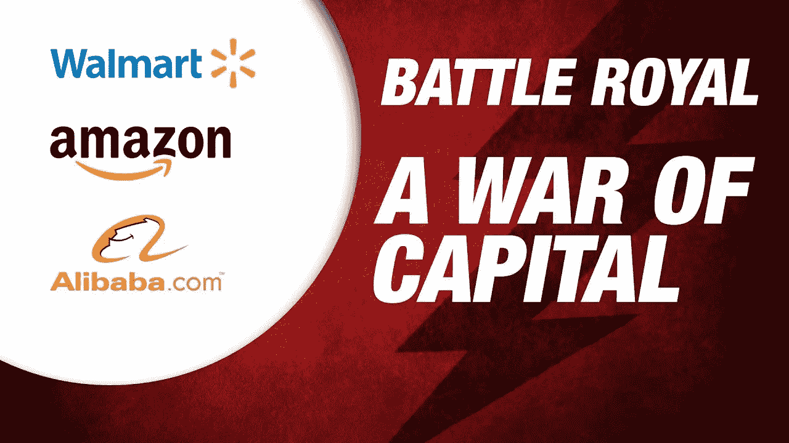

# 电商巨头的博弈:亚马逊 vs 沃尔玛 vs 阿里巴巴

> 原文：<https://medium.com/swlh/the-game-of-e-com-giants-amazon-vs-walmart-vs-alibaba-2fe21e92ed99>

你看过《黑镜》系列吗？奢侈的，引人入胜的，真正巨大的融合了科幻和超高科技的未来主义想法正在到来。他们是敲你窗户的无人机，带着一束从 Amazon Prime 买的新鲜欧芹。他们是智能助手(例如 Alexa、天猫)，向你推销转基因的永不蠕动的苹果。它们是人工智能聊天机器人的建议，你很难从人类的建议中辨别出来。

他们是未来。这个未来就在我们的指尖。

Pic: [https://goo.gl/gznzJp](https://goo.gl/gznzJp)

# **亚马逊**

亚马逊欧盟零售副总裁 Xavier Garambois 表示:“ ***创新是亚马逊 DNA*** 的一部分，在过去的 15 年里，我们一直在不断增加和完善技术，以增强和改善我们所有客户的体验。”。

## 亚马逊 Go

这是一家由内置人工智能和复杂图像识别软件的摄像头全程监控的商店。CNN [揭开](https://edition.cnn.com/2018/10/03/tech/amazon-go/index.html)三人组出现在西雅图和另一个出现在芝加哥的原因。

亚马逊五年前开始致力于零售店，着眼于消除消费者的痛点。Amazon Go 的亚马逊副总裁 Dilip Kumar 说:“不断出现的一个问题是，人们不喜欢排队等候。

因此，现在你有一个空的商店，只有早期贡献的收银员、收银机或自助结账台的幽灵般的照片。你对顾客的体验始于安装应用程序，登录你的亚马逊账户，在你经过商店门口的十字转门时扫描个人条形码。然后你拿着你想要的东西出去，在十字转门处自动为它开账单。稍后，你的应用程序会收到你的购物收据和在商店花费的时间。10 美元，50 分钟，不用排队。如果你犹豫要不要做出选择，人工智能还会建议你买什么产品。

简单的方案——复杂的方法。

Pic: [https://goo.gl/BCwM8z](https://goo.gl/BCwM8z)

但是，像往常一样，问题就出现在创新的地方。

在 Amazon Go 的情况下，**数据隐私**应该是一个问题，因为亚马逊希望在入口处转向**生物识别**来识别人。200 位生物特征数据、个人偏好和行为模式将被收集到亚马逊云中，以改进算法并为商店提供更好的客户便利。

另一件事是，免结账购物的便利和个性化的提示推动了商店之间的竞争。因此，沃尔玛和微软的合作将会越来越频繁，此外，像 Zippin 这样的硅谷初创公司正在开发可以引导顾客找到任何库存商品的技术。

商店的其他功能可能包括增强现实隐形眼镜，可以可视化产品选项的利弊，或者根据您目前的支付能力为产品自动定价。

亚马逊在棋盘上走了一步。

Ecom 巨头的游戏里沃尔玛后仰是什么？

# **沃尔玛**

## **扫描并运行**

这是一项类似于亚马逊的举措。Scan & Go 应用程序[允许顾客](https://www.supermarketnews.com/news/walmart-pulls-plug-mobile-express-scan-go)在购物和直接通过手机支付时扫描和打包物品，包括农产品，而不必在收银台排队。该应用程序安全地存储信用卡或借记卡信息，一旦客户完成购物并付款，他们只需在离开时走过移动快递通道。

然而，截至 2018 年 5 月，该公司已经对该应用程序进行了封堵，但山姆俱乐部的商店除外，并表示该应用程序不受欢迎，对大篮子无效。这发生在亚马逊 Go 的扩张浪潮中，对沃尔玛来说是悲哀的。

但是沃尔玛已经开始挣扎了。它推出了**现场顾客结账服务**——**跟我结账**。它的好处主要是关于*“抓住阳光的机会”*:在地板上检查顾客。由于采购的规模和重量，沃尔玛的工程师最需要“草坪花园中心”的顾客使用这些设备。

TechCrunch [报道称，这项被沃尔玛称为“和我一起结账”的新服务要求商店员工戴上一个装有蓝牙收据打印机的小手提箱。他们的移动设备充当交易的条形码扫描仪和信用卡刷卡器。](https://techcrunch.com/2018/04/19/walmart-launches-check-out-with-me-for-on-the-spot-checkouts-in-hundreds-of-u-s-stores/)

你再也不用在停车场和商店之间做出选择了。眨眼之间一切都完成了。

不错的选择——高竞争力。

Pic: [https://goo.gl/vxJp7p](https://goo.gl/vxJp7p)

亚马逊和沃尔玛确实步调一致。

亚马逊 Prime = Jetblack

高级机器人=波沙·诺瓦机器人

但这不仅仅是歌利亚对大卫的故事。他们都有亚洲同行，推动令人眼花缭乱的技术智能的东西。阿里巴巴在这场游戏中做出骑士的举动吗？

# **阿里巴巴**

从规模开始，应该提到的是，根据麦肯锡全球研究所的数据，去年大约 42%的全球电子商务交易发生在中国。

中国政府的兴趣、支持、投资和承诺为科技巨头收集和测试大量中国人口的人工智能创新数据铺平了道路。在这片沃土上，阿里巴巴构成了最大的变化。

## 时尚 AI

在不远的将来，时尚趋势将由阿里巴巴集团等人工智能驱动的公司决定。Pull&Bear、Mango、Zara 可能会为应用商店中的时尚产品植入付费。我对你在这个问题上的想法感兴趣。这种事态是不是不可避免？

据 Alizilia 报道，阿里巴巴推出了第一家“FashionAI”概念店，该店广泛使用人工智能(AI)来简化客户的服装购物体验。顾客在店内的体验通过试衣间的**智能镜子**得到改善，智能镜子会向顾客提供尺寸、颜色、配饰的建议，并自动显示顾客正在互动的商品信息，并要求顾客直接从试衣间试穿更多商品。

更重要的是，**【虚拟衣柜】**有望集成到手机淘宝 app 中。这种购买衣服的方式比时尚大师们想象的要彻底得多。

Pic: [https://goo.gl/sp1aUf](https://goo.gl/sp1aUf)

# 赢家还是输家

所有人和所有人。这场游戏不会有赢家。实际上，他们玩的游戏的结果应该是促进还是不促进消费者的福利，我们的福利。因此，这不是关于竞争和“丛林法则”，而是关于我们在退出时的收益。是我们在和他们比赛。潜移默化地。

另外，如果你对电子商务感兴趣(如何开展你的电子商务业务/电子商务的基础知识是什么),请访问我的[网站](https://finmodelslab.com/e-commerce-financial-model/)。

P.P.S .如果你喜欢这个故事或者觉得它很有知识性，请为它鼓掌:)

感谢阅读！在这里加入我:[脸书](https://www.facebook.com/finmodelslab/)，[中](/@finmodelslab)，[推特](https://twitter.com/FinmodelsLab):)

## 这篇文章发表在 [The Startup](https://medium.com/swlh) 上，这是 Medium 最大的创业刊物，拥有+387，966 名读者。

## 在这里订阅接收[我们的头条新闻](http://growthsupply.com/the-startup-newsletter/)。

