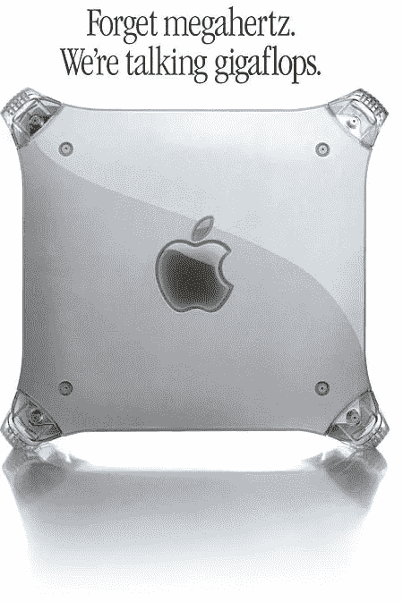
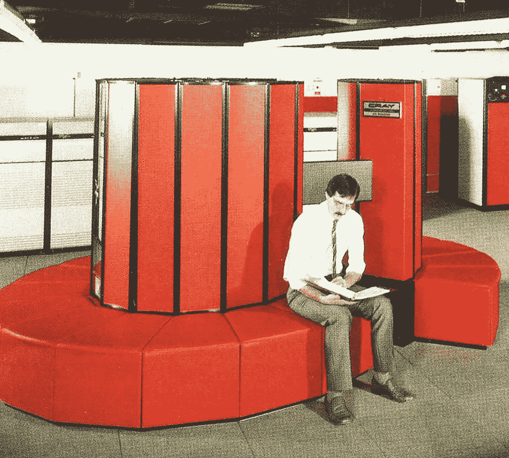
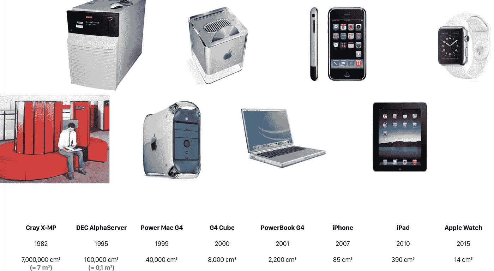
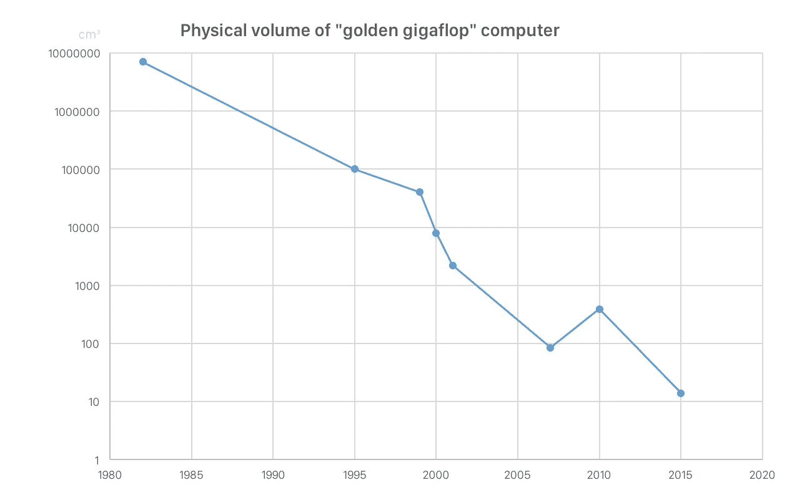
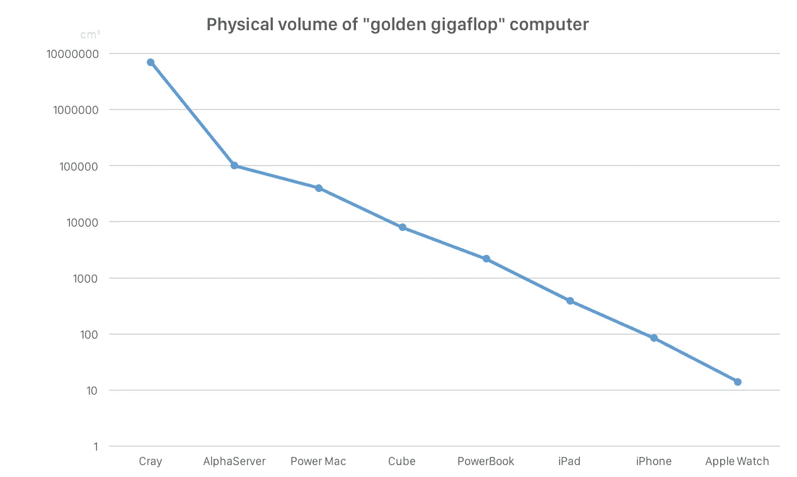
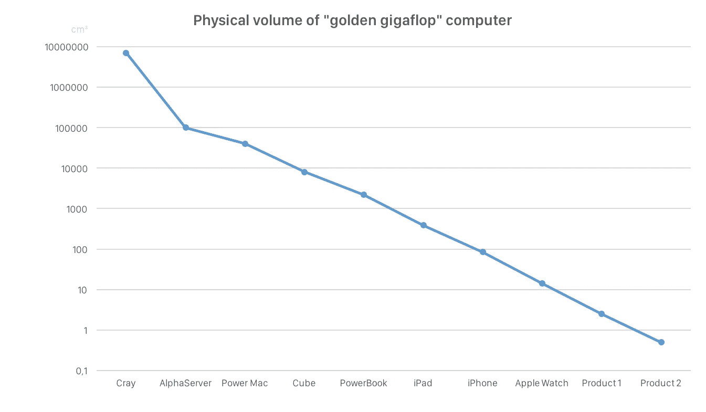

# 金色的 gigaflop:苹果不断萎缩的性能最佳点

> 原文：<https://medium.com/swlh/the-golden-gigaflop-apple-s-shrinking-performance-sweet-spot-e1be50ff88d7>

gigaflop 是一个有趣的测量单位名称。不难想象回到未来的 Doc Brown 用这个词来描述一个被摧毁的时间线和无尽的糟糕后果的噩梦场景:*“这可能会引起几十亿次的时间冲击波！”*(他当然会念成[【jigoflop】](http://wheels.blogs.nytimes.com/2008/04/08/you-say-gigawatt-i-say-jigowatt/))。)

实际上，flop 代表“浮点运算”，每秒十亿次 flop 就是一个千兆次 flop。当谈到 flops 时，我们测量的是硬件设计在一秒钟内可以执行的理论最大计算次数。这不是一个很好的衡量 CPU 性能的方法，因为它完全忽略了现实世界中的考虑因素，比如“那些操作实际上在做什么？”以及“我们如何将那么多数据放入 CPU？”…但翻牌很容易统计，所以它们已经存在了几十年。

苹果一度非常喜欢 gigaflops，以至于他们围绕它开展了一场广告宣传活动:

In 1999–2002, PCs had more than twice the megahertz compared to Macs.

你再也看不到苹果谈论 gigaflops 了。如今翻牌王都是 GPU。NVidia 目前的高端图形处理器可以完成超过[6000 千兆次浮点运算](https://en.wikipedia.org/wiki/List_of_Nvidia_graphics_processing_units#GeForce_900_Series)。(是的，显卡确实比 20 世纪 90 年代末自豪地宣传其失败的专业 Mac 快几千倍……但警告是，释放这种性能需要软件适应 GPU 模型，这通常是一项艰巨的任务。)

当 gigaflops 最初成为热门商品而不仅仅是理论上的猜测时，领带很流行，红色皮革很酷，神话中的 giga flops 机器大到可以兼作沙发:

The Cray X-MP, introduced in 1982, reached gigaflop performance in 1986.

克雷计算机在 1986 年花费了大约 1400 万美元。苹果购买了其中一台，原因尚不完全清楚(然而，史蒂夫·乔布斯刚刚走进克雷购买这台机器的传言显然是假的)。

到 90 年代中期，一台装有多个 DEC Alpha CPUs 的服务器计算机可以处理一次千兆次浮点运算。几年后的 1999 年，Power Mac G4(如上广告所示)终于将苹果的硬件带入了 gigaflop 领域。

但是后来发生了什么呢？事实证明，千兆次计算机并不是历史的遗迹。相反，苹果发布了几款性能大致相同的电脑，但体积不断缩小:

1999 年的 Power Mac G4 大约为 40，000 厘米(2，440 立方英寸)。
2015 款 Apple Watch 约 14 厘米(5/6 立方英寸)。

然而，在某种意义上，它们是同一台计算机。这就好像苹果以大致相同的性能水平开始每一款新产品，然后让产品的性能按照摩尔定律增长。因为每样东西都需要一个品牌名称，所以我将把这个叫做苹果的金色大失败。

> 技术方面:我对硬件规格不太了解。高端 G4 型号实际上可以完成几十亿次浮点运算，而第一代 iPhone 却达不到一次。“golden gigaflop”不是一个具体的衡量标准，更像是一个性能类别和一个设计目标。(此外，“黄金”品牌有被过度销售的历史。不管大众科学想让你相信什么，T2 黄金比例并不是所有古典艺术的基础；T4 的黄金法则也不容易适用于生活的方方面面。我很高兴金色 gigaflop 加入这个可疑团体。)

让我们绘制出 gigaflop 的体积随时间的减少情况:

iPad 在图表中有点分散注意力——但那是因为它是“无序”发布的。它实际上巧妙地填补了 PowerBook 和 iPhone 之间的空白，正如我们在这张重新排序的图中看到的:

看看这些时间间隔，未来还会有一个甚至两个产品的空间。在这里，它们被添加到情节中:

“产品 1”的体积约为 2.5 厘米。如果你要打造一款比 38 毫米的 Apple Watch 略小，但厚度只有 4 毫米的轻薄可穿戴设备，那就是它了。或许是“Apple Watch Air”？

“产品 2”的投机性更强，成交量为 0.5 厘米。它的大小接近指甲。或者一枚戒指？缝在衣服里的东西？甚至是皮肤移植？

奇怪的是，这张图表看起来与克莱顿·克里斯滕森的开创性著作《创新者的困境》中的图表非常相似。在这本书的第一部分，克里斯滕森研究了 20 世纪 80 年代的磁盘驱动器行业，这听起来非常无聊，但实际上是一个竞争激烈的高科技行业，公司几乎一夜成名，在一两年内上市，但很快就被新的竞争对手取代。(顺便说一句，这本书最初向我们释放了被滥用的术语“颠覆”。)

这种竞争格局的一个关键因素是新的磁盘外形。在 8 英寸硬盘上取得成功的公司通常无法在 5 英寸硬盘出现时占领市场。同样的情况也发生在 3.5 英寸和 2.5 英寸的过渡上。在每一步中，较小的驱动器开始时速度较慢，容量也较小，这使得它对拥有现有客户的大型磁盘驱动器公司没有吸引力，这些客户通常会要求更快的磁盘和更大的容量。但是那些更小的磁盘可以卖给新客户，最终它们会在性能上赶上上一代，这样就没有理由再去买旧的大东西了。

对于这些磁盘系统，启动新一代系统的最佳点是大约 20 兆字节。在这种容量下，新的更小的磁盘对新的应用程序变得有用。(20MB 在八十年代是相当大的空间！)

苹果的金色 gigaflop 也有类似的用途——它是一台“最小可行的破坏性计算机”。当然，这与克里斯滕森研究的磁盘驱动器市场有一个很大的不同，因为苹果打算自己进行破坏，而不是等待竞争对手的到来。这是否意味着 Apple Watch 具有颠覆性？不一定。收缩图上的所有步骤并不都同样有效；Power Mac G4 Cube 彻底失败了。但为了找出哪些步骤可行，苹果可能需要自己开发产品，而不是让别人来做。