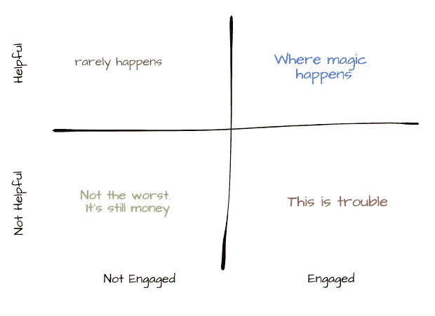

# 好的、坏的和丑陋的投资者

> 原文：<https://medium.com/swlh/the-good-the-bad-and-the-ugly-investor-a3b670d71bf4>

如果你明白自己面对的是什么类型的投资者，你就更有可能找到合适的合作伙伴来信任你宝贵的创业公司。

我有机会向更多的投资者推销产品，从第一次推销会议开始，我就记住了一个观察结果。根据你被问到的问题，你可以把投资者分为三种类型:好的、坏的和丑陋的。

Source: [http://cinetropolis.net/scene-is-believing-the-good-the-bad-and-the-ugly/](http://cinetropolis.net/scene-is-believing-the-good-the-bad-and-the-ugly/)

**丑陋的投资者**

丑陋的投资者主要关心交易的融资。

如果她一有机会就问你当前的估值、之前的估值，以及你下一轮融资时的估值会是多少，那你就是在向一个丑陋的投资者推销。

如果前三个问题中有一个是“还有谁在投资？”，你是在向一个丑陋的投资者推销。

如果她所说的“帮助”你的创业公司是在告诉你，她还想让其他哪些投资者来“运作这件事”，那你就是在向一个丑陋的投资者推销。

如果你在第一次会议上花时间讨论交易结构，辩论可转换债券相对于定价轮次的优势，你就是在向一个丑陋的投资者推销。

**糟糕的投资者**

糟糕的投资者有点好奇，但还不够好奇。

如果她只关心市场有多大，如果你的初创公司有 10 亿美元的 TAM，你就是在向一个糟糕的投资者推销。

营销规模是交易评估中重要且必要的一部分，但糟糕的投资者只关注市场规模。又轻松又懒。

**优秀的投资者**

向优秀的投资者推销则完全不同。

如果她问你关于你的客户的问题，对你客户的行为和习惯感到好奇，你是在向一个好的投资者推销。

如果她想知道谁是你真正的竞争对手，为什么，你是在向一个好的投资者推销。

好的投资者想知道你的潜在客户可能会雇佣你的产品或服务做什么工作。

就是这样——就这么简单。下次你参加推介会议时，注意投资者问你的问题。知道你是在推销一个好的、坏的还是丑陋的投资者，将有助于你为你珍贵的创业公司找到合适的投资者。

**奖金:投资人评估的 2 x2**

The simple 2x2 to evaluate investors

一旦你成功筹集了一些资金，你可以使用另一个简单的工具来评估你的资本表中的投资者。最积极参与、最乐于助人的人是很好的合作伙伴——优秀的投资者。不订婚不怎么帮忙的乡亲还是可以的，还是钱。丑陋的人是那些忙碌而不乐于助人的人——这就是麻烦发生的时候。

## 这个故事发表在 [The Startup](https://medium.com/swlh) 上，Medium 的出版物有超过 256，410 人关注。

# 订阅[在这里获取头条](http://growthsupply.com/the-startup-newsletter/)。

