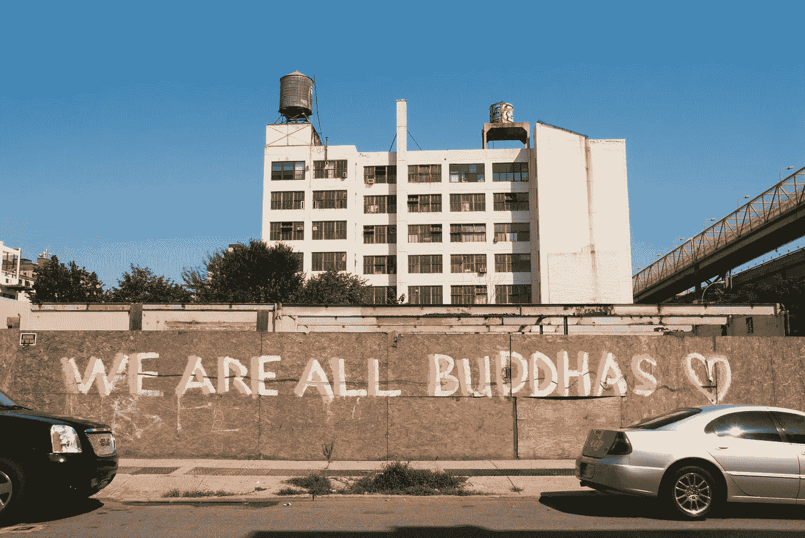

# 自知之明指南。

> 原文：<https://medium.com/swlh/the-guide-to-self-knowledge-656ad7e23a3d>

Credit [unsplash](https://unsplash.com/photos/hlv8GaQ1hi0)

我要向你证明你有两个头脑。闭上眼睛，什么都不想 30 秒，就当实验。好吗？

准备好了吗？走吧。

(等待)

完了？不容易吧？

你可能和我们一样失败了。你的想法可能会向各个方向发展。要求某人不要思考是…