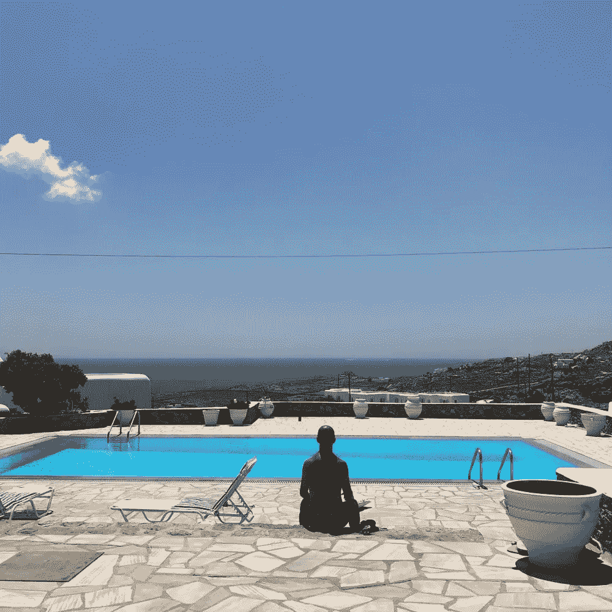

# 练习 31 天高影响力正念的习惯

> 原文：<https://medium.com/swlh/the-habit-of-practicing-high-impact-mindfulness-for-31-days-2c9111943510>

## 生活方式实验:结果、发现和反思

如何通过)**的练习和其他源自并保持与自己亲密关系的技巧，在你的日常生活中创造高影响力？高影响力正念实验。这就是我的想法，准备和执行，直到昨天 31 天。正如我所说的，高影响力正念实验的限定期昨天结束了。下面你可以找到我在过去的 15 天里为了获得更好的表现**和在人类的四个维度上的流畅性而遵循的步骤:智力、身体、情感和精神。****

# ****高影响力正念目标****

****这种“测试”的原因是创造新的修改( [**hacks**](https://isragarcia.com/how-to-redesign-life-and-work) ),允许提高生活方式，更好地优化您的个人和专业资源。其他原因，至少对我来说，是:****

1.  ****获得对身体的控制，感觉更好，不再那么独立于思想。****
2.  ****更高的意识****
3.  ****养成微冥想的习惯(有意识的停顿)。****
4.  ****探索 31 天不间断练习高温瑜伽的好处。****
5.  ****看看身体是否能抵抗每天多做一次力量瑜伽和一次流瑜伽，看看结果。****
6.  ****通过增加早晨冥想的时间。****
7.  ****测试 [**维姆·霍夫呼吸法**](http://thoughtbrick.com/wim-hof-method/wim-hof-method-power-breath-exercise-explained/)31 天，看看是否有效。****
8.  ****持续练习力量瑜伽+冥想流瑜伽的结果。****
9.  ****看看我是否能一次连续运用所有这些技巧。****

********

# ****结果呢****

*   ******目标 1** :已实现。反复的练习让我注意到了以前没见过的动作。发现手指、腹部、肩膀或背部的感觉****
*   ****以前我从未有过的感觉。当你想到一件事，然后你可以分析它，知道它是在什么状态，这将是下一步。****
*   ******目标 2** :已实现。通过设法几乎一成不变地停止一天(8 到 12 次)，更容易活在当下。****
*   ******目标 3** :获得。我开始无意识地这么做了，虽然有几天我不得不通过系统提醒自己好像写在哪里。有时候一天会被分成几部分，就像今天一样。在更紧张的日子里，我会把它们更紧密地放在一起。****
*   ******目标 4** :发现了，不仅仅是利益，还有损害，已经有了。你的身体变得更加灵活、有意识和流畅。然而，如果强迫你超过平均水平，你的肌肉和关节将会受到影响，尽管在这方面有经验(在我开始高影响力正念实验之前，我已经上了大约 170 堂课。****
*   ******目标 5** :已检查。是的，你可以抵抗，但是把你身体的一部分推得太远了。如此之多，至少对我来说，在我 31 岁的那天，我不得不强制休息一整天。那是在拜访了一位偶尔为我治疗的理疗师 Dani de La Sella (Denia)之后发生的。****
*   ******目标 6** :我得出的结论是，我们越是增加冥想的时间，就越难不被更多的想法攻击。但是，你有更多的时间去意识到你在想什么，然后回到起点。****
*   ******目标 7** :有效。当我每天早上醒来的时候，我已经整合了这个练习，结果是精力充沛，放松和集中。每周我都会增加 40 次呼吸，从 1 次增加到 4 次。如此强大，以至于我决定把它作为一种超级习惯。****
*   ******目标 8** :取得的成果。除了成长，你还获得了弹性、力量、注意力不集中和脱离，因为你在一天中更多的时间里为自己工作——以一种相当紧张的方式。然而，负荷可能太大了，就像我实验的最后一周。****
*   ******目标**9:发现。所有这些技巧的组合让我得以提高、成长和学习。虽然这是真的，但需求一直高于我的预期。在某些时候，它可能不会像我希望的那样有利。****

****它是 [**最终仪表板**](https://docs.google.com/spreadsheets/d/1Uvc0NUU_S3zIuDx4HsDe7nP__sSGCRgKSt96OEN5mB8/edit?usp=sharing) ，包含我认为重要的所有定量和定性结果。****

# ****优点/缺点+细节****

****这些是实验的优点、缺点、教训、错误和趣闻。****

# ****高影响力正念实验结束****

****虽然这是一个更倾向于最后三个维度(情感、精神和身体)的测试，但几乎所有维度都是相关的，智力部分也取得了胜利。处于一种更平和的情绪状态有助于你融入工作和精神负担。身体变得更强壮、更有控制力、更平衡、更灵活，能让你提高注意力、记忆力和贡献能力。精神上更加真实，与自己联系更加紧密，注意力更加集中，这能让你更清晰、更迅速地思考和做出决定。****

****【本帖首发于**】******

# ******只有当你觉得值得的时候，才让这个故事震撼吧！如果你发现任何有价值的东西，请鼓掌。******

> ******Isra Garcia = 55 个客户，48 家企业，400 次演讲，3.603 篇帖子，24 个项目，6 本书，380 场讲座，6 家公司，18 次冒险，26 次实验，∞失败。到目前为止…******
> 
> ******[有一手](https://isragarcia.com/wp/marketer)。顾问。扬声器。作家。教育家。经理。在 [IG](http://thisisig.com) 的负责人。博主。企业家。颠覆性创新。数字化转型。高绩效者和生活方式实验者。******

# ******行动号召>>点击[这里](http://feeds.feedburner.com/isragarcia)订阅更多类似的文章！******

************

## ******这篇文章发表在 [The Startup](https://medium.com/swlh) 上，这是 Medium 最大的创业刊物，拥有 348，974+人关注。******

## ******在此订阅接收[我们的头条新闻](http://growthsupply.com/the-startup-newsletter/)。******

************