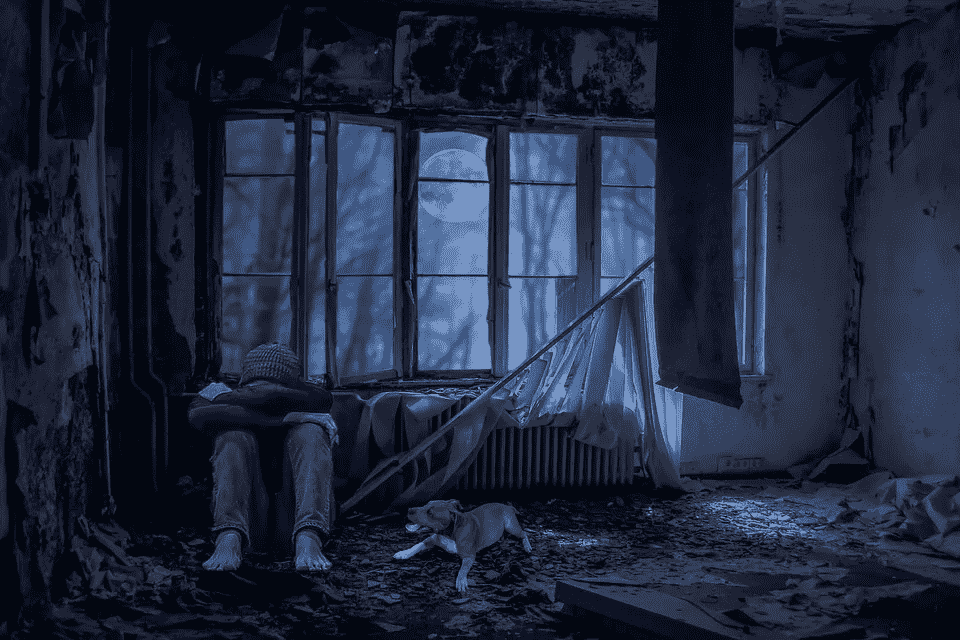

# 不成功人士的习惯

> 原文：<https://medium.com/swlh/the-habits-of-unsuccessful-people-351448df8631>

如果你想要别人没有的，你必须做别人没有做的。

我在下面写了一些不成功人士的习惯，这样如果你真的想创造一种到目前为止你只是梦想的生活，你就会知道应该避免什么。

在我们的一生中，有很多时候，我们可能会沉迷于我将要谈到的一个或一些活动，这没什么，因为我认为偶尔参与一些令人头脑迟钝的经历没有什么坏处，但是，“一切都要适度。”

如果你发现你在这些事情上花费了数不清的时间、天数、周数甚至年数，那么我建议你停下来！

评估你的现状，评估你目前的日常工作是增加了还是减少了你生活的价值。

我猜，如果你正在读这篇文章，那么你有强烈的愿望成为你个人最好的，或者我喜欢称之为(最好的你)。如果是这样的话，那就有理由相信你可能想要“现在”做出决定，你愿意改变下面任何一个阻碍你走向成功的习惯。

如果你认同下面的例子，请不要对自己妄加评判，相反，要感谢自己能够承认自己需要改变并坚持到底。

有很多方法可以让你 [**彻底改造你的生活**](https://victorygranted.co.uk/reinvent-your-life) 一旦你知道是什么一直在挟持着你，它从你的思想开始，然后是积极的日常行动(不管有多小)。

罗马不是一天建成的，你的杰作也不是。所以切掉吧。

不管你喜不喜欢现在的你，你的习惯决定了今天的你，事实上最棒的是，只有你能完全控制创造更好的习惯“从现在开始”

坏的或不健康的习惯会导致 [**深度抑郁**](https://victorygranted.co.uk/killer-strategies-helped-beat-depression) 甚至更糟，所以请带着开放的心态和思想继续读下去。

“你是自己命运的创造者。”

你的选择变成了你的日常习惯，然后变成日常事务，最终成为你的生活，所以做出好的选择。

让我们开始吧！

# **不成功人士的习惯**

## **(习惯 1)——拖延**

有许多特质将决定你是否会成功，但头号梦想杀手是拖延症。

> 也就是说，无论你多么努力地试图找到动力去完成哪怕是一个简单的任务，你就是找不到动力和意愿去开始。

我们都曾感觉到拖延症在某个时间点悄悄向我们袭来，然而，在追逐梦想的过程中，你是成功还是失败的区别在于当拖延症出现时，你如何选择处理它。

不成功的人是拖延的奴隶，因为拖延成了他们的第二天性。他们会找各种各样的借口来解释为什么他们没有完成对自己和他人的责任，并且很不幸地会停滞多年。

另一方面，成功的人看到事情的本来面目，观察他们从拖延中得到的感觉，并不管不顾地继续下去。

动力创造动力，所以你做得越多，事情就变得越容易。

这对健康和不健康的习惯都适用，所以如果你真的想战胜拖延症，那么你必须负起责任，开始你一直在逃避的任务。即使一开始一天只有 5 分钟。

最终，如果你继续沿着这条路走下去，你的动力会越来越大，直到你全身心地投入到你的梦想中。最初看起来很难，但是放弃最好的自己最终会更难。

所以不要拖延。

## **(习惯二)——看客**

你是否正忙于观看其他人在真人秀、电影或电视节目中的生活？当你可以专注于你设定的成为最好的自己的目标时，你会浪费时间在电话上或面对面谈论别人吗？

看的人会上瘾，营销人员不知道吗？

电视行业已经把它钉在一门艺术上，以确保他们的业务繁荣，但你的业务呢？

你能给这个世界带来的伟大呢？你的才能和天赋。

当你担心别人在做什么的时候，不要忘记你是谁。

通过“关注自己的事业”获得成功。字面意思！

## **(习惯三)——上瘾**

沉迷于任何不健康的物质或活动都会剥夺你生命中最美好的部分。相信我，我知道。我曾经对大麻上瘾。

由于我不健康的嗜好，我拖延时间，想得太多，以至于在我 20 多岁的大部分时间里，除了参加聚会和嗑药之外，我从未真正取得过任何成就。

如果你想成功，那么坚持你的计划需要意志力和坚强的性格，“即使在你不喜欢的日子里。”如果你有一种不可避免会出现的瘾。

不要让你的梦想因为一时的快乐而受挫。看到更大的画面，你会克服。

## **(习惯 4)——负面言论**

不成功的人爱说自己和别人的坏话。事实上，那些对自己不满意的人经常把这种不开心投射到他们周围的人身上。你有没有和朋友或同事在一起，他们似乎只会批评周围的世界。

可能是天气或交通让他们的存在感到厌烦，也可能是在星巴克排队买咖啡，最后为他们服务的收银员忘记为长时间的等待道歉。

不管怎样，一个不快乐的人会对他们周围的几乎所有人和事吹毛求疵。如果你发现自己经常抱怨蓬松的东西，我喜欢这样称呼它，那么重新评估你当时的动机，并有意识地决定就此打住。花时间赞美你的世界，并观察它对你的赞美。

## **(习惯 5)——没有计划**

我敢肯定，在你的一生中，你至少离开过你周围的环境一次，如果不是成千上万次的话，这里所说的周围环境，我只是指你的家。

可能是去当地商店买杂货，也可能是去别的国家。不管是什么情况，为了让你踏上旅程，你至少在某种程度上必须制定一个计划。

你会穿什么来适应这种天气？你需要打包午餐吗？你必须在什么时候洗完澡穿好衣服才能准时去搭公车或火车？

如果你是司机，你的车需要燃料吗？你是否应该准备第二条路线以防交通堵塞和不可预见的情况等等。

*我想你明白了吧？*

> 如果你想成为最好的自己，那么你需要一个遵循的计划。给自己设定任务并每天执行，不管它们看起来有多小。
> 
> 如果你还不知道你的目标是什么，那么我鼓励你去冥想、阅读和探索，直到你找到它。

每天为你自己、你的习惯、你的健康和你的幸福而努力，这样你就能回报这个世界和你自己。记住，我们都是有人类经验的至高无上的存在，所以不要把自己看得太重。

享受乐趣，了解你成功的触发因素是什么。一旦你知道了这些，你就可以很容易地遵循并永不放弃。

如果你知道锻炼能让你产生自然的兴奋感，那就去做吧，如果是冥想或者阅读一些鼓舞人心的东西，那就去做吧。

不管是什么，定期练习，成为你知道你真正值得成为的人。

*要获得更多成为最好的自己的技巧和提示，请访问* [*我的博客*](https://victorygranted.co.uk/resources) 的参考资料部分

## 如果你喜欢这篇文章，那么让我们来看看我的博客胜利吧

查看我的 YouTube 频道[https://www.youtube.com/channel/UCreF8-HuO5SFyKSK2MLbNdw](https://www.youtube.com/channel/UCreF8-HuO5SFyKSK2MLbNdw)

## 这个故事发表在 [The Startup](https://medium.com/swlh) 上，这是 Medium 最大的企业家出版物，拥有 285，454+人。

## 订阅接收[我们的头条新闻](http://growthsupply.com/the-startup-newsletter/)。

