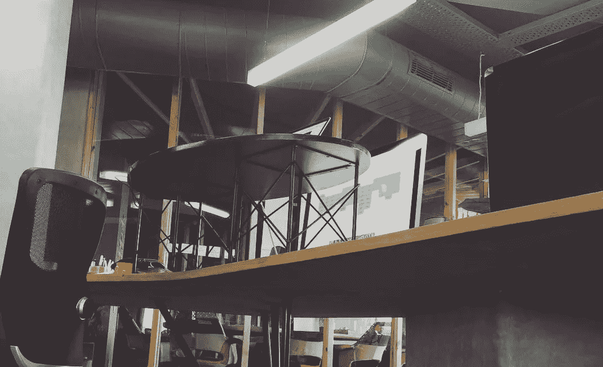

# 构建数字产品的黑客马拉松方法

> 原文：<https://medium.com/swlh/the-hackathon-approach-to-building-digital-products-4e4a8cdbe21b>

我喜欢黑客马拉松。我通常不会赢得任何东西，但开发一个产品，看到人们尝试它，并说服自己这是一个巨大的进步，你会继续努力，这种感觉非常棒。

最近在我公司的一次黑客马拉松上，我们召集了一个以前从未一起工作过的 9 人小组，组成了一个团队。我不会谈论团队动力、管理期望或为黑客马拉松做准备的 21 种方法，而是更多地谈论这种经历如何形成我目前正在尝试的产品构建方法。

我们决定开发一个应用程序，让你可以播放音乐并和朋友一起实时聆听。在设计和开发的几个小时里，我们有了一个使用 Spotify API 和聊天的工作原型。使用它的体验是非凡的。在花了大约 45 分钟在应用程序上为朋友播放音乐后，我意识到原型化应用程序的核心体验会产生多么巨大的影响。我从来没有预料到为你的朋友当 DJ 会有多么疯狂的乐趣。

> 我肯定可以创建一堆屏幕，一个漫威原型，关于这样的东西会有多棒的假设等等，但是使用这个有缺陷的，硬编码的版本来播放真正的音乐是美丽的。这是对这个想法的验证，出乎我的意料。

我的下一个问题是——如何模拟黑客马拉松环境？你如何人为地制造约束来欺骗你的大脑让它全部释放出来？说“我将在接下来的 48 小时内完成这项任务”是行不通的，至少对我来说是这样。

我提出了一个原型化过程，我称之为周末者(我在写这篇文章的时候想到了这个名字)。周末计划包括选择两天，最好是周末，并设定一个切实可行的最后期限。你不能掉以轻心。

对于我的第一个实验，我决定将它应用到我们的音乐应用程序中。第二个周末，我心血来潮地飞往德里，会见了驻在那里的部分团队成员(并希望在黑客马拉松之外参与这个项目),规定的最后期限是我将在本周末飞回来，我们必须完成下一个开发周期所需的所有设计工作，这些工作需要高度的协作，并且很难远程完成。

72 小时，3 个素描档案，45(？)画板，12 瓶啤酒，几个原则和漫威原型和许多草图之后，它出乎意料地好。我们完成了大量的工作，并且乐在其中。我们完成了应用程序的主要流程，包括加入、邀请朋友、开始对话、通知、聊天/音乐室的复杂性等。

这个 sprint 的开发周期已经开始了，我们正在利用本周的空闲时间回到我们的工作中，修复我们所犯的所有匆忙的和“事后看来明显的”错误。我们也在计划我们的下一个开发周期，并将尝试弄清楚如何远程模拟周末旅行者(我们目前的团队位于德里、孟买和新加坡)。

我很想听听你对用于原型和验证想法的黑客马拉松有什么想法，以及你是否会以不同的方式处理它。

–

演示在 [LISN.xyz](http://lisn.xyz) 上传，看看吧。

PS——在黑客马拉松的热潮中，我们将其命名为 DUCE。向朋友介绍音乐和网球术语 deuce，这意味着一个来回，这是你在这个应用程序上做的音乐。多棒的名字啊！不幸的是，我们没有查《T2 城市词典》或意大利语中“T4”一词的含义。我们现在已经和 LISN 谈妥了。给我发推特，让我知道你对这个名字的看法！

PPS–我们接受测试版用户。给我发微博，我会给你发邀请！

发表于*[**【SWLH】**](https://medium.com/swlh)**(***创业、流浪、生活黑客)**

******