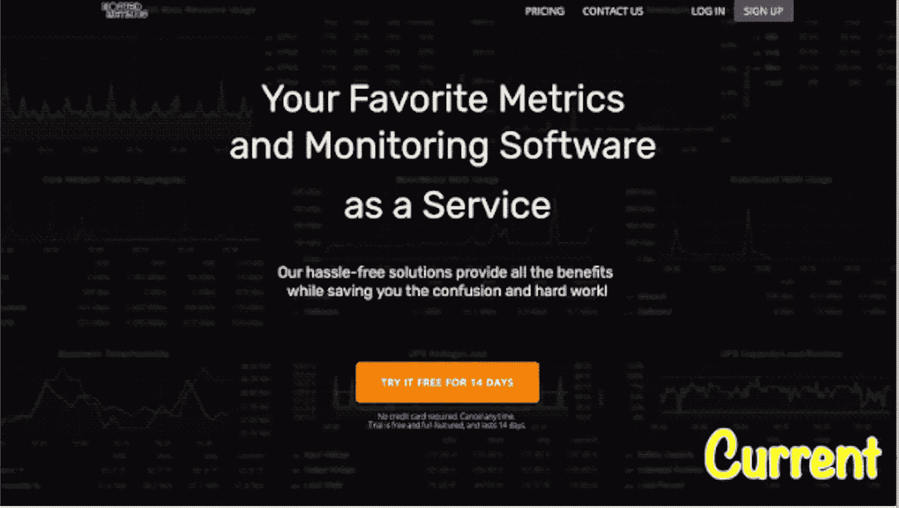
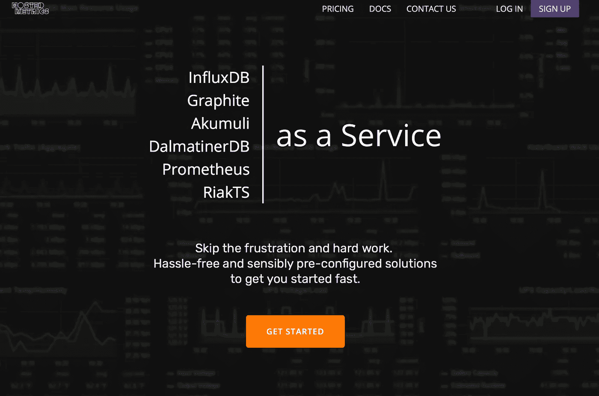

# 命名事物的隐藏力量

> 原文：<https://medium.com/swlh/the-hidden-power-of-naming-things-aef3e707e4ff>

[Pexels](https://www.pexels.com/photo/blackboard-chalk-chalkboard-concept-261734/)

> 就像每个人都在自己的脑海里讲述一个关于自己的故事。一直都是。一直都是。那个故事造就了你。我们从那个故事中走出来。
> 
> ——帕特里克·罗斯富斯的《风的名字》

所有进入创业世界的人——潜行者、开发者、企业家、营销人员，我们所有人——都有一个嵌入我们内心的故事，我们从中汲取能量。每天早上醒来，对我们的应用程序进行更多的增量调整，发出更多的冷邮件，或登录谷歌分析，看看最后一次搜索引擎优化的变化是否对我们有利。

我的能量来自同一本书的不同引文。

> 词语是被遗忘的名字的苍白的影子。正如名字有力量一样，词语也有力量。言语能点燃人们心中的火焰。言语能从最坚硬的心灵中挤出眼泪。
> 
> ——帕特里克·罗斯富斯的《风的名字》

我今天发现我的热情有一个名字。我发现我最擅长的叫做 [UX 写作](https://www.indiehackers.com/@Anastasiia/how-to-build-a-better-product-with-ux-writing-2d480e6a34)。

让我倒回去一点。

你的故事，那个深藏在你内心的故事，已经存在了几个月，也许几年，等待被讲述。所以，当你决定投身创业时，你已经比普通用户领先了几个月。

你知道你的视野。你知道你能带来的价值。对你来说，你的产品实际上是在推销自己。很多时候，你的网站文案反映了这种比你的读者知道得更多的感觉。

这里有一个极好的例子来说明我的意思。请看一下托管指标登录页面的前一版本。

Before my UX Writing contribution

托管度量团队非常有信心，他们的产品可以支持所有形式的“*度量和监控软件*”。他们的目标用户群？没有那么多。他们不知道可以将哪些监控软件外包给托管的 Metrics。这种脱节可能会让他们付出转换的代价。

当他们向我寻求帮助时，我的[回应](/artisana/hostedmetrics-ada55e35167f)很简单，“*说出事情的名称。*”

The Hosted Metrics homepage after my contribution

这是我的建议—

> …列出前 3-4 名监控和指标产品…
> 
> 当你把产品名称展示给人们看时，你表明你确切地知道你的最佳点是什么。人们信任透明。不要让他们在文件夹下寻找产品名称。

*(完全披露——事实上，他们的新版本甚至比我在回应中提出的还要好。这是对团队的赞扬。)*

这是 UX 作家带来的价值。

他们最大的优势是，虽然他们理解你的价值，但他们实际上是在为你的用户工作。他们倾听你的故事，同时给你一个机会与那些用信用卡支付你辛苦工作的人交谈。

如果你的网站正遭受低转换率或信息不清晰的困扰，你可能错过了我们在 [Second Look](https://www.2ndlook.xyz) 提供的那种高质量的 UX 作品。UX 写作可能帮助你的潜伏者转换的未命名的 x 因素！

*   *在第二次看，我们为您的网站提供个性化的，诚实的反馈和建议。*

## 这篇文章发表在《T4》杂志《创业》(The Startup)上，这是 Medium 最大的创业刊物，拥有 339，876+读者。

## 在这里订阅接收[我们的头条新闻](http://growthsupply.com/the-startup-newsletter/)。

