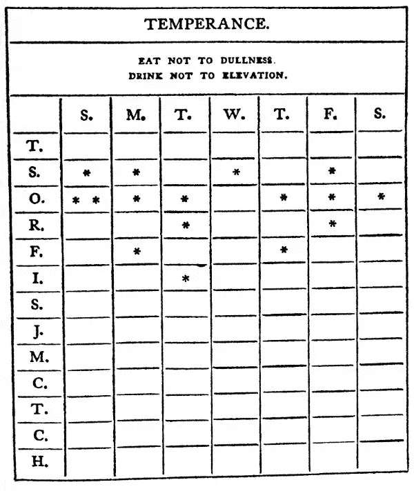

# 本·富兰克林巨大成功背后隐藏的套路

> 原文：<https://medium.com/swlh/the-hidden-routine-behind-ben-franklins-massive-success-c1ecf64a4325>

“The flag of America stands in the grass with looming sunnset on 4th of July” by [Aaron Burden](https://unsplash.com/@aaronburden?utm_source=medium&utm_medium=referral) on [Unsplash](https://unsplash.com?utm_source=medium&utm_medium=referral)

> 大约 20 岁的时候，我爱上了本杰明·富兰克林。我不得不在大学的美国历史课上读他的自传，我差不多用了 17 个小时就读完了。

> "我们生来都无知，但一个人必须努力保持愚蠢。"
> 
> -本·富兰克林

这家伙有太多面了，真是可笑。

他和我一样是个旅行者！)。他是个政治家。他是个商人。他是个发明家。他是一名科学家。我可以一直继续下去。

> 这个家伙基本上为我们赢得了独立战争，对我来说，他可能是第一个真正的美国人。

这意味着他通过[的努力](https://findingtom.com/how-gain-medium-followers/)，狡猾，无情的决心和一点点运气成为了他想成为的人。

这就是美国梦(顺便说一句，它仍然令人难以置信地活着)。

> 但是他是怎么做到的呢？本·富兰克林是如何从印刷工人变成与真正的国王共进晚餐的外交官的？

他是如何从波士顿来到法国，并在那里度过了他生命中的几十年？

在互联网出现之前，他是如何成为世界知名人物的？(**说真的，欧洲人看到他会失去理智**)。

以下是方法。

# 本·富兰克林的成功可以归结为一件事..

> 本当然很聪明。他可能是那个千年中最伟大的头脑之一——一个真正的文艺复兴时期的人，他掌握了科学、外交、商业和人际关系，而其他人都在努力避免失去谈论税收的集体智慧。

那些该死的税。

然而，对我来说，在这条线的起点有一个小多米诺骨牌使所有其他的都倒下了。

> "能量和坚持征服一切。"
> 
> -本·富兰克林

他一直在做的一件事让他成为了一名熟练的科学家、政治家和关系艺术家(是的，这是我编的)。

> 女士们，先生们，本·富兰克林痴迷于改善自己。

事实上，他有一个帮助自己变得更好的奇特系统——他每天都在使用它。

让我展示给你看..

# 本·富兰克林实现“道德完美”的方法

> “与你的恶习作战，与你的邻居和平相处，让每一年都让你成为一个更好的人。”
> 
> -本·富兰克林

> 在他生命的早期，老 BF 对他所谓的“道德完美”产生了极大的兴趣。

他知道这是不可能的，但通过努力达到完美的道德，他会变得更好。

他做到了。

他列出了 13 种美德，他会连续几周坚持下去。其中有真诚、温和和谦逊。说真的，这家伙很特别。

> 起初，他每周都会做一个。例如，他会花一周时间练习真诚。

如果你看上面的图表，他会在这里记录他是否在周一，周二，周三等等的任何时候不真诚。他真的会有意识地努力这么做。

经过 13 周的努力，他决定一次完成所有的工作——不断地记录他什么时候哪里出错了。

这是后来老 BF 说的努力。

> 总的来说，虽然我从未达到过我雄心勃勃想要达到的完美境界，但离它还差得很远，但通过努力，我比我没有尝试过的人更好、更快乐。

# 老实说，你会这么做吗？

> 有很多很棒的文章会教你如何变得更好。我们大多数人读了它们，忘记了它们，然后又读了另一篇，上面写着完全相同的内容。我们不做一件关键的事情..

我们不会每天都有意识地努力变得更好。

本·富兰克林痴迷于个人发展。他想在生活的每个方面都变得更好。他想更好地思考，吃得更好，有更好的人际关系，尽可能帮助更多的人。

> “宪法只赋予人们追求幸福的权利。你得自己去抓。”
> 
> -本·富兰克林

最重要的是，他把自己的愿望变成了现实。他做了一个图表，记录了他一直在做的事情。让我再说一遍…

> 他意识到自己在每天醒着的时候都做了什么！

他有缺点吗？哦，当然——但是这个人活着的时候影响了数百万人，死后影响了数亿人。

这家伙善于分析，富有创造力，精确，狡猾。

一方面，他热爱规则和程序，但当他后来反抗国王时，他也对这些规则和程序嗤之以鼻。

> 有人曾经说过，本·富兰克林是那种坐在餐桌旁，彬彬有礼的老人……但他也会时不时趁没人注意时偷偷给狗喂些食物。然后他会对可能抓到他的孩子眨眼。

这是本·富兰克林。

他的成功很大程度上来自于他的智慧、雄心和干劲，但我相信如果他没有执行**的严格惯例**，每天对自己做的对与错保持残酷的诚实，这一切都是不可能的。

这延续到他的政治生涯、科学成就和写作能力中(是的，本·富兰克林在很长一段时间里是殖民地最好的作家！).

照着做，你就会像本一样！😃

> 说到百元大钞..我在 Medium 上有 22000 名粉丝。本周，我将举办几场网络研讨会，讨论如何通过中型合作伙伴计划每月赚取**500 美元。**报名[就在这里](https://events.genndi.com/register/169105139238473045/ab6ebc4e1d)！

## 这篇文章发表在[《创业](https://medium.com/swlh)》上，这是 Medium 最大的创业刊物，有 340，876+人关注。

## 在这里订阅接收[我们的头条新闻](http://growthsupply.com/the-startup-newsletter/)。

