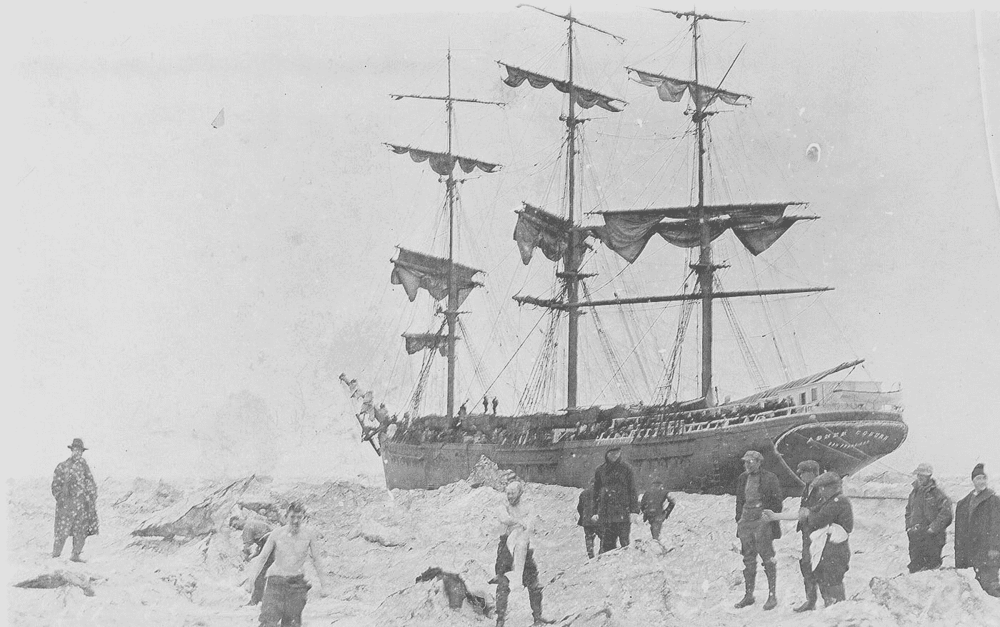
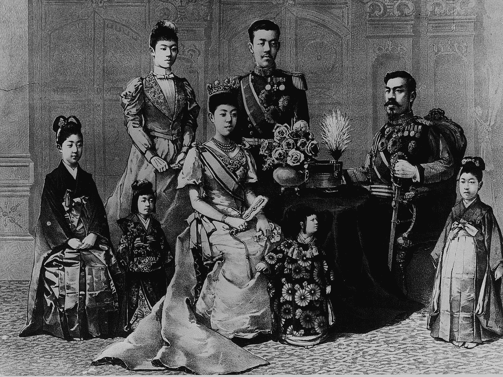
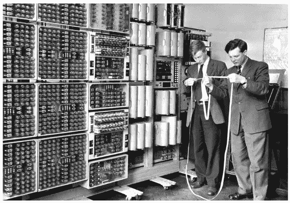

# 外包的历史

> 原文：<https://medium.com/swlh/the-history-of-outsourcing-65fb5cdb196e>

## 从木匠到会计师

Image credit: [Kingston Chen](https://unsplash.com/@travelinglight)

今天，没有外包的世界是难以想象的。一度由资本主义快速发展的本性所决定的经济运动，变成了一种文化现象，比我们人类历史上的任何事情都更能把我们这个直径为 7917.5 英里的星球团结起来。尽管我们的部落心态还处于初级阶段，尽管我们当中最坏的人都表现出仇外心理，但我们还是设法维持了一种合乎道德的工作模式，这种模式在今天的世界上运行着。

让我们看看外包是如何开始的，it 的未来是什么样的，我们特定的数字行业在有效外包方面做得如何，以及它对全球的历史影响。

# 进步的根源

我们的文明是由许多普遍的和精神的因素形成的。我们已经积累了足够的知识和经验，为许多人提供了舒适的生活，并在某种程度上保持了我们的理智。在许多方面，科学的变化促进了我们物质地位的提高和文化的发展。

> 我们的价值观和目标在某种程度上成为了“好科学”的构成标准

什么是*好科学*？科学家本身倾向于对好的科学有不同的衡量标准，这使得他们可以在很多方面利用他们的偏见。对这一范式的研究是一个与经济现实没有太大关系的哲学课题。这让我们想到了*目标*的概念，它通常是有形的。达到目标的进度是可以衡量的，因为你可以清楚地认识到目标是否已经实现。正如斯坦福哲学百科全书所说，

> 一个目标可能是可达到的，因为它可以在有限的时间内通过有限的步骤达到。如果一个目标无法达到，甚至无法接近，那它就是乌托邦。因此，乌托邦式的目标是无法理性追求的，因为试图达到这些目标是不可能取得任何进展的。

如果目标是明确且可达到的，我们可以朝着它努力，在朝着目标前进的过程中，我们会发现自己的伟大。我们在解决问题的能力中茁壮成长，并不断寻求经验真理。这就是进步。这是什么让我们看向另一边，总是想出一些东西，不管我们受到什么限制。

# 历史性的外包惯例

外包的第一个证据很难追踪。有些人的技能在其他人无法获得这些技能的地方更受重视，这是很自然的。然而，交易能力作为一种商品，更多的是一种需求，而不是寻求进步。

# （使）当船员

在 18 世纪晚期，漂洋过海意味着失去一半的船员，这使得指挥官们在世界各地收集失踪的船员。在商业表现形式上，这是向世界多样化的一个重大转变。一旦这些联系建立起来，由需求决定的东西开始被雇佣廉价船员的经济利益所取代。

*Image credit:* [*ageofsail*](http://www.ageofsail.net/aosshipa.asp)

拥有各种技能、奉献水平和不同劳动力支付能力的人的迁移，让当时的许多工业领袖看到了外包的潜力。从那时起，我们不再局限于地域和文化边界，而是在成长的各个阶段不断挖掘人力资源的多样性。

# 彼得大帝

俄罗斯的皇帝彼得大帝，可以认为是第一个专业的招聘者和外包者。他出生于俄罗斯沙皇政权，因其统治下的俄罗斯的新方向而臭名昭著。在他 20 多岁的时候，他基本上把自己外包到了荷兰，从事造船工作并学习这门手艺。

> 他带着丰富的知识和一支由不同职业的外国工匠组成的队伍回到俄罗斯，建立了新的帝国。

以下是他运用直观的外包原则，以明确的目标成功做到的:

*   彼得将所有官方机构和军队的着装规范从“亚洲”改为欧洲风格，这一传统甚至在今天的制服中也得到遵守。
*   彼得打开了边境。对于一个大部分时间都在与侵略者战斗的国家来说，这是巨大的。皇帝相信教育和投资。他鼓励外国人在俄罗斯创业，也鼓励本国人去旅游。
*   彼得建立了一座城市，这座城市成了明信片和国家的象征。他按照欧洲传统建造了圣彼得堡。为此，他外包了意大利建筑师、德国工程师、法国艺术家，以及几乎所有能为我们北方首都的建设做出贡献的人。
*   他建立了第一个博物馆，培养了对艺术的品味和对世界奇迹的欣赏。
*   彼得建立了新的字母表和阿拉伯数字，这大大简化了语言的教学。
*   彼得让所有上流社会的公民都可以接受义务教育。一个没受过教育的贵族是不允许结婚的。

*Saint-Petersburg*

彼得从欧洲借了很多钱，但他从未把俄罗斯变成殖民地。他的所有改造都经过了提炼和修改，以适应他的国家的需求和具体情况。同样，带着重建旧方式的可及目标，Peter 利用直觉外包创造了传统与创新的独特融合，一切都是为了更好的生活。

# 军事外包

外包、[突出](https://shakuro.com/blog/outstaffing-challenges-esprit-de-corps/)和招聘的最好例子之一是明治时期的日本。明治维新这一时期在历史书上占有一席之地，成为 20 世纪后期日本工业崛起的主要原因。随着天皇的远见卓识和适应现代世界变化的能力结束了几个世纪以来使日本四分五裂的封建时期，现代世界变得前所未有地团结起来，并需要日本这个众所周知的闭关锁国进行大量追赶。明治天皇[在他的 1868 年宪章誓言中宣布](https://en.wikipedia.org/wiki/Meiji_Restoration)说:

> *“全世界都将寻求知识，从而加强帝国统治的基础。”*

难怪现代伦理和观念要在西方寻找。荷兰造船商、英国银行家、德国武器制造商，当然还有来自美国的军人，都获得了服务、供应和监护方面的巨额外包合同。在成功地粉碎了几次连续的武士起义后，日本希望回到旧的生活方式，永远采用西方的生活方式作为进一步发展的指导方针。

从 1867 年开始，日本请求各种西方军事使团帮助日本实现武装力量的现代化。1867 年，法国在日本执行了第一次外国军事任务。当时欧洲两大国家争夺的是欧洲内部的领土，也为以后的殖民纷争和势力范围的分配打下了基础。

1871 年，普法战争以法国的失败而告终，最终导致日本政府转而以德国的胜利作为军事模式。

其他著名的外国军事顾问包括来自意大利的蓬佩奥少校和夸拉特兹·格里洛少校，来自荷兰的斯凯尔贝克上尉和指挥官雅克-保罗·福雷，他们被要求协助日本空军的发展。

东亚地区许多国家的悲剧在于，欧洲的侵略战略和战术在后来被称为日本军国主义的地方开花结果。但说实话，如果有一个国家以最严厉的方式缴纳了会费，那肯定是日本。,

*Emperor Meiji and his family*

日本人以自律和对职业的宗教奉献而闻名，这种心态为许多西方企业家提供了肥沃的土壤，他们利用日本作为在亚洲各地扩张的平台，扩大自己的品牌。以下是其中一些公司，由朱利安·巴绍尔的伟大文章提供:**拜耳**、**哈雷戴维森**、**施乐**、**博世**、**欧瑞康**、**鲍尔泽**、**阿康尼**等等。

# 法律和会计

自 19 世纪中期以来，英国见证了法律和会计工作外包的兴起。由于判例法制度，人们要求商业案例由有类似案例的合格专家来解决。这导致了全英国私人律师事务所的建立。他们提供的服务越多，咨询范围就越广，最终将他们变成了法律外包公司。

“四大”就是从这种类型的法律和会计/审计事务所中诞生的。四大有坚实的历史；自从 1849 年普华永道(PricewaterhouseCoopers)和德勤(Deloitte)以及 20 世纪初的安永(Ernst & Young)和毕马威(KPMG)成立以来，对于那些愿意不受干扰地有效经营业务的公司来说，外包法律业务和会计审计已成为一件常见的事情。这是商业目标战胜孤立和完全控制的例子。

*Image credit:* [*Griddiron*](http://griddiron.com/blog/2017/8/7/leadership-lesson-from-the-worlds-worst-accountant)

# 20 世纪的外包

1921 年小阿尔弗雷德·P·斯隆接管通用汽车后，公司离破产仅一步之遥，斯隆对外包的重视使公司摆脱了危机，并使通用汽车击败了主要竞争对手亨利·福特。

这两场战争重塑了世界曾经赖以运作的原则。成千上万从战场上回来的人需要工作。他们中的许多人是合格的机械师、无线电电子工程师、飞行员和机械操作员，成为了新兴职业外包的核心。

> 新的经济现实创造了经营外包业务的高度专业化公司。

例如，成立于 1949 年的 ADP 公司只提供工资计算服务。1962 年，名为 EDS 的 IT 外包公司在德克萨斯州的达拉斯成立。它将主要通过从高容量计算机上租用时间来抵消几家银行的余额。EDS 为 GMC 节省了 400 多万美元。

在苏联，外包被掩盖在社会主义合作的术语之下，这意味着一个巨大的国家资助的工厂附属于较小的工厂，生产独家配件和科学项目。

*Data processing in 1950’s. Image credit:* [*CNN*](https://edition.cnn.com/2012/11/21/tech/innovation/witch-computer-restoration/index.html)

# IT 外包起源

随着计算机变得越来越强大，越来越可用，数据处理例程变得越来越复杂，这意味着企业所有者要么必须在企业中开设新的部门，要么雇用其他人来进行分析、计算和其他基于计算机的操作。最重要的是，拥有自己的电脑意味着不断维护和保养机器。这成为 IT 外包的另一个分支。很快，企业主意识到，购买第三方复杂的基础架构解决方案比自己试错构建要好得多。

除了节约成本，企业家们还欣赏 IT 外包带来的其他优势。这些优势包括业务流程和数据的相对安全性、瞬间整合新技术的能力，以及消除招聘人员的必要性。

在经济危机频发的现代世界，对任何公司来说，适应新领域都是极其重要的。如果一家公司的高管被迫优化他们的业务流程，节约 IT 成本是必不可少的举措。IT 人员的工资通常用矩阵的大写字母表示。IT 外包不仅可以节省薪酬成本，还可以通过外包 IT 专业人员来调动业务，从而跟上现代发展趋势，因为该领域的竞争非常激烈。

外包是多方面的。您可以根据您的目标和能力决定哪些流程可以外包。外包的现代趋势之一是与功能外包的概念相联系的，或者是以财务灵活性、多功能性和生产率为主要关注领域的有意义的外包。

## 这个故事发表在 [The Startup](https://medium.com/swlh) 上，这是 Medium 最大的企业家出版物，拥有 298，432+人。

## 订阅接收[我们的头条新闻](http://growthsupply.com/the-startup-newsletter/)。

