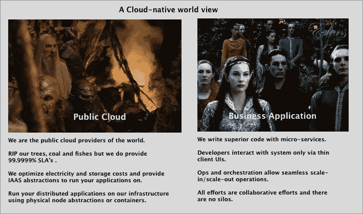
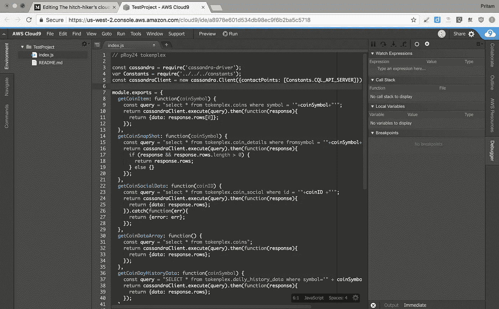
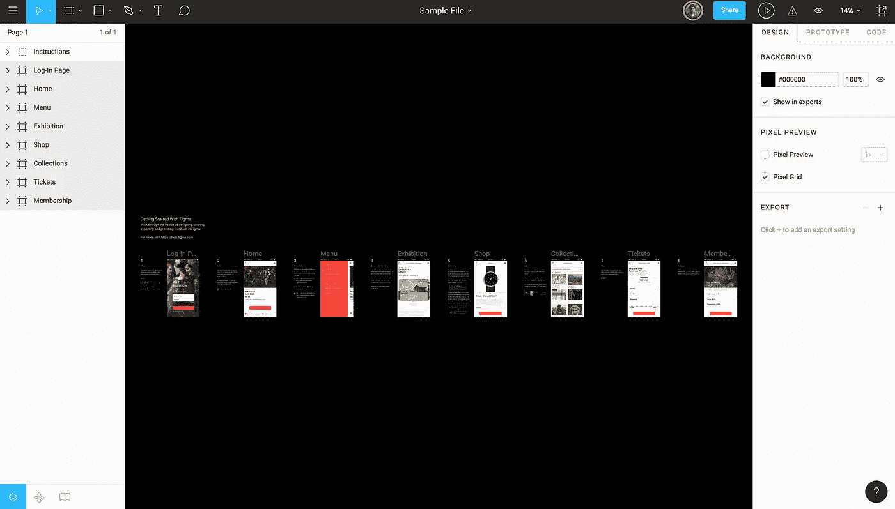
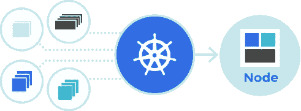
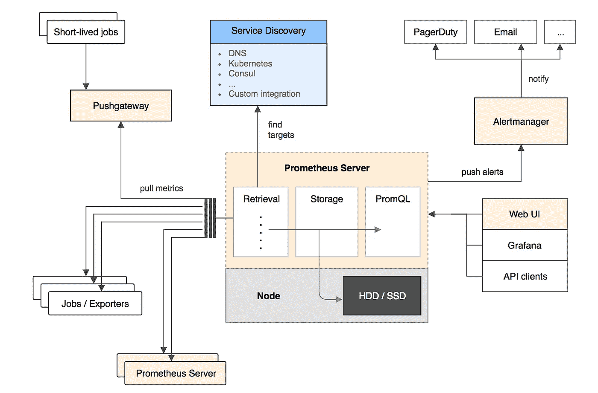
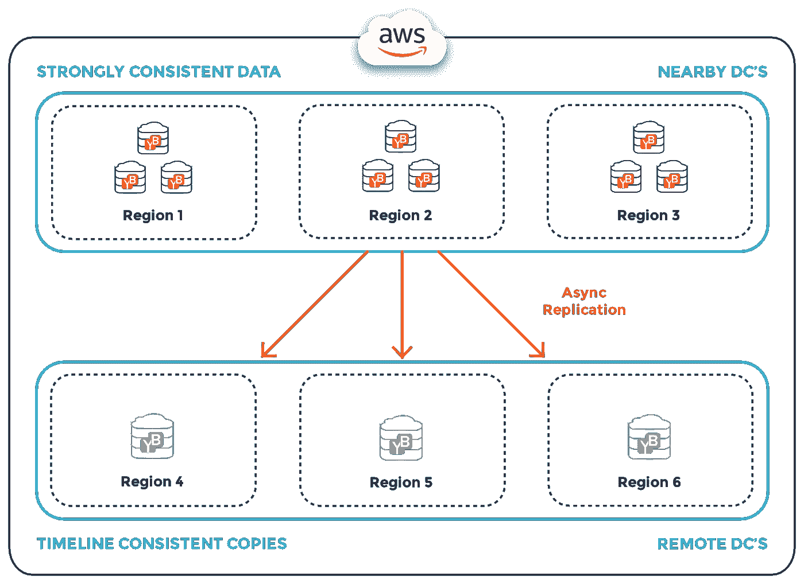

# 搭便车者的云原生工具包

> 原文：<https://medium.com/swlh/the-hitch-hikers-cloud-native-toolkit-774d79b4ac41>

## 将您的应用程序和流程迁移到云原生世界。

## 一个拥有微服务和动态编排的乌托邦..

在这个世界上，组织的 IT 是精简的，完全由基于 SAAS 和 PAAS 解决方案的微服务组成。你办公室的地下室里没有嗡嗡作响的数据中心，你系统的工程师们终于摆脱了他们随身携带的编译 C++代码的箱子。随着计算密集型工作负载转移到不可见的公共云中，您办公室的碳足迹降至最低。开发人员远程工作和在现场工作一样高效。与离岸团队的深夜会议很顺利，因为整个代码库是完全透明的。臣民们心满意足，在街对面高喊*国王万岁*

本文对原生云的定义是一组基础设施解决方案和应用程序，让您能够以 SAAS 或 PAAS 解决方案的形式运行整个应用程序生命周期。

# [云 9](https://aws.amazon.com/cloud9/)

**云端原生 IDE**

**The IDE running on your browser**

像剥离 EC2 实例一样剥离 IDE 实例。此外，每个 IDE 环境都有一个从 t2.nano 到 m4.16xlarge 的 EC2 机器支持。直接在云上编写和运行您的代码，实时协作，并使用 [Cloud9](https://aws.amazon.com/cloud9/) 与其他 AWS 基础架构和服务顺利集成。因此，构建您自己的开发环境，不考虑语言选择，根据您的计算需求为其提供动力，并且永远不必再回到 IntelliJ。(开个玩笑 IntelliJ 很牛逼:)

# [图玛](https://www.figma.com)

**协同界面设计工具包**

**Prototype on the browser and collaborate in real-time**

Figma 是一个全面的基于网络的云原型和设计工具包，提供了 Sketch 和 CreativeCloud 等产品提供的大多数设计功能，而无需在您的机器上下载软件。该界面与 Sketch 非常相似，因此如果您的设计师已经在使用 Sketch，那么迁移将会很容易。

为什么它领先于 Adobe Creative-Cloud 和 Sketch Cloud，是因为它们都不是一个完整的 SAAS 解决方案，因为用户仍然需要在他们的计算机上下载客户端，而云只是用来同步数据，并确保你没有使用盗版等。

# [Kubernetes](https://kubernetes.io/)

**来自未来的应用容器编排。**

**Orchestrate your application deployment and go on a vacation**

HBO [著名的流媒体](http://www.eweek.com/cloud/why-hbo-chose-kubernetes-to-help-stream-game-of-thrones)他们最新一季的 GOT 使用 [Kubernetes](https://kubernetes.io/) 在首映夜客流量大增时放大他们的容器。虽然这证明了它的力量，它允许媒体内容以电视历史上最高的流量激增进行横向扩展操作，但 [Kubernetes](https://github.com/kubernetes/kubernetes) 的真正动力来自于这样一个事实，即它使您的应用程序云不可知，并迫使它成为一个更加基于微服务的架构，而不是一个巨大的整体引擎。告别云锁定和支付高峰时段流量预测的高成本，即使在不同的潮涨潮落期间也是如此。将权力交还给云服务消费者..

# [普罗米修斯](https://prometheus.io/)

**大规模分布式工作负载的指标**

**Push metrics for Time-Series data**

具有易于使用和灵活的查询语言层，并支持各种数据模型和客户端驱动程序。 [Prometheus query metrics](https://prometheus.io/) 生态系统(由 Prometheus 服务器、节点导出器和警报管理器组成)为您在云上运行的应用程序提供了一个全面的监控系统。它还可以方便地插入到各种客户端驱动程序中，因此可以将您的指标数据导出到 CSV 中，输入到您自己的警报系统中，或者使用您喜欢的图形库呈现漂亮的图形和仪表盘..你的选择。

# [尤加比特](https://www.yugabyte.com/)

**为云定制的数据库**

Move your data between cloud providers or scale-up/down without taking downtime

轻松地在云上开发和部署您的数据模型，在 AWS、GCP 或 OnPrem 提供商之间转移工作负载，同时仍然提供数据。无需停机即可扩展或缩小您的集群，通过内置的 Prometheus 聚合器在交互式仪表板中查看数据库中的实时指标和警报，并在同一数据库引擎上运行 SQL 和 NoSQL。在 [YCSB](https://forum.yugabyte.com/t/ycsb-benchmark-results-for-yugabyte-and-apache-cassandra-again-with-p99-latencies/99) 和 [Ndbench](https://forum.yugabyte.com/t/yugabyte-db-p99-latencies-with-netflix-data-store-benchmark/94) 工作负载中， [YugaByte 项目](https://github.com/YugaByte/yugabyte-db)在 SQL 和 NoSQL API 的 beats 开源 Cassandra 之上提供了高性能和强一致性的实现。YugaByte 对您的数据所做的，就像 Kubernetes 对您的应用程序所做的一样。

## 定义里到底有什么？

术语“云原生”有多种定义，例如,[云原生计算基金会](https://www.cncf.io/)将云原生堆栈定义为容器化、动态编排和面向微服务的堆栈。对于这个分析，我采用了一个更自由的方法，creterion 是一个基于 SAAS 和 PAAS 的生态系统，允许您使用微服务架构运行基于瘦客户端的流程。我会试着在未来做更多这样的帖子，比较和对比给定类别中的各种解决方案。如果你喜欢这个帖子，请在下面留下反馈..希望能收到大家的来信。:)

## 这篇文章发表在 [The Startup](https://medium.com/swlh) 上，这是 Medium 最大的创业刊物，拥有 295，232+人关注。

## 在此订阅接收[我们的头条新闻](http://growthsupply.com/the-startup-newsletter/)。

