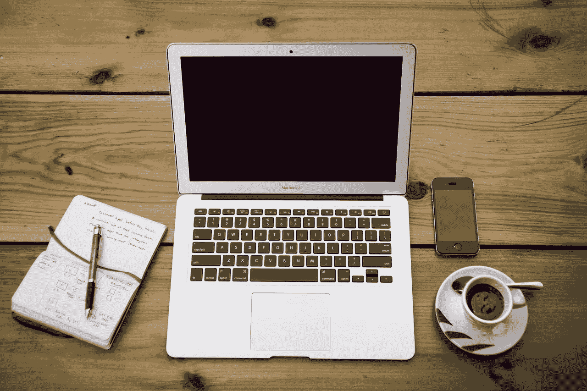
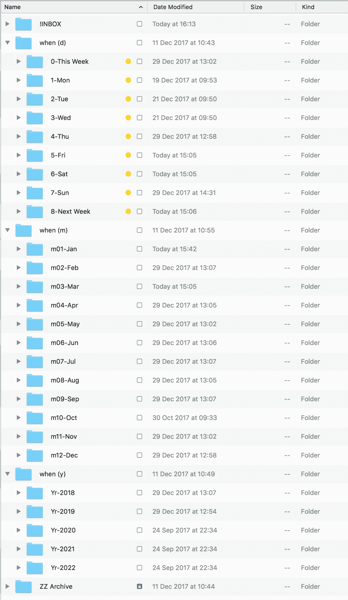
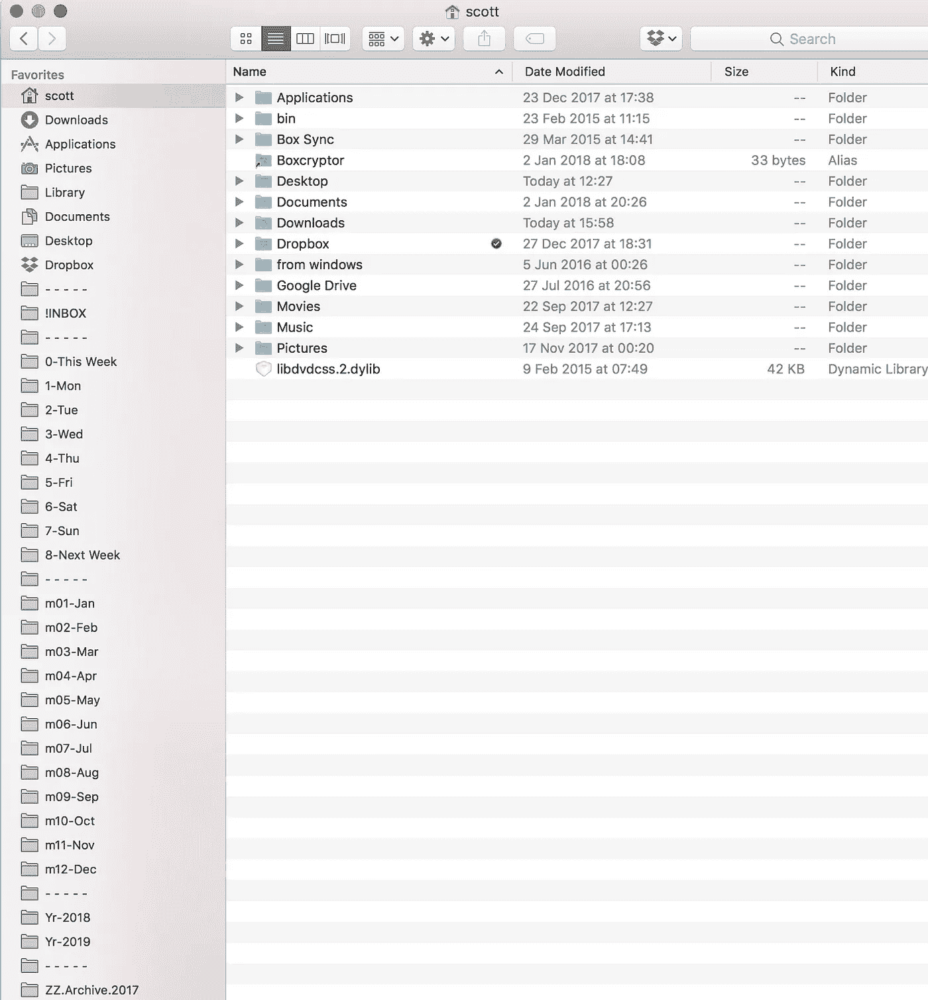

# “我是如何做的”做事指南:第一部分

> 原文：<https://medium.com/swlh/the-how-i-do-it-guide-to-getting-things-done-part-one-ead2cfb91419>

5000 封未读邮件。5 个电子邮件帐户，可在工作和个人设备上查看。家中一个 6 英寸高的纸盒

这些日志堵塞会让你的思维陷入一种唠叨的状态，让你觉得有事情要做，而你却没有去做。这种唠叨耗尽了你的思考能量，打断了你的思路，降低了你的效率。

新的基于人工智能的工具可以帮助你管理电子邮件/任务野兽，并确定什么是重要的，需要采取行动。不过，它们对线下世界没有帮助。它们不会帮助你管理你的目标和目的。

这是我的方法。这不是唯一的方法。当然不会适合所有人。但是(对我来说)很管用。我当然欢迎反馈和改进建议。

所以，我有三个要求:

1.  很简单
2.  **一个**通用收件箱，记录我可以在任何地方访问的所有内容
3.  安全、私密且有备份！

我不希望也不需要复杂的标签、专有软件工具、不友好的在线网络工具或其他解决方案。

它大致基于大卫·艾伦的[成事](https://www.google.co.uk/url?sa=t&rct=j&q=&esrc=s&source=web&cd=4&cad=rja&uact=8&ved=0ahUKEwjTvsyVncHYAhVqIsAKHRTZAVkQFghJMAM&url=https%3A%2F%2Fen.wikipedia.org%2Fwiki%2FGetting_Things_Done&usg=AOvVaw1eDDMYkWoYx6e03H3BqIc1) (GTD)，但在你继续前进以避免另一篇 GTD 文章之前(你没有时间了，对吗？)，我想向你保证，这是一个实用的方法——它可能需要 40 分钟来设置和一些纪律来管理，但它是有效的。我可以为此担保。

它是如何工作的？

每一封电子邮件、项目、任务、需要某种程度行动的想法都会进入我的通用收件箱(姑且称之为！暂时是收件箱)。

任何可以在 2 分钟内完成的事情都是在我每天计划的一次会议中完成的(稍后会有更多的介绍),因此避免了被添加！收件箱。

任何需要更长时间的东西都需要添加进去！收件箱，并根据其优先级和所需时间进行安排。哦，我说的“行动”也是指思考时间，而不仅仅是执行事情。

所以建立一个！收件箱。

你可以在你的电子邮件客户端上做这件事(但是我很难快速管理临时任务、我需要处理的文档、我想阅读的网页等等)

你可以使用像 Evernote 这样的工具(我不这么做，因为我越来越担心安全性、可读性和我可以永久访问的信心)

你可以用笔记本(我很容易丢)

我的选择是 Finder 文件管理工具是 OSX 的一部分。您同样可以使用资源管理器或其他文件管理解决方案。

我创建了如下的文件夹结构:

**！收件箱**:这是我收集所有需要安排的任务的文件夹

我有三个文件夹来管理我的“[备忘录文件](http://www.lifehack.org/articles/featured/back-to-basics-the-tickler-file.html)

**当(丁)**’:管理天

**当(m)** :管理月份

**When (y)** :管理年份

最后，我有 **ZZ 存档**，我已经完成或结束的事情被转移到那里。

在每个文件夹中，我都有一个命名约定，使用字母数字排序来表示每一天、月和年。

以下是我的工作流程:

1.  如果一项任务需要在某一天、某一月或某一年完成并不明显；它被添加到我的！收件箱文件夹(我将很快介绍我是如何做到这一点的)。95%的新任务都在这里完成。
2.  每天**结束的时候**我都会回顾一下！收件箱文件夹，并将任务移到我计划完成或开始工作的相关日期。为此，我在工作日的 17:30 有一个每天 30 分钟的循环会议。我在周日也有 60 分钟的时间来计划即将到来的一周。
3.  文件夹的逻辑是:

*   本周:我需要在本周做这件事，但是什么时候做并不重要，或者我还不能决定是哪一天。我在每天的回顾中回顾这个文件夹
*   8-下周:下周需要做的事情。我在周日的计划会议上回顾了这一点。
*   **m0x-xxx** :需要做的月份(未来)。可以包含不是本周或下周的当月任务。
*   **Yr-xxxx** :需要完成的年份(未来)

我在 Finder 的边栏中添加了链接，这样我就可以快速访问最常用的文件夹(见图片左侧)

我也有！我的 OSX 菜单栏中的收件箱。

设置的最后一部分是，所有这些文件夹都存在于 [Dropbox](http://www.dropbox.com) 中。这些文件夹也会备份到我的本地 TimeMachine。

这意味着我可以在家里、办公室和手机上访问我的文件，无论是在线还是离线。

我想第一部已经足够了。

在第二部分中，我将介绍如何快速添加东西到！来自电子邮件、网络和外出时的收件箱。

我还会遮住房间里明显的大象；安全。

第三部分将介绍我如何安排&执行任务和项目。待办事项列表是不够的。

## 这个故事发表在 [The Startup](https://medium.com/swlh) 上，这是 Medium 最大的企业家出版物，拥有 281，454+人。

## 在这里订阅接收[我们的头条新闻](http://growthsupply.com/the-startup-newsletter/)。

