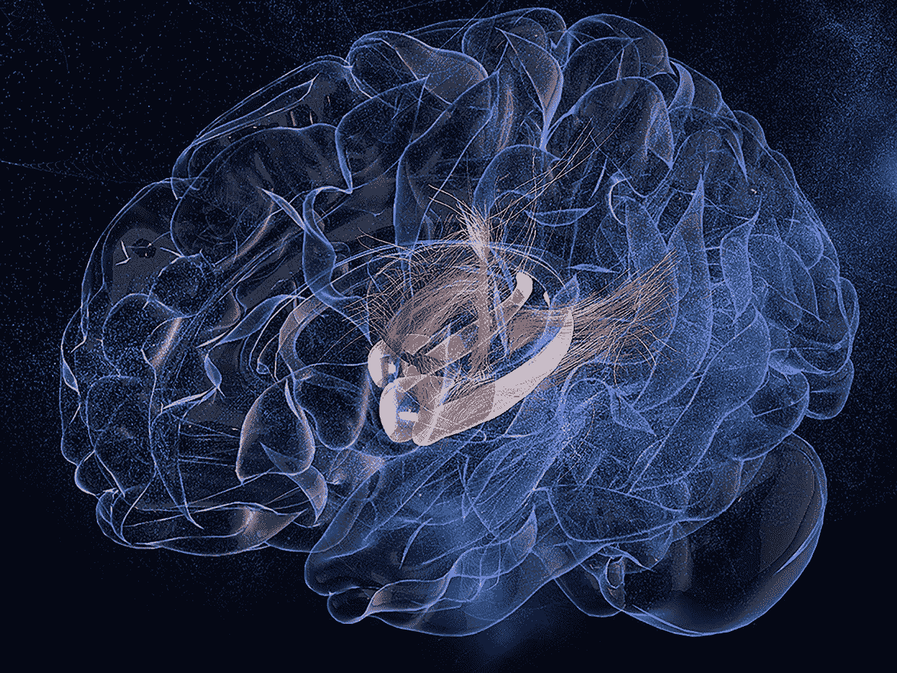

# 人脑讨厌创业公司！

> 原文：<https://medium.com/swlh/the-human-brain-hates-startups-1f28aafb83f4>

Image: Bona Kim/Emory University

进化和大脑(主要是边缘系统)是初创公司的敌人。为什么？损失厌恶、风险厌恶、现状偏差、禀赋效应(在产品界也称为 [9x 效应](https://elezea.com/2013/07/9x-effect/))等。这方面有很多行为研究。这里有一个[一](http://www.behavioraleconomics.com/mini-encyclopedia-of-be/status-quo-bias/)的剧情简介。

# 底线—我们只是讨厌失败！

在一些研究中，我们倾向于选择损失的风险，而不是获得的希望，比例大约是 2:1。我们在细胞层面对抗变化。

矛盾的是，为了生存，变化是大多数创业公司需要他们的客户接受的。

查看这个[链接](http://www.beinghuman.org/article/loss-aversion)了解更多关于损失厌恶的信息。

**现实生活中的例子** *(我工作过或建议过的 20 多家创业公司之一(d))*
几年前，我加入了一个由年轻企业家组成的伟大团队，他们利用非凡的技术解决了一个酝酿了 100 多年的问题。在几个月的时间里，该团队基于一项经过验证的底层技术创建了一个非常酷且易于使用的工具。在许多情况下，在大约一个小时内，过程是这样的:

1.  我们会从客户那里获取现有数据
2.  在我们的系统里搜索一下
3.  向他们展示他们当前的系统、组件和流程是多么低效。
4.  他们可以对数据进行分割，从多个角度向他们展示如何根据自己的市场需求从业务中获得最大收益。
5.  85%以上的时间，我们为他们节省了大量资金。

我们要拯救地球！我们要改变一个有几百年历史的无处不在的行业。我们太兴奋了！

有一次，我站在行业中代表数百万人和数十亿收入的一些最大的公司面前，根据我们与他们的一些同行所做的工作，向他们展示了他们大约 40 人的团队(代表行业的 10%)每年大约有 3 亿美元的浪费。浪费会直接影响他们的利润。天哪！你算算。

我们可以用他们自己的数据展示给他们看！他们可以实时做“如果…会怎样”的场景。你还需要什么？有人会认为，他们会当场给我们开支票，因为我们只希望收到一小部分作为我们的费用实现的节余。

遗憾的是，事实并非如此。

我们后来在几十次探索采访后发现，他们根本不在乎做出必要的改变来实现节约。以下是他们的理由:

1.  生态系统中有太多其他参与者受到影响。(我们后来发现有些人在和我们作对。)
2.  100 多年来(基本上)以同样的方式做这件事的惯性阻止了他们努力实现节约。
3.  他们觉得他们有更大的问题要先解决。

我们应该先做采访，从外到内对比从里到外。我们可能已经建立了整个生态系统所需要的东西，并带走了一些变化的负担。

大脑倾向于简单而非正确！创始人注意了。

他们更关心感知损失的风险，而不是未实现收益的前景。这是人类的基本条件，也是每个初创公司创始人都应该意识到的。

人脑不喜欢创业公司！

悲哀的事实:你可以拥有世界上最好的想法，毫无疑问地证明它的价值，但仍然会破产。人们并不总是做出理性的决定— [*行为不端*](http://www.amazon.com/gp/product/B00NUB4GFQ/ref=dp-kindle-redirect?ie=UTF8&btkr=1) 是一本关于这个话题的好书。

然而，还是有希望的，因为有些人已经穿过了这个小孔。以下是我观察到的情况。(请注意，这些主要基于 B2B 公司，但有些具有广泛的适用性。)

*   他们致力于解决需求。
*   他们真正关心的是为客户做得更好。
*   他们每天都在门口检查自己的自我和所有先入为主的观念。
*   他们让客户/潜在客户成为流程的一部分。
*   他们不会问客户要制造什么
*   他们会发现是否存在问题，并发现现在是如何解决的。
*   他们会发现当前解决方案中是否有任何弱点。
*   他们问了很多关于魔杖的问题。
*   他们确保创始人和另一个人是完整的，并致力于这个过程(至少你们中的一个人应该天生就有强烈的好奇心)。
*   一旦他们有了一些一致的反馈，他们会先与一小群似乎代表整体的人一起工作。有了 B2C，如果你有能力处理大型数据集，你可能会更好。
*   他们构建(或重新构建)，测试，失败，再构建，再测试，再失败……(你知道该怎么做)

如果你最终推出的东西获得了足够广泛的接受，你得到了足够的动力或者一些有影响力的人支持你，你可以利用已经提到的相同的一般神经偏见——损失厌恶的一个方面，有时被称为 FOMO(害怕错过)。

大多数人不喜欢被落在后面，但很少有人想成为第一。我们都想有归属感，但也想觉得自己是独一无二的。这就是为什么朋克很强大，纹身卷土重来，苹果如此成功…很奇怪吧。

这个过程永远不会停止，因为众所周知的曲棍球棒不会永远持续下去，随着市场和业务的增长，最终看起来更像一个“S”。增长意味着继续创新并专注于业务中的四个主要决策——人员、战略、执行和现金。请查看我之前的[帖子](/swlh/30-years-30-businesses-16-startups-3-lessons-learned-a8d4ff04e80c)了解更多关于这个话题的信息。

例外！

## 这篇文章发表在[《创业](https://medium.com/swlh)》上，这是 Medium 最大的创业刊物，拥有+ 378，330 名读者。

## 订阅接收[我们的头条新闻](http://growthsupply.com/the-startup-newsletter/)。

