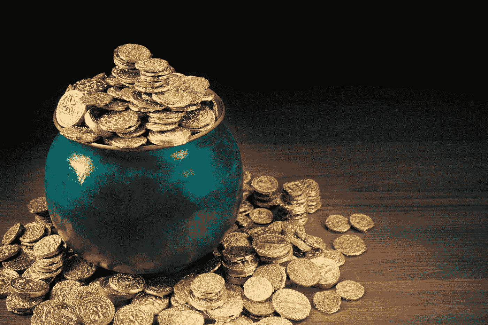
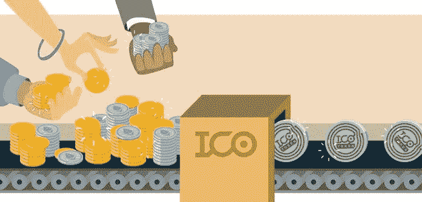

# ICO 经济和你需要了解的知识

> 原文：<https://medium.com/swlh/the-ico-economy-and-what-you-need-to-know-about-it-f46bfb026500>

如果你正在阅读加密货币，或者如果你在加密领域呆了一段时间，如果不阅读最新的惊人 ico，你就无法打开脸书、Twitter、谷歌或 Medium。

我是你的粉丝！但我不是粉丝！

这个概念很棒，另一方面，创业公司现在如何使用它，大多数时候都令人失望。无论如何，让我们来谈谈这个概念，以及它如何让每个人都有可能把钱投资到世界上最富有的 0.04%的人的地方。

> ico 让每个人都有可能把钱投资到世界上最富有的 0.04%的人的地方。点击发微博

# 很酷的概念，ICO。

ICO 的概念很酷。在人类历史上，人类(甚至你的祖母)从来没有收购过一家公司，并且:

*   分享他们的利润；
*   搭上公司成长的顺风车；
*   或者投资于人们通过使用实际产品/服务/协议/或 ICO 代表的任何东西来增值的东西。

例如:如果人们使用 Steemit.com，代币的价值会随着需求的增加而上升。

# 世界上 99.96%的人根本无法像其他 0.04%的人那样投资！

在 ICO 现象出现之前，如果你:

*   有关系；
*   有很多钱；
*   对你想投资的分支机构的一切都了如指掌；
*   在正确的时间、正确的时刻听说了这个机会；
*   有时间会见你所投资的初创公司的创始人，对他们进行彻底的尽职调查，并让你的关系为他们担保。

在 ICO 现象出现之前，市场是这样的:

为了这篇文章，我假设你和我都是“普通投资者”。我们桌上还剩下一点钱，我们不想把它花在像最新的电视或新车这样的负债上，所以我们决定让我们的钱为我们服务，我们投资于资产。

我们的部分资金被保留用于“高风险投资”，所以我们看看脸书、特斯拉、阿里巴巴和谷歌。

所以等一下。哼！我错过了什么？其余 92.8%的谷歌股票在 IPO 期间去了哪里？这很简单。

这些股份的一部分给了团队，拉里&谢尔盖的股份比开发者#29.458 多一点，但剩下的呢？

**其余的给了早期投资者:“天使投资者”和“风险投资公司”。**

天使投资者通常提供一次性投资，以帮助企业推动或持续注入资金(通常来自风险投资)，以支持和帮助公司度过艰难的早期阶段。

美国的天使投资者必须符合证券交易委员会(SEC)对合格投资者的标准。要成为天使投资人，你必须至少拥有 100 万美元的净资产和 20 万美元的年收入。

上次我检查的时候。世界人口的 99.96%每年挣不到>20 万美元，因此不属于“潜在天使投资者”的范畴。

风险投资公司获得了 IPO 的最大份额。他们向多家创业公司投入大量资金。他们中的许多人失败了，有几个做得很好，有几个成为了下一个谷歌或脸书。

那是在 ICO 现象之前。你(假设你属于世界上 99.x %的人，假设你不在一个自己发股份的有前途的创业公司工作)没有机会投资早期创业公司。

# ICOs 代币:现在每个人都可以投资一切！

所以你可以问自己:

*   为什么早期创业公司不给你我买 100 美元股份的机会？
*   为什么美国证券交易委员会不允许人们每年投资 500 美元在早期创业公司，即使他们没有被认可，一小笔钱也不会伤害任何人，对吗？

现实是，即使上面的回答是“是的，我们让这成为可能/是的，证交会允许这样做”，这也是不可行的。

你如何跟踪你公司里成千上万人持有的迷你股票？就是不可行。

**ICO 解决了这个问题。ICO 本身没有解决这个问题，但是“令牌”解决了这个问题。**

# 那么什么是 ICO，它是如何中继到令牌的呢？

ICO 代表首次发行硬币。虽然加密社区并没有完全下定决心，实际上这个术语是错误的。它应该是一个 ITO:初始令牌提供。无论如何，既然 ICO 是通用术语，现在更改它没有任何意义。

加密社区中的硬币是一种数字货币。另一方面，代币是一种可编程的数字货币/储值方式/更多(见下文“代币怎么样，它有什么特别之处？”

代币是所有这些 ico 赠送的东西，以换取另一种加密货币或法定货币。

# 但是令牌是如何创建的呢？

代币可以通过在以太坊、Waves & NEO 等平台上构建所谓的 DAPP(去中心化应用程序)来创建。

或者一些不太熟悉的公司:Qtum/NXT/UbiQ/counter party/Omni/元宇宙 ETP，将来可能还有 EOS / Lisk。

这条规则有一个例外。这是 Bancor，如果他们的平台有一天会完成，每个人都可以创建“智能令牌”。

可以凭空创造的代币，并且可以在另一个硬币或代币中保留。这个系统有点复杂，但从长远来看很有趣。

在 ICO 期间，智能合约可以将加密货币兑换为令牌。请注意，您可以在不发布令牌的情况下构建 DAPPs。

# 好吧，我明白了..那么代币怎么样，有什么特别的吗？

代币的工作很简单:你给一家公司钱，公司给你一个代币作为回报；

*   这通常在 ICO 期间完成。
*   Token 代表:价值(既然你一开始就给公司付费了)；
*   令牌有可能在您支持的平台/服务/产品上使用；
*   代币可能用于折扣；(用作折扣卡)
*   代币使我有可能给你利润分成(分红)；
*   代币使你有可能投票。每个代币有 x%的投票权；

如果公司的令牌是好的，其他人想要令牌，需求增长，价格上涨。

换句话说:现在可以成为投资者，在没有任何行政麻烦的情况下向早期创业公司投资<1 美元。

突然之间，你可以让每个相信你的公司的人来投资你的公司，你可以奖励每个这样做的人，而不需要太多的行政麻烦。

最重要的是，您所有的令牌持有者都存储在区块链上。没有人再讨论是否有人持有代币。

**区块链:**

*   使伪造成为不可能；
*   具有防欺诈性；
*   是分散的，因此没有单点故障；
*   使得免费持有代币成为可能；
*   转让代币时收取超低固定或有时免费的交易费用；
*   不像你的股票经纪人那样有欠条(我欠你的/一份承认债务的签字文件)。你实际上真的持有代币，它们真的是你的。它们存放在你自己的钱包里。

# 代币让世界上其他 99.96%的人可以投资任何东西。

之前，我在这篇文章中使用了“早期创业公司”和“公司”作为例子，但还有很多其他有趣的高风险选项，0.04%的人将他们的钱投资于这些选项，而这些选项目前是无法获得的。

实际上，事情变得更有趣了。每个人都可以创建代币。以你当地的面包店为例。他们可以创造代币并出售。

面包店创造新的资金来扩大商店和购买一些新的烤箱。作为回报，代币可以给你日常面包一个不错的折扣，以及面包店利润的年终分红。

**等等！更有趣的是:**代币也可以作为折扣券或积分系统。汉堡王(Burger King)最近推出了一种代币来做到“就那样”。

简而言之:我们有可能为任何事物创建令牌。每一项服务，每一家店铺，每一件产品，每一项资产等等。

# 如果这是革命性的，为什么我会读到这么多关于 ICO 的负面报道？

就像每一次新的革命一样，尤其是当有钱可赚的时候，总会有人从中渔利。

> 就像每一次新的革命一样，尤其是当有钱可赚的时候，总会有人从中渔利。ICOs 也是如此。点击发微博

我写了一篇很好的文章:大多数 ico 有什么问题，目前 ico 根本没有任何意义！一个可能的解决方案是 IPCO 模型，我在这里写了它。

由于抱怨是为那些不寻找解决方案的人准备的，我将在下一篇文章中提出可能的解决方案。

现在，请分享你对这篇文章的想法。我真的很好奇你对 ico、代币的想法，以及你现在看到的可能的机会，我们有了这个新的筹款媒介，让人们成为我们业务的一部分。

# 请随意分享您对这一新现象的建设性反馈和意见，以便我们进行一些具有前瞻性的讨论🙂

另一个问题:你和我一样对加密市场感到兴奋吗？

如果你能帮我，让我知道你对我们创业的想法，那就太好了:【CoinCheckup.com】T2

*原载于 2018 年 4 月 23 日*[*coincheckup.com*](https://coincheckup.com/blog/ico-economy/)*。*

## 这篇文章发表在 [The Startup](https://medium.com/swlh) 上，这是 Medium 最大的创业刊物，有 319，283+人关注。

## 在此订阅接收[我们的头条新闻](http://growthsupply.com/the-startup-newsletter/)。

