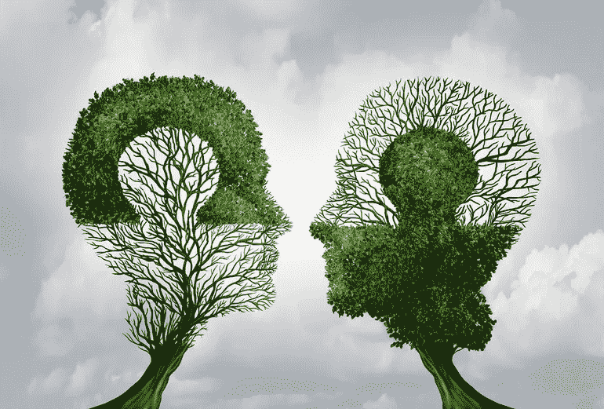

# 联系的幻觉

> 原文：<https://medium.com/swlh/the-illusion-of-connection-44fcdcad6eea>

## 我们是普通人

我们是谁？我们要么是我们一生的经历、接触和周围环境的累积组合..或者我们仅仅是一个瞬间的能量振动，无限地回荡。呃…今天让我们从科学和前者开始吧。

“我们是相处时间最长的五个人的平均值。”吉米·罗恩。

这涉及到平均律，即任何给定情况的结果都将是所有结果的平均值的理论。我们不仅是他们的普通人，也是他们的信仰、习惯、恐惧、心态、精力、意志力等的普通人。这是一个有趣的警告，当我们走出一步，看看我们身边的人和事。这五个最能塑造和影响你现在的你和未来的你。我们也许不能控制谁，但我们可以控制多少。

那么，你们五个是谁？你是谁？你想成为谁？你想象自己是什么样的人，或者渴望成为什么样的人，并把时间和精力花在他们身上？他们是如何做到的，用什么方式做到的？

## 进入:连接的幻觉

我们知道我们是与我们交往最多的五个人的平均值。但是谁是我们的 10 号？我们的 50？我们的 150？我们投入了多少时间、精力和注意力来维持这些关系？更有趣的是，当有一片空白时，我们做什么？

开始，我们的时间和注意力有限。24 小时减去睡眠、专注的工作和上厕所的时间。剩下的是我们给予和接受的能力。

理论认为我们有能力维持:

*   5 我们离不开的难以置信的亲密的个人关系，这些关系极大地塑造了我们。我们五个人。
*   10 种有意义的、可信的、可靠的长期友谊，它们会为我们做任何事情，我们也会为它们做任何事情；
*   50 个亲密的朋友组成了我们的“和我们一样的人”部落，他们有着相似的兴趣、性格和相互尊重。
*   150 种可靠稳定的友谊，最著名的是“邓巴的数字”。最喜欢的人，我们希望我们能花更多的时间在一起，更好地了解他们。有趣的是……如果在这些类别中有一个空白，我们不会把精力和努力转移到现有的人身上，而是通过想象自己与遥远的人和人物的联系来填补空白。

    我们会跟随、观察、阅读、倾听和参与那些我们没有实际接触的人的生活；在自我构建的虚幻叙事中经历或与他们一起生活，我们将其视为友谊经历，仿佛这是有意义的现实。

    补充说，我们的屏幕驱动的超连接世界有助于这些想象关系的灌浆比例，并且正在发生真正的转变。所以，再问一次…谁是你的 5，10，50，150？在哪里，用什么来填补空白？寓意:我们是我们周围五个人的平均值。除此之外，我们能够付出和接受的时间、精力和注意力是有限的。我们应该明智地选择。

    这样如何……你想成为谁？在你的想象中，你周围的人会是什么样的人，会把时间和精力花在什么事情上？成为你想成为的人。

## 这篇文章发表在 [The Startup](https://medium.com/swlh) 上，这是 Medium 最大的创业刊物，拥有 281，454+人关注。

## 在此订阅接收[我们的头条新闻](http://growthsupply.com/the-startup-newsletter/)。

