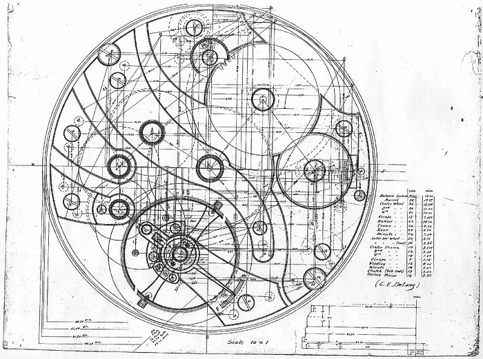
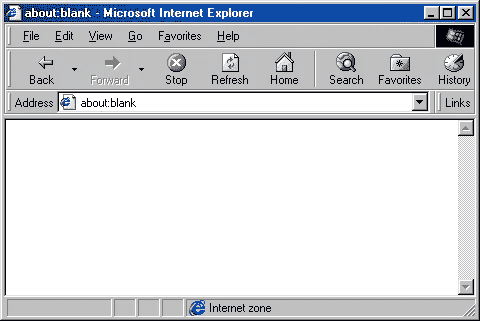
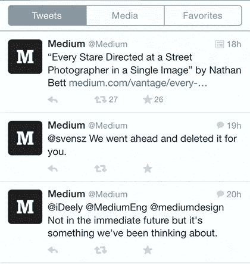
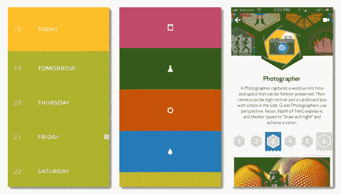
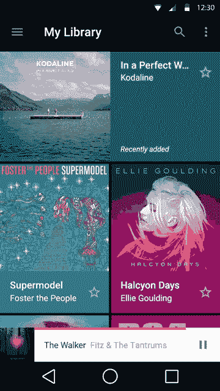
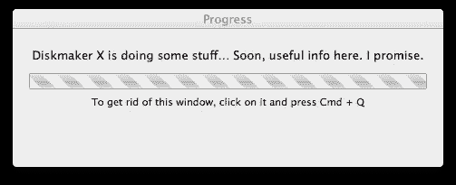
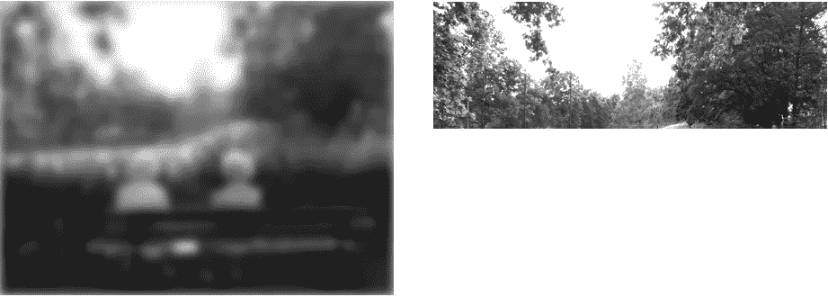
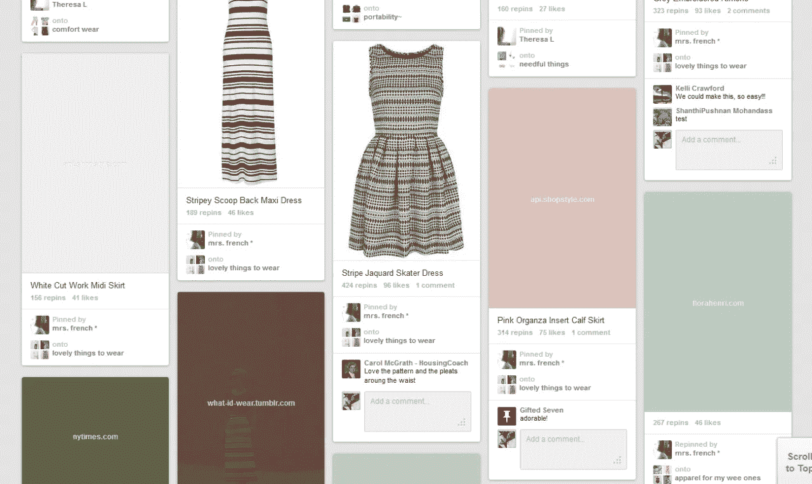

# 时间的幻觉

> 原文：<https://medium.com/swlh/the-illusion-of-time-8f321fa2f191>

时间感知如何塑造用户体验

我的祖父是一名钟表匠。当我还是个孩子的时候，我常常坐在他巨大的木头桌子旁边，看他设计和组装由几十个精致的零件组成的钟表。他在设计的每一个方面投入的耐心、决心和精确性是我一直钦佩的。

Clockwork architecture drawing

第一次看运转的发条装置感觉像是魔术。虽然电脑的内部看起来相当冰冷和沉闷，但手表的美丽、工艺和人情味立即迷住了我们。

直到我十二岁的时候，我的祖父终于给了我一个。当他把它戴在我的手腕上时，他说了一些我永远不会忘记的话:

> "记住，时间是最珍贵的礼物."

也许没有《蜘蛛侠》中本叔叔的最后一句话那么戏剧化，但它从此对我思考设计的方式产生了影响。时间是我们拥有的最宝贵也是最有限的资源。这就是为什么好的设计是为了节省时间。

# 数字时代的时间

设计数字体验伴随着一种根深蒂固的痴迷。对速度和性能的痴迷。亚马逊计算出，仅仅增加*一秒*的加载时间就可能让它每年损失 16 亿美元的销售额。当页面速度降低 0.4 秒**—s*卡里狗屎！*

***那么我们该怎么办？***

*我们创建性能预算，削减开支，运行图像优化，缩小我们的 JavaScript 和 CSS，并将我们的资产缓存在位于全球最具异国情调的服务器上。*

*不过有一个警告。首先，[更快不一定等同于更好的体验](http://uxmas.com/2013/wait-for-it)。其次，*对时间的感知是高度主观的*，或者像爱因斯坦恰当地说的那样:*

> *“和一个漂亮女孩坐在公园长椅上的一个小时像一分钟一样过去，但坐在热炉子上的一分钟却像一个小时。”*

*还记得你最后一次糟糕的约会吗？时间突然过得非常慢，你唯一能想到的就是为什么你没有坐在家里舒适的沙发上看《权力的游戏》的最新一集。我想到了许多其他较少涉及激素的例子。*

*当你盯着手表看时，你可以真切地感受到时间是如何变慢的。有时候甚至感觉手表停了一秒钟。*

*在假期，时间观念会发生巨大的变化。不成比例的新印象改变了我们对时间的感觉。这就是为什么最初的几天通常看起来“很慢”,而后面的几天却过得飞快。*

## *时间<>交互设计*

*时间是交互设计的关键部分。在一天结束时，用户必须等待的绝对分钟和秒钟并不重要。这是关于人们如何体验和记住它们。*

*亚马逊的案例对此有所启发。*

*UIE 的一项 T2 研究比较了网页的感知速度。他们发现亚马逊的平均下载时间为 36 秒，比 About.com 的平均下载时间 8 秒更快。这是巨大的！他们一路上发现了更多…*

> *当用户完成他们在网站上设定的任务时，他们会觉得这个网站很快。*

*这怎么可能呢？*

**我们不会用绝对的术语来编码时间。*这很大程度上取决于个人的情绪状态和背景。当我们因为一项活动而感到快乐和进步时，我们几乎没有注意到时间。这同样适用于用户界面。设计良好的界面让人感觉更快，尽管它们实际上可能会更慢。*

*让我们看看我们可以用什么样的设计策略来改变时间感知，并潜在地创造更流畅的体验。*

# *1.*

# *保持用户参与*

*你去过曼哈顿吗？当你站在人行横道上时，你会目睹人类行为的一个显著模式。人们急切地按信号按钮，希望减少等待时间。按下这些按钮的频率通常与行人的沮丧和压力程度成比例地增加。*

*但是有一点大多数人都没有意识到:*

> *曼哈顿大约 90%的人行横道信号按钮什么都不用*

*那为什么这些按钮还在？如果他们实际上不工作，为什么市政府不把他们赶走？*

*答案很大程度上取决于我们所说的“工作”是什么意思。人们通常认为等待时间比实际时间要短。这些按钮工作正常。只是不是我们预期的方式。*

*让人们参与进来是减少等待时间的最古老、最有效的策略之一。这就是为什么我们在电梯里有镜子，为什么在候车室里有八卦杂志和书籍，为什么我们总是倾向于在*【等待体验】即将到来时查看我们的手机。**

## **网络呢？**

**在过去人们使用 Internet Explorer 浏览网页的美好时光中，我们总是不得不看着空白的画布，直到加载新的页面:**

****

**Internet Explorer Windows 98**

**广阔的白色带来了自我反省、空虚和不确定的时刻。**

**后来版本中引入的一个小变化改变了这一点。通过保持当前网站打开，直到新的页面被加载，使人们相信网站加载更快，仅仅是因为人们能够继续参与当前显示的内容。**

**迪士尼乐园因尽可能愉快地创造等候线而闻名。从建筑中借用基本原则，他们确保人们在开始时不会因为看到线的尽头而沮丧。你在排队等候的不同阶段移动，同时总是发现新的东西。有些人甚至说，迪斯尼乐园的人们不是在排队，而是在排队时很开心。**

****外卖**:我们在*之前讨论过的按钮，从体验的角度来看*起作用。这不是技术在起作用，而是心理学在起作用。**

**如果我们想创造更流畅的体验，我们需要停止将技术视为我们唯一的救世主。*让我们缩短等待时间，为人们提供有价值的内容，如提示、链接、报价等。让他们的等待时间更有意义。***

# **2.**

# **乐观地执行行动**

**今天的网络和移动应用充斥着微型状态。无论是 Instagram 上的赞按钮还是 Twitter 上的推文，我们的应用程序都需要不断与我们的服务器保持联系。**

**每个需要与后端通信的交互都会引入潜在的延迟。让我们看看如何摆脱这一点，让我们的应用程序感觉更快一点。**

**追溯到 1968 年的研究表明，我们将响应时间分为三个不同的类别:**

****100 毫秒**
100ms 以下的一切感觉都是瞬间反应。在手机上试试。大多数手机网站都有令人讨厌的 300 毫秒的点击延迟。这些额外的毫秒可以在我们对接口速度的感觉上产生关键的差异。**

****1 秒**
用户保持在应用程序的流程中，但失去了对即时反应元素的控制。**

****10 秒**
代表用户开始思考生活中存在的问题之前的绝对极限。**

**只要有可能，我们希望在甜蜜的 **100 毫秒范围内**。Mike Kriege 首创的一个设计策略，他称之为*“乐观地执行行动”，*试图解决这个问题。**

**当在 Instagram 上喜欢一张照片时，它不会显示加载指示器，而是在后台进行服务器通信时，即时激活心形图标。这使得体验更加流畅，因为用户只有在操作失败时才会被打断。**

**Twitter 使用了同样的技术。**

****

**Fav feature as seen on Twitter.**

****要点:**
通过在用户界面上提供*即时*反馈，设计和创建更加乐观的用户界面，增强用户的流动。**

# **3.**

# **创建过渡接口**

**运动已经成为现代用户界面设计的一个关键因素。如果时间和空间是交互设计不可分割的一部分，那么运动就是表达它的关键。我们不能再把运动当成点缀了。动画是一种非常强大的工具，可以引导用户体验、讲述故事、增强流动和创建品牌互动。**

****

**Branded interactions in mobile apps**

**当谈到使用动画时，时机是至关重要的。如果时间太长，用户会觉得每次都被迫观看你的噱头。太快了，他们可能会错过关键的细节。关于动画的文章已经够多了，所以我不想在这里赘述。**

**然而，在时间知觉的背景下，有一个我们应该考虑的关键因素。我们可以使用动画来减少等待时间。看看下面的例子:**

****

**这部动画相当慢不是吗？如果我们每次都要看这个动画，它可能会变得很烦人。不过，如果使用得当，这种动画可以让我们在从服务器加载新内容时获得一些额外的时间。**

**较慢的动画可以*将注意力从等待转移到应用程序的使用体验上。*我们将再次遇到的一个关键因素。**

****外卖**:我们越有意识地体验等待时间，它就变得越长。就像魔术师一样，我们可以使用动作来抓住用户的注意力，并将他们的注意力转移到我们想要的东西上。**

# **4.**

# **避免模态微调器**

**你有没有想过为什么在商店排队时，你总是感觉自己排在最慢的队伍里？原因是**意义**。**

**我们不时会遇到令人痛苦的缓慢排队。然后，我们会在偶尔下班后喝酒时告诉别人我们的经历。我们谈论得越多，记忆就变得越重要。下一次我们遇到类似的情况时，我们会立即回忆起这个时刻，以及随之而来的所有负面情绪。结果是:我们变得有偏见，认为这种事发生在自己身上的次数比发生在别人身上的次数多。**

**这同样适用于 ajax spinners 和其他活动指示器。**

**不管它们有多漂亮，在看到数以千计的五颜六色的花式纺车后，你会意识到这个家伙会像一个饥饿的胖吃豆人一样吃掉你的时间。这是我们经常使用它们的方式。考虑这两种设计聊天应用程序的方法。**

> ****接近 A**
> 每当用户点击发送按钮时，他会得到一个全屏模式旋转器，显示一条消息正在被发送。**

**每当用户点击发送按钮时，一个小的旋转器就会被附加到发送的消息上。一旦服务器收到消息，微调器就会消失。**

**哪种方法更好？很明显，对吧？方法 A 产生了摩擦，迫使用户每次发送信息时都要看着旋转器，而方法 B 包含了心流。**

**将此与我们之前讨论过的 Twitter 的 fav-functionality 进行比较。想象一下，如果你每次点击 fav 按钮都要等到服务器完全处理完你的请求，那该有多烦人。您会立即停止使用该功能。**

**这不仅仅适用于聊天应用。它适用于所有涉及微观状态的相互作用。方法 B 显然更好，但人们仍然经常选择方法 A，因为它似乎更容易构建。**

****外卖**:合理使用旋转器。避免全屏微调器阻塞应用程序的用户界面状态。**

**沟通等待时间更长**

**有时，更长的等待是不可避免的。我们设计它们的方式极大地影响了人们体验它们的方式。**

**以逛餐厅为例。在餐厅等候时，有几个因素在起作用:**

# **5.**

# **我能马上得到服务吗？我很早就被注意到了吗？**

**我是否知道预期的等待时间并感觉它是合适的？**

**我明白*为什么*我必须首先等待吗？**

*   **我是否得到了诚实的对待，或者我是否需要比其他人等待更长的时间？**
*   **空气中是否弥漫着一股美食的香味？**
*   **所有这些因素创造了一系列预期，为接下来的经历铺平了道路。事实上，设定错误的期望会让最好的人变成令人讨厌的混蛋。**
*   **这同样适用于数字领域，一个小小的失误，比如用错了按钮的颜色，就可能让一个看似谦逊平和的人变成最阴险的巨魔。让我们通过帮助人们更好地利用时间来避免这一点。**
*   **进度条**

**在寻找交流进展的方法时，一个不可或缺的工具显而易见:**good ' ol 进度条**。事实证明，进度条有好有坏。那么进度条什么时候是坏的呢？**

***总之，说谎的时候。***

# **还记得旧的 Windows 应用程序的设置过程吗？它启动得非常快，然后在 99%的时候突然停止，时间长得不成比例。如果你从一开始就知道整个过程需要多长时间，你就会去喝杯咖啡。但是你没有。**

**传达的进度设定了错误的期望。你没有啜饮美味的拿铁咖啡，而是盯着屏幕，绝望地等待那最后的 1%完成。不太令人愉快。**

**这不是一个新现象。几十年来，进度条一直在欺骗我们，这并不令人惊讶。构建真实反映系统状态的进度条本身就是一项极其复杂的任务。**

**但是也许我们弄错了进度条。也许我们需要重新思考他们为什么会在这里。也许他们的目的从来就不是给我们提供准确的信息。也许他们真正的好处在于建立合理的预期，并给人们一种视觉上引人入胜的方式来观察估计的进度。**

**实现这一点的一个方法是确保进度条以一个规则的、可预测的速度移动。但是还有更多…**

****加速进度条****

**时间是主观的。如果我们可以通过一些简单的设计调整来改变对速度和时间的感知会怎么样？我们能侥幸逃脱吗？克里斯·哈里森进行的一项研究试图回答这个问题。这是他们的发现。**

**众所周知，频率和节奏的变化会影响人们对时间的感知。研究发现闪烁的进度条比静态的感觉更快。当他们增加向相反方向移动的罗纹时，时间错觉变得更加强烈。*所有这些都能让等待体验加快 11%。***

## **其他研究发现，使用者很容易被启动。他们更喜欢在程序开始和结束时更快的进度条，这与 Daniel Kahnemann 的峰值结束规则相一致。**

**有些人可能会认为，这种调整是欺骗性的，是操纵行为。我认为它们是有益的。就像曼哈顿的人行横道信号按钮一样，这些设计调整减少了感知等待时间，改善了整体体验。**

**Progress Bar Study by Chris Harrison**

**试试这个简单的技巧:下次你在电脑上移动一个大文件时，调整进度窗口的大小。它越宽，感觉就越快，因为进度指示器需要覆盖更大的距离。**

**倒计时/预计到达时间**

**虽然进度条是交流进度的高度可视化的工具，但它通常是不够的。尤其是更长的等待时间需要一个更精确的指标。进入**倒计时**。**

**由大卫·迈斯特所做的关于排队等候的臭名昭著的研究表明，知道估计的等候时间会让人感觉更快。另一方面，获得错误的信息会导致相反的结果:**

****

# **“[……]反复宣布“只剩几分钟”的飞行员在等待持续不断的情况下雪上加霜。顾客不仅被迫等待，而且没有得到诚实的对待。”**

**用户可以大大受益于反馈显示更长的等待时间。它允许他们做其他事情，稍后再回来。同样，精确度并不像人们想象的那么重要。这是为了给用户一个粗略的概念，整个过程需要多长时间。需要一两分钟，还是 10 多分钟？**

**要点:加快你的进度条，确保你不是那 99%的混蛋之一。利用倒计时来延长等待时间，这样用户可以更好地利用他们的时间。**

> **逐步加载内容**

**几个月前，我去伦敦参加一个会议。每当我去那里，我一定会去一趟我最喜欢的咖啡馆:*乔&果汁*。我只是喜欢那里的气氛。轻松的歌曲、足够的工作空间、鲜榨橙汁、上好的浓缩咖啡，当然还有漂亮的 Slayer 3 组咖啡机。**

**这一次，我的访问会有所不同。这是一个阳光明媚的星期五下午，令我失望的是，商店因为装修而关门了。它被巨大的布帘覆盖着，上面写着*“我们正在为您翻新”*。相信你也见过类似的。重点是建立预期，让人们知道新的东西来了。**

# **6.**

# **在过去的几年里，有很多关于是否应该使用渐进式图像渲染或者坚持默认的“基线”渲染方法的争论。区别主要在于图像的加载方式:**

**虽然渐进图像在不同阶段加载，从像素化和模糊到清晰，基线图像从上到下线性加载。渐进式图像的基本思想是改善用户体验，因为图像已经占据了它的位置，就像封面一样，让用户知道发生了什么。**

**这不仅仅是图像。脸书采用了渐进式图像渲染的基本思想，并将其应用到他们的帖子中。尚未加载的帖子使用此占位符:**

**这个占位符设定了期望值。当你去 facebook.com 的时候，这种经历似乎更顺利，因为那里已经有一些东西了。一旦帖子的内容被加载，占位符就会被实际内容替换。**

****

**Progressive (left) vs baseline loading.**

**Pinterest 遵循类似的策略。它们显示图像最主要的颜色，直到它被完全加载。**

**从无内容到实际内容的过渡更加无缝，总体上看起来更快。**

****

**Facebook content placeholder by George Philipps**

**类似地，我们应该优先考虑位于折叠上方的资产，然后是位于网站底部的资产。**

****Takeway:** 逐步加载内容，以便尽快获得基本体验。**

****

**滴答。托克。**

**我们对时间的感知，以及人们对我们放在这个世界上的东西的每一种体验，都是由我们可能没有意识到的各种因素形成的。只要技术没有完全消除等待，我们就可以利用我们对世界的主观感知，让我们的体验变得更加爽快、无缝和迷人。**

**时间是宝贵的，也是最珍贵的礼物。让我们充分利用它。**

# **感谢您的阅读。如果你发现了其他适合你的策略，请分享。**

**如果你喜欢这篇文章，请*推荐*。可以关注我的 [*推特*](http://twitter.com/@azumbrunnen_) 。**

**图片提供给:**

**马塞洛·格拉**

**[照片中的历史](http://historyinphotos.blogspot.ch/2012/06/golden-gate-bridge.html)**

**新老库存摄影**

*   **[NCPR](http://www.northcountrypublicradio.org/news/npr/96654742/a-depression-era-anthem-for-our-times)**
*   ***纪念我的祖父彼得·沃纳·珍妮。谢谢你教我如何阅读时间。***
*   ***发表于* **创业、旅游癖和生活黑客****
*   **[NCPR](http://www.northcountrypublicradio.org/news/npr/96654742/a-depression-era-anthem-for-our-times)**

*******

***In memory of my grandfather Peter Werner Jenny. Thank you for teaching me how to read time.***

****

***Published in* **Startups, Wanderlust, and Life Hacking****

************

**-**