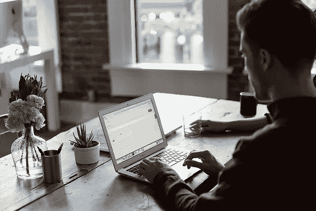

# 你所处的环境对你成功的影响

> 原文：<https://medium.com/swlh/the-impact-of-your-environment-on-your-success-3c42f3fd8c50>

[Free-Photos/pixabay](https://pixabay.com/en/office-office-desk-laptop-desk-1081807/)

当你想到成功时，你会想到什么？对我们大多数人来说，它更努力、更长久、更聪明。

当然，你可以通过努力和聪明的工作来提高你的成绩，但这只是成功公式中的一个因素。还有其他因素如环境 [**身份**](https://ideavisionaction.com/personal-development/a-shortcut-to-building-an-identity-for-success/) 。

创造合适的环境会提高你的生产力、效率，甚至是你的动力。这将导致更好的结果。

# 在家工作！做自己的老板！

这些是许多在线营销人员用来销售他们赚钱的在线课程的口号。登陆页面通常会有一个穿着比基尼的女人，膝上放着一台笔记本电脑，在沙滩上“工作”。

我们都知道，由于阳光耀眼，不可能带着笔记本电脑在海滩上工作。笔记本电脑不应该放在膝盖上使用，因为它会变热。

尽管如此，年复一年，新人们还是会将他们的电子邮件和信用卡信息输入到这些登录页面中。怎么会这样

# 老实说

这里有两个场景。

1.  你在办公室工作。你穿严肃的衣服。你从九点到五点工作。
2.  你在家工作。你穿睡衣。你想什么时候工作就什么时候工作。

在哪种情况下，你的工作效率最高？在哪种情况下你能产生最多的结果？

与第一种情况相比，你可能更喜欢第二种情况，但是你会同意在第一种情况下你会更有效率。

办公室环境和严肃的服装有助于你进入工作状态。你的家和睡衣让你感到休息和放松。

# 内政部

在家工作有它的好处。

*   避免日常通勤。
*   弹性工作时间。
*   轻松、舒适的环境。

然而，这并不意味着穿着睡衣工作，躺在床上，背景是白天的电视。你需要一个有助于你集中注意力并激励你把工作做到最好的环境。

# 创造成功的环境

你如何改善你的工作环境来提高你的绩效？

*   你的书桌和书架上有什么乱七八糟的东西是你可以处理掉的吗？
*   能不能弄个好一点的办公桌和办公椅来提升业绩？
*   你身边有哪些让你分心的事？
*   是否需要关闭手机或开启“请勿打扰”模式？
*   你能清理你的电脑桌面吗？
*   你的桌面壁纸让你分心了吗？

我最喜欢的工作配件是降噪耳机。我听轻松的古典音乐。我一整天都会喝几杯咖啡和绿茶。所有这些都有助于我专注于手头的任务。

你可能会认为这些只是细节，但是一系列的小调整组合起来会有很大的不同。如果你每天取得 1%的进步，你将在一年内**改善你的生活 38 次。**

> ****在你的工作环境中，你能做出哪 1%的改进？****

# **投资您的环境**

**你是否使用了金钱所能买到的最好的工具？你是否使用了你能负担得起的最好的电脑、智能手机和软件？**

**智能手机的主屏幕上有哪些应用程序？它们是提高了你的工作效率还是分散了你的注意力？**

**你家离你工作的地方有多近？你住在什么样的社区？我知道你不可能在一夜之间做出这些决定，但这些决定值得思考。**

**开始时，这些改变中的一些听起来可能需要大量的时间、金钱和努力来实现，但是想想它们将随着时间的推移而支付的红利。如果你每天能节省一个小时，难道不会对你的整个职业生涯产生很大的影响吗？**

# **为成功设计你的家**

**高绩效不仅仅取决于你的工作环境。你的家和你的工作环境一样重要。**

**大电视是否主宰了你的生活环境，是否一直开着？你的家干净、整洁吗？**

**有质量好的床可以好好休息吗？我甚至注意我卧室的温度和湿度。我意识到这对我晚上休息的好坏和第二天的表现有很大的影响。**

# **结论**

**你的环境对你的成功有很大的影响。如果你以前没有关注过你的环境，现在是时候对它进行批判性的审视，并对它进行优化，以提高关注度、生产力和成功。**

**你不需要一下子改变一切。你可以从列一个清单开始，然后随着时间的推移一个一个地检查清单。**

**改变你的环境可能需要你的努力、时间和金钱，但随着时间的推移，它会带来更高的绩效和成功。**

*****如果你真的想让你的生活更上一层楼，*** [***注册我的电子邮件简讯***](https://ideavisionaction.com/email-newsletter/) ***每周都会收到我关于个人发展和生活经验的最新帖子。*****

****

## **这篇文章发表在 [The Startup](https://medium.com/swlh) 上，这是 Medium 最大的创业刊物，拥有 343，876+读者。**

## **在这里订阅接收[我们的头条新闻](http://growthsupply.com/the-startup-newsletter/)。**

****