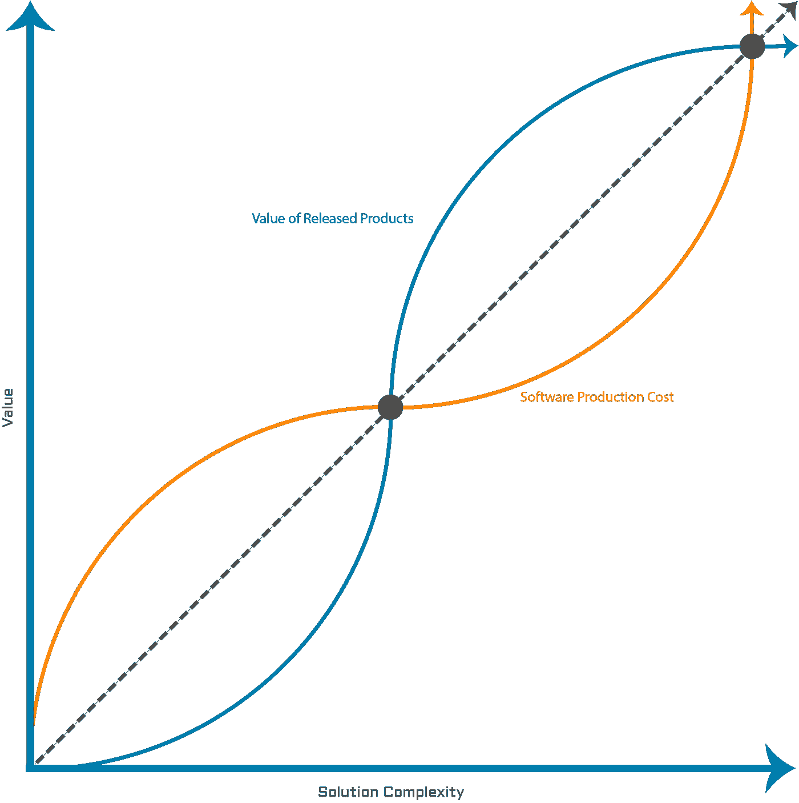
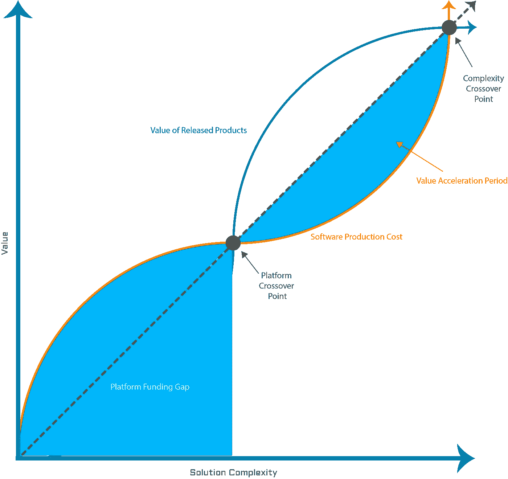
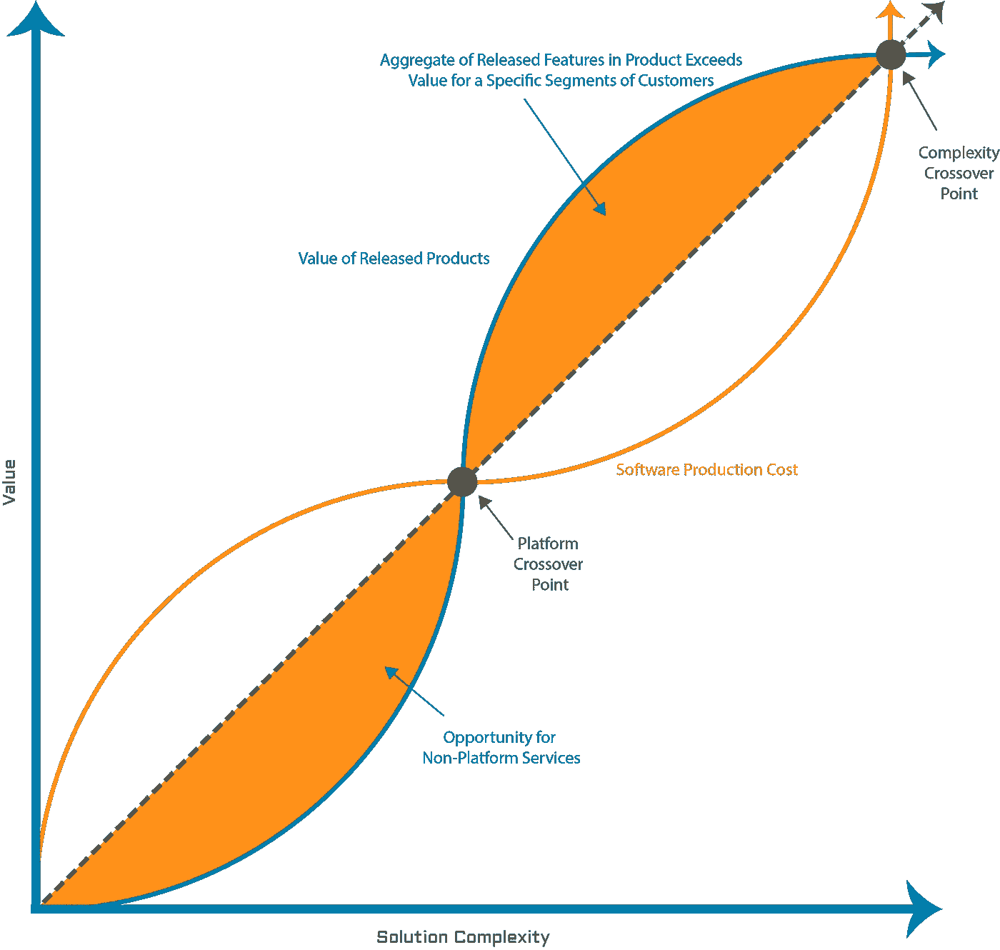

# 建立平台公司在现代经济中的重要性

> 原文：<https://medium.com/swlh/the-importance-of-building-a-platform-company-in-the-modern-economy-43bf754f2e09>

与早期公司合作是一个令人兴奋的机会，无论是作为天使投资者审查潜在投资，还是为社区或投资组合中的人提供建议。最近，软件即服务(SaaS)业务的发展速度和增长似乎导致了“产品”公司超过“平台”公司的爆炸式增长。在我看来,“产品”公司的增长是几个“平台”公司惊人成功的结果，这些公司由于其规模而开放了他们的架构，允许外部创新。

有多种方法来描述“产品”公司和“平台”公司，所以让我澄清一下我是如何看待这两者的。首先,“产品”公司是指销售针对特定行业或特定类型的问题的特定类型解决方案的公司。相比之下，“平台”公司寻求用一套解决方案和产品来改造行业或部门。产品缺乏防御性，通常依赖其他平台来获取客户、数据或基础设施。相反，平台允许以低得多的增量成本构建新产品，用户为提供的新价值付费，而不是仅仅为消费更多的服务付费。一家公司的定价页面可能会显示他们是否已经建立了一个产品或平台，因为产品公司将根据用户数量收费，而平台将根据产品为客户提供的增值来定价。

此外，一些早期投资者、顾问和董事会似乎在推动专注于建立产品公司，因为管道和客户获取模式更具可预测性。虽然这可能会降低一些风险，但这种关注会限制投资的上升潜力。它还鼓励将资本配置用于产品开发，而不是平台增长。结果是缺乏对架构的关注，并希望只专注于销售特定的产品。在[平台思维实验室](http://platformthinkinglabs.com/)有一场关于[【管道思维】](http://platformed.info/why-business-models-fail-pipes-vs-platforms/)[【平台思维】](http://platformed.info/why-business-models-fail-pipes-vs-platforms/)的精彩讨论。

虽然“产品型”公司可以取得难以置信的成功，但我发现大多数创始人很早就实现了*产品适应市场，并寻求扩展这一解决方案。然而，随着软件的增长和制造新产品的低成本，越来越需要确定 [*创始人-市场-适合*](https://alexiskold.net/2016/04/27/why-founder-market-fit-is-so-important/) 来创建新的和可持续发展的公司。创始人应该对改变一个行业充满热情，尽管许多人以前在这些行业工作过，但其他人认为，提供技术或商业模式创新将是变革性的。*

*为了更好地说明为什么公司应该专注于建立一个平台战略，我创建了几个图表来解释这个概念和基本前提。首先，我的核心主张的基础是，定价与用户获得的价值直接相关。如果你熟悉基于价值的定价，这是核心的基本信念。下面的图表仅仅说明了一个得到解决方案的问题越复杂，客户愿意支付的费用越多。*

**

*实际上，这意味着客户愿意为每个用户的存储支付比他们购买完整的内容和工作流管理解决方案低得多的价格。如果你正在构建一个商品服务，那么这个市场必须足够大，这样你才能对数百万用户收取最少的费用。然而，如果你正在建立一个改变行业的平台公司，那么你需要能够为你的客户提供解决更复杂问题的解决方案。*

*当建立一个平台公司时，你需要强大的技术、流程和人员基础，这样你才能增加每个客户的平均收入。下图显示了与构建平台以解决客户挑战相关的生产成本之间的关系。如果这是一个解决最不复杂问题的解决方案，那么成本会更低，收到的最大价值也会更低。对于更复杂的挑战，构建新平台的成本更高，客户将为他们获得的价值支付更多。而在生产方面，每增加一个新功能，成本都大大降低。如果是以客户为中心的版本，应该有客户想要的最低限度的可行产品，尽管它们不能完全解决问题。当产品为企业带来了技术，但没有解决与解决行业问题相关的核心流程或技术时，通常会产生这种价值。*

**

*从投资人的角度来看，平台资金缺口造成创始人和投资人之间的核心裂痕。构建平台的成本非常昂贵，但在构建每个新功能的成本低于初始功能的平台上，存在创造价值和加速的巨大机会。*

**

*创始人有办法最小化平台资金缺口，但我们作为投资者经常不鼓励其中一些方法。我想提出以下理由，说明为什么投资者应该关注建立平台的公司的替代收入来源，并强调创始人与市场契合的好处。*

*首先，给公司的典型建议是，他们应该专注于打造自己的产品，获得用户增长和牵引。大多数指标都指向这一点，而且创始人通常也希望专注于产品的开发。如果创始人有足够的资本或最低限度可行的产品，当大规模交付时，可以填补资金缺口，那么保持专注。然而，如果你是一家不在硅谷的初创公司，或者希望继续专注于改变一个行业而不是筹资，那么下面的内容可能会更有帮助。*

*第二，强大的创始人-市场契合度为公司提供了与一小部分客户合作解决其复杂问题的知识和理解。这种服务的定价和方法不是由产品驱动的，而是更加定制化，与客户一起构建，并被归类为专业服务。*

**什么？！！！我刚才说专业服务了吗？咨询？！！！我们不投资生活方式公司！！！我们只投资那些能够进入大规模市场、拥有人人都想要的产品的公司！！！**

*让我澄清一下，我并不主张建立一个专业服务公司，但我确实相信专业服务是一个可靠的收入来源，可以增加公司对市场的了解。此外，专业服务公司可以是可行的公司，我们不应该害怕作为企业家和创始人建立可持续发展的企业，同时也要放眼未来。虽然[保罗·格拉厄姆](http://paulgraham.com/ds.html)谈到做不具规模的事情，但我不同意公司不应该把它作为收入来源。公司永远不应该害怕要求客户为他们获得价值的服务付费。对于来自公司关注的行业的创始人来说，一个附带的好处是，他们的热情往往来自于解决行业的重大问题和挑战。他们是思想领袖，寻求变革，他们建立的关系将推动为公司提供参考价值的大客户。*

**

*上图突出显示了构建非平台服务的机会，这些服务很可能是通过提供一次性服务(即专业服务)获得报酬的人。在公司生命周期的早期，每个服务可以被定制，但是随着公司的发展，公司可以选择使用服务来填补平台尚未完全构建的空白，例如安装和集成服务。*

*在某个时候，公司将到达我所说的平台交叉点。在这一点上，公司应该逐步淘汰专业服务，重点应该从探索商业模式转移到专门为平台增加用户。在这个阶段，创造了最大的价值，新的功能和产品以如此快的速度发展，新的客户群开始在平台上出现。这通常会导致平台中增加许多用户不使用的新功能，但却有足够大的客户群。*

*下一个主要拐点是复杂性交叉点。在这一点上，添加新功能或解决新问题达到了不可降低的复杂性，或者更临床地说，平台上的开发成本超过了客户愿意支付的价值。当考虑公司提供的新产品、平台和服务以及平台开发的合作伙伴生态系统时，这些复杂的领域变得有趣起来。它们也是新技术可能改变或被公司创建的平台增强的领域。*

*我写这篇文章的目的是给创始人和投资者一个新的视角，让他们思考如何建立更具可持续性、资本效率更高的公司。专注于为客户提供越来越多价值的公司将拥有长期维持和创新的文化。他们将是永远不会让一个平台衰落的公司，员工将会像邪教一样专注于利用这个平台来改变一个行业，因为没有人会仅仅为了销售产品而建立邪教般的追随者。*

**

## *这个故事发表在 [The Startup](https://medium.com/swlh) 上，这是 Medium 最大的创业刊物，有 295，232+人关注。*

## *订阅接收[我们的头条新闻](http://growthsupply.com/the-startup-newsletter/)。*

**