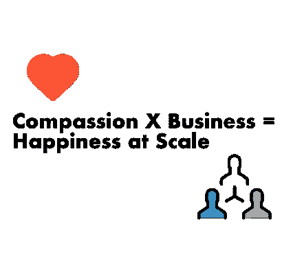

# 富有同情心的企业家精神的重要性。

> 原文：<https://medium.com/swlh/the-importance-of-compassionate-entrepreneurship-3953c7566ef3>

## 被忽视的商业成功的关键。

Photo by [Rémi Walle](https://unsplash.com/@walre037?utm_source=medium&utm_medium=referral) on [Unsplash](https://unsplash.com?utm_source=medium&utm_medium=referral)

## 随同音频一起收听(可选):

# **我开始相信有两种截然不同的动机驱动着几乎所有的企业家:**

**1——圆满。**企业家愿意每周工作 80 小时，这样他们就不用工作 40 小时。愿意努力工作，而不是满足于朝九晚五。我们通常会对我们所做的工作寻求一种深刻的个人满足感，这样我们就能满足于自己在人类中的地位，过好每一天。

**2 -爱情。**归根结底，大多数企业家真的只是想被爱……因为他们是谁而被爱，因为他们的工作而被爱，因为他们作为个体所创造的价值而被爱。

那么，作为企业家，我们如何才能确保我们正在走向一个能产生我们所寻求的满足感和爱的结果呢？

不幸的是，当今世界的许多业务都是在缺乏激励的情况下运营的，结果造成了不人道的影响。剥削、不必要的竞争和贪婪都会助长企业的不良形象。

具有讽刺意味的是，在创业时，我们已经如此迷失在我们“想要想要的”中，以至于我们没有朝着我们希望从得到我们想要的东西中获得的爱和满足感前进。

具有底线优先激励的企业可能会带来许多短期的快乐，但它们永远是短命的。一个贪婪的企业永远不会给任何人带来持续的满足感。

当然，*一个企业需要生存和财务增长才能成为一个企业，如果你不增长，你就死定了*。我并不是说，为了创造一个可持续发展的企业，为了嬉皮士式的“同情”而放弃需要发生的事情。不过，我建议，从根本上来说，任何试图建立高增长企业(或任何企业)的人都应该牢记一个真诚的愿望，即如果我们想在实现自身福祉方面从努力中获得最大收益，就要提高我们作为一个集体的生活质量。

大量经营不善的企业来自(我认为)一种错觉，这种错觉从我们成长到上学期间一直被教导和宣扬，那就是你的成功必然是以别人的失败为代价的。名牌大学只能录取这么多吧？只有这么多人能为那家热门公司工作，对吗？世界是稀缺的吧？

我们会，都是相对的。只有 1%的人能成为 1%最成功的人，但是 100%的人都能从我们的工作中找到满足感和爱。企业家很容易迷失在一个虚荣的游戏中，一个围绕他们周围的人的数字和指标的游戏，并且永远不会找到他们从一开始就想获得的真正的满足感。

那么，我们如何才能再次确保他们的业务被用作一种手段，实际上实现真正的个人实现和企业家每天都在寻求的爱？

我会试着让你相信这是出于同情。看，要成为一个有同情心的企业家，你不必是圣人……**斯坦福医学院心理学教授贾米尔·扎基博士表示，善待他人实际上在大脑中更像是吃你最喜欢的食物，而不是履行某种道德义务:**

**有大量研究表明，对他人的同情、富有同情心的行为，甚至仅仅是富有同情心的思考，都会提高幸福感、生产力和调节情绪的能力的整体水平。**(下面找引证)

作为一名企业家，同情心可以说是你可以培养的最具经济效益的东西之一，因为它为我们节省了大量时间，否则我们会浪费在怀疑、恐惧、愤怒或怨恨上。

做一个有同情心的企业家不仅仅是一个道德或伦理上的决定，它还是你生意的一个净正引擎。同情心也是你可以努力提高的，就像演奏乐器或锻炼肌肉的能力一样。(见下文引用)

埃默里大学的查尔斯·赖森和他的同事最终发现，那些花大部分时间做“爱心”同情练习的人，血液和唾液中的压力荷尔蒙较低，也就是说，真正花集中时间向他人表达爱心和善意的想法。

很好笑吧？出于对他人的真诚同情的工作，也就是说，你不断思考你的建筑将如何对他人产生积极影响的工作，将会增加你自己的福祉，远远超过你试图为帮助自己而创造的任何东西。

从小型社区企业到可能自然带有政治性质的大型企业集团，你仍然可以成为任何规模的富有同情心的企业家。

## 坦率地说，富有同情心的企业家精神应该是所有企业家精神的未来。

我真正的意思是:企业家精神就是愿意穿越未知，失败，保护，对不舒服的事情采取深思熟虑的行动，接受相反的观点，坚持一个愿景，并约束自己承担建立一个公司这样的必然困难的工作——所有这些都是为了减轻他人的痛苦，提高我们作为一个集体的生活质量。当你成为一名企业家，毫无例外地为自己和周围的人减轻痛苦、增加快乐时，你将创造一种企业家的生活方式，带来持续的满足感、爱和持续的快乐。

冒着巨大的风险在极度不确定的情况下坚持你的愿景，为了帮助别人，为了帮助你自己。

随着 21 世纪下一批伟大公司的建立，成为真正大规模帮助他人的工具的风险投资应该是最重要的。

_________________________________________________________________

## **更多关于作者:**

我的📸insta gram:【https://www.instagram.com/mattlfsmith/ 

我的🐥推特:[https://twitter.com/ayemattsmith](https://twitter.com/ayemattsmith)

我的邮箱:[mattlfsmith@gmail.com](mailto:mattlfsmith@gmail.com)

我的上的启动内容📹 🔴YouTube 频道:[https://www.youtube.com/channel/UCFQwaQO8xVmgv_80Mp7IE3g](https://www.youtube.com/channel/UCFQwaQO8xVmgv_80Mp7IE3g)

_________________________________________________________________

## 关于同情心研究的材料改编自:

来自同情研究前沿的三个洞见。[*Http://greatergood.berkeley.edu/*。](http://Http://greatergood.berkeley.edu/.)新名词，2012 年 9 月 7 日。网络。2015 年 6 月 1 日。<[http://greater good . Berkeley . edu/article/item/three _ insights _ from _ the _ cutting _ edge _ of _ sympathy _ research](http://greatergood.berkeley.edu/article/item/three_insights_from_the_cutting_edge_of_compassion_research)>。

贝克，埃里克。"如何变得富有同情心:有研究支持的通向幸福生活的 3 个步骤."*时间*。时间，2015 年 1 月 20 日。网络。2015 年 6 月 2 日。<[http://time.com/3674619/compassion-happier-life/](http://time.com/3674619/compassion-happier-life/)。

理查德·j·戴维森。《冥想者的心灵》*科学美国人档案在线【EBSCO】*。新物理学报，2014 年 11 月。网络。2015 年 6 月 2 日。

费鲁奇，皮耶罗。善良的力量:富有同情心的生活带来的意想不到的好处。纽约:J.P .塔彻/企鹅出版社，2006 年。打印。

斯塔夫，欧阳丹丹。“培养同情心能导致幸福吗？”*科学 KQED 公众媒体*。新名词，2014 年 3 月 4 日。网络。2015 年 6 月 3 日。<[http://blogs . kqed . org/science/2014/03/04/慈悲-幸福-互联网/](http://blogs.kqed.org/science/2014/03/04/compassion-happiness-internet/) >。

## 这个故事发表在 [The Startup](https://medium.com/swlh) 上，这是 Medium 最大的企业家出版物，拥有 355，974+人。

## 在这里订阅接收[我们的头条新闻](http://growthsupply.com/the-startup-newsletter/)。

