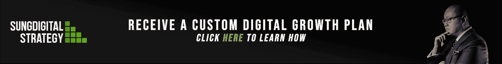

# 拥有一个商业导师的重要性

> 原文：<https://medium.com/swlh/the-importance-of-having-a-business-mentor-2840c4969fae>

> “没有人是一座孤岛。”约翰·多恩

Photo by [Harli Marten](https://unsplash.com/photos/M9jrKDXOQoU?utm_source=unsplash&utm_medium=referral&utm_content=creditCopyText) on [Unsplash](https://unsplash.com/search/photos/mentor?utm_source=unsplash&utm_medium=referral&utm_content=creditCopyText)

需要自己做每件事是我们企业家的共性。

称之为盲目的野心。称之为傲慢吧。

不管你怎么称呼它，从长远来看，它对我们弊大于利。

现在是我们面对一个严峻事实的时候了:我们没有所有的答案。我们会有需要帮助和建议的时候。我们会有犹豫、怀疑或质疑自己的时候。这很好:一个聪明企业家的标志是知道他们不能总是知道他们需要知道的一切来取得成功。

那么，作为一名企业家，你如何前进、成长和学习呢？

通过找一个导师。

# 什么是导师？

导师是一个拥有你尚未获得的经验的人。他们会有你错过的后知之明。他们会有很多过去的错误和成功，你可以从中学习。一个导师都看过了；他们在个人和职业上都经历了很多。

他们会告诉你同龄人无法告诉你的残酷事实，因为在你做出决定之前，他们就已经知道了你的决定的后果。但最重要的是，他们想帮助你成功。他们已经达到了个人成功和成就感的水平，并决定将它传递下去。

他们真正关心你和你的未来。

这就是这种关系的真实性。你不应该强迫导师。这就是为什么找到正确的导师是成功的一半。

让我们深入探讨一下:

# 如何找到导师

在寻找导师的时候，我们很自然地会希望志存高远。但是，向你所在行业的大人物寻求指导，可能不如从已经获得成功的小地方人物开始更现实。

如果你打算通过冷冰冰的电子邮件联系某人，确保你不会表现得过于强势或苛刻。培养一段感情，但不要对他们要求太多太快。拥有一个真实的声音，代表专业、尊重和魅力。

我知道，说起来容易做起来难。

但通常情况下，最好的导师是那些已经在我们的网络中的人。看看你现在的老板，经理，教授，甚至家人朋友。也许你的生活中已经有了一个人，你可以向他求助，而不必给那些冷淡的潜在客户发一堆电子邮件。

另一个选择是通过一个项目支付导师费用。这样做的好处是保证你能得到指导。坏处是这会让你花钱。自己掂量一下这两个因素的分量，弄清楚是否适合自己。

# 如何接近导师

导师/学员的关系可以追溯到很久以前，从梅林和亚瑟到史蒂夫·乔布斯和比尔·坎贝尔。这是一个值得信赖的过程，因为它行得通——但就像每一段关系一样，它需要双方的努力。你不能指望一个导师神奇地纠正你所有的错误。导师给你的建议只会影响你的学习能力和按照他们说的去做。

所以，你需要开诚布公地处理与导师的关系。接受他们的诚实；这就是他们的建议如此有价值的原因。作为回报，你要对他们诚实。如果你不能坦诚面对自己的能力、弱点和恐惧，你将一无所获。

在见你的导师之前，列出你想从会面中获得的所有东西。离开你自己，看看你的缺点。你的弱点是什么？你的导师能帮你实现什么？你能预测哪些障碍会阻碍你的目标？记住所有这些将有助于你和你的导师理解需要做什么以及如何做。

同时，你的导师也是你的朋友。你在交往中不必如此正式。简单地边喝边聊会给你有意义的建议。这完全取决于你和导师之间的关系类型。找到对你们双方都有效的方法。

你也不局限于一个导师。也许你生活中的不同领域需要不同的指导方法。拥有一个动态范围的建议可以帮助你在生活中形成更全面的观点。

史蒂夫·乔布斯，埃隆·马斯克，比尔·盖茨。除了他们是我们这个时代最成功的企业家，他们还有什么共同点呢？他们都有导师。他们明白外界建议的价值。他们因此脱颖而出。

我希望这篇文章能说服你去找一两个有价值的导师。如果你喜欢这篇文章，一定要给我更多的关注！

*我们来连线:*

[*Linkedin*](http://bit.ly/bensonsunglinkedin)*|*[*Youtube*](http://bit.ly/bensonsungyoutube)*|*[*脸书*](http://bit.ly/bensonsungfacebook)

## 这个故事发表在 [The Startup](https://medium.com/swlh) 上，这是 Medium 最大的企业家出版物，拥有 358，974+人。

## 在这里订阅接收[我们的头条新闻](http://growthsupply.com/the-startup-newsletter/)。

