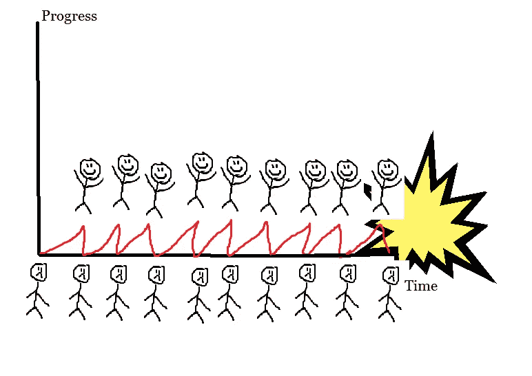

# 为什么 MVP 不会让你成功的不寻常的事实。

> 原文：<https://medium.com/swlh/the-important-truth-about-why-an-mvp-wont-make-you-successful-5af8533bc88>

## 如何通过关注你的基本面来释放你的潜力？

在创业公司的世界里，“快速失败”是圣杯。“旋转”是获得成功的唯一途径。

但是该死的，我看到太多的创业公司失败了，并以这种愚蠢的方式发展。诚然，你必须经常失败才能获得成功，但你必须聪明地失败。特别是你需要向前失败。

视觉上是什么样的？大多数创业公司都是这样做的:

High-skill paint skills!

失败是失败后没有进步的唯一结果。

为什么会这样？

因为他们在喝创业公司 kool-aid。

他们坚持 MVP 的想法。他们陷入了构建-测量-学习的循环中。

> "最重要的是检验你的假设和支点."—几乎每个人都在创业。

不过，这有两个根本性的缺陷:

1.  **创新者的偏见:**我们中的大多数人都会围绕自己的绝妙想法遇到问题，然后试图找到足够的证据来说服自己我们走在正确的道路上。这被称为创新者的偏见。如果你从测试开始，你需要猜测实际问题。由于创新者的偏见，这真的很难，因为我们习惯于围绕我们的解决方案制造假问题。这就增加了我们说服自己走在正确道路上的几率——这正是你想要避免的事情。
2.  **缺乏灵活性:**如果你从一个并不存在的问题开始，就很难从一个让你的假设无效的测试中恢复过来。不从一开始就探索整个问题的背景会破坏你的灵活性，并使你很难从面试中提取可操作的问题。

刚开始时，你希望最大限度地学习，最大限度地缩短产品与市场匹配的时间。与其尽快构建你的 MVP，不如从一个**最低可行的理解**开始。

# 每个新想法都应该从 MVU 开始

> "初创公司最常犯的错误是解决没有人解决的问题."保罗·格拉厄姆

你见过非常成功的企业家谈论他们的愿景吗？他们能够勾勒出一幅几乎不可避免的未来图景。

大多数企业家都知道愿景是一幅鼓舞人心的未来图景。成功的企业家意识到，好的愿景是当前趋势和客户需求变化的结合。

为了做到这一点，您需要对以下几个方面有最起码的理解:

1.  **趋势:**哪些趋势让你现在为实现这一愿景而努力变得格外重要？这些可能是技术趋势(云计算)、消费者趋势(UX 的重要性)、法律趋势(GDPR)、经济趋势(2008 年的经济危机)等。
2.  **客户:**你的客户是谁？
3.  **客户的工作:**客户想要完成什么？例如，建立一个创业公司(加速器)，从 A 点到 B 点(优步)，或扩大一个团队(Angel.co)
4.  **流程:**您客户目前的工作流程是怎样的？
5.  **问题:**当前流程的首要问题是什么？
6.  **替代品:**客户有哪些替代品？
7.  **抱怨:**目前的解决方案有哪些不理想之处？

然后你可以把它变成一个陈述:

> *对于 _ _【****客户*** *】，至关重要的是 _ _****客户的工作*** *】。他们目前的做法是 __[* ***流程*** *]，但那是因为 __[* ***问题*** *]而具有挑战性。目前，他们用 __[* ***替代方案*** *]来解决这个问题。然而，【* ***投诉*** *】。*
> 
> *因为 __[* ***趋势*** *]，解决这个问题将变得同样关键和可能。*

一旦你有了这份声明，你可以把它放在专家和客户面前，看看你是否有所发现。一旦你明白了这一点，你就能更清楚地了解实际需求和趋势。你可以看到你是更接近创新还是更接近幻想。

填这个有困难吗？我在这里写了关于采访客户的内容。

# 推动发现

从最基本的可行理解开始是最大化学习的关键，将帮助你发现最大的机会。它消除了在你准备好之前构建产品的欲望。您不再需要担心设计或代码。

有了最低限度的理解，你就把注意力转移到了学习上。这是你需要开始建立的基础。

然而，这样做很难。你需要真正诚实和严谨地获得正确的最低可行的理解。但是当你尽快地从构建你的 MVP 转移到从你的最低可行理解开始，这将会省去你很多痛苦。

## 小忙…

喜欢阅读吗？想让其他人也读这个吗？想让我开心吗？点击那个👏(最多 50？？会对我有很大的影响！)并随意分享！

## 如果你想了解最新消息，你可以在这里订阅接收我的帖子。

## 这篇文章发表在《创业公司》杂志上，这是 Medium 最大的创业刊物，有 317，238 人关注。

## 订阅接收[我们的头条新闻](http://growthsupply.com/the-startup-newsletter/)。

