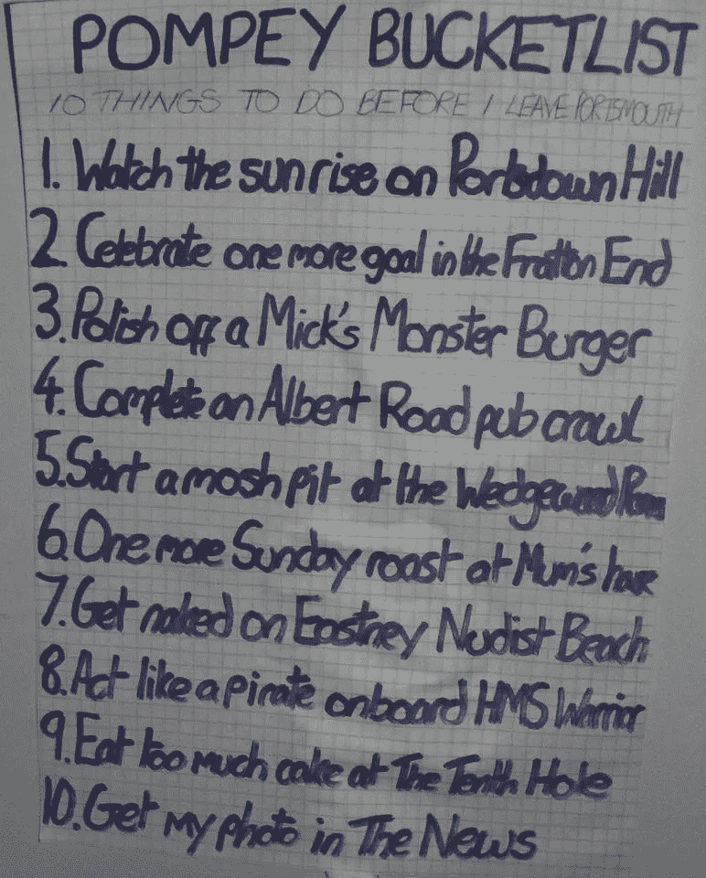

# 遗愿清单不可思议的力量

> 原文：<https://medium.com/swlh/the-incredible-power-of-bucket-lists-ef70371abd68>

你总是太忙而看不到的吸引力。你认为你会很擅长的爱好。那个你一直想去的国家。

有趣的是，我们总是“抽不出时间”去做那么多能让我们开心的事情。

单调的日常生活妨碍了我们，直到我们把乐趣放在第一位。

遗愿清单是一个很好的工具。

目标只是愿望，直到它们被写下来。一旦它们实际存在，我们会发现自己更有动力去完成它们。

一大串目标把乐趣变成了挑战。它释放了我们竞争的一面。突然，如果我们没有一定的乐趣，我们就是失败者。

每个人都同意尽可能多的娱乐是很重要的。这就是为什么大多数人如此支持这样的列表。你的大多数朋友都会想帮你完成它。我建议写一份遗愿清单，哪怕只是为了花更多的时间和你在乎的人在一起。

# 庞贝遗愿清单

我完成庞贝遗愿清单已经整整四年了。

在我离开伦敦开始新生活的前一个月，我着手完成了 10 项挑战，这些挑战定义了这座城市的全部。

大多数事件都很容易列举出来。完成艾伯特路酒吧爬行。吃完米克的巨型汉堡。弗拉顿那边又进了一球。

其他人把我推出了我的舒适区。在韦奇伍德房间开始狂欢。在英国皇家海军勇士号上扮演海盗。在裸体海滩上裸体。

最终目标是最雄心勃勃的。把我的照片登在当地报纸上。我给《新闻报》发了一封电子邮件，希望一切顺利。当他们打电话回来采访我，让我做一个关于这份名单的整版专题时，这可能是最令人激动的事情。用遗愿清单挑战你的极限是值得的。越难完成，你就越有成就感。

[这是刊登在《新闻》上的文章](https://www.portsmouth.co.uk/news/people/joe-s-pompey-bucket-list-is-complete-with-picture-in-the-news-1-5786818)。

# 伦敦遗愿清单

《伦敦遗愿清单》是我 2016 年写的第一本书。它提供了 50 个在我们首都可以做的奇特、独特的活动。你可以[免费下载电子书](http://www.thelondondater.co.uk/the-london-bucket-list/)或者[在亚马逊](https://www.amazon.co.uk/London-Bucket-List-Awesome-Things/dp/1533271410/)上购买纸质书。

2017 年，我挑战自己，要在 30 岁之前完成书里的 [30 项活动。结果，我享受了许多我可能懒得去尝试的经历。我当时并不知道，但是做完单子一个月后我就要离开这个城市了。](https://www.instagram.com/explore/tags/joeslondonbucketlist/)

# 你的挑战

与其制定新年计划，不如写一份遗愿清单。

让你的目标更大、更大胆、更美丽，还有一点点吓人。邀请尽可能多的朋友帮你完成。

这是一个超级有趣的 2018 年的万全之策。

***原载于***

**

## *这篇文章发表在 [The Startup](https://medium.com/swlh) 上，这是 Medium 最大的创业刊物，拥有 281，454+人关注。*

## *在此订阅接收[我们的头条新闻](http://growthsupply.com/the-startup-newsletter/)。*

**