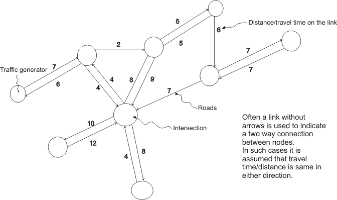

# 创新挑战

> 原文：<https://medium.com/swlh/the-innovation-challenge-2b61807c3754>

## 为什么公司努力创新，为什么他们应该专注于重新利用想法，而不是试图重新发明轮子。

“When starting SpaceX I thought the odds of success were less than 10%, and I just accepted that I would probably just lose everything.” — Elon Musk

与许多数据科学家不同，我没有数学、统计学或计算机科学的博士学位，我甚至没有这方面的博士学位。我相信这就是为什么我不会像许多数据科学家那样，被复杂的算法困住，无休止地争论哪种算法可能解决问题的主要原因。我倾向于从商业角度看问题，并专注于期望的结果，然后一头扎进一堆数据，找出什么类型的算法可以解决我的问题。

从很小的时候起，我就一直有创业精神，从在我家附近开始园艺服务，到洗车或挨家挨户卖邮票。但与你听到的大多数伟大的创业故事不同，我没有把它变成一个数百万美元的企业，我的大部分努力都是非常具体和短期的。从想买糖果、一辆新自行车或一些新衣服。幸运的是，随着年龄的增长，我意识到推迟享乐在职业和经济上都更有回报。

但在我的工作中，理解大局并能够将其分解为更小的短期目标对我很有帮助。这就是为什么我对 so my companies 感到震惊，他们希望被视为最具创新性的公司，一个颠覆者，但不明白要真正具有颠覆性，你不必重新发明轮子。

## 创新与提高效率

像大多数人一样，我热爱创新，过去我会是排队等候或预购最新游戏机、智能手机或可穿戴设备的人之一，最近我倾向于对什么是创新以及什么实质上是将旧想法重新用于新场景/行业/流程持怀疑态度。

当苹果推出 Apple-I 时，它创造了一种真正创新的产品，这导致了来自 IBM、康柏和后来的戴尔的竞争，这些公司不一定创新，但专注于开发更有效和更便宜的方法来为大众生产个人电脑。

Innovation or Incremental Steps?

在我的专业领域——支付领域，我正经历着同样的事情。那些声称极具创新性，但本质上只是提高流程效率的公司。

举个例子，如今有超过 900 家不同的支付服务提供商，每一家都为商户提供通过万事达卡、维萨卡、JCB 卡、Diners/Discover 卡和银联卡等卡网络处理交易的能力。PSP 不是专注于寻找一种在商家和消费者之间交换价值的新方式，而是专注于扩展连接和功能，并称之为创新。整合数百种替代支付方式，或通过将支付价值链的多个部分构建到一个平台来减少摩擦，是非常具有挑战性的，并为全球商家提供了重要的价值，但直到大多数 PSP 明白处理支付是一种商品，他们才会开始探索如何创新以创造实际价值。

***旁注:*** *你可能会想，这难道不是加密货币正在做的事情吗，你是对的，但与大型卡网络不同，加密货币不属于整个世界所认为的货币价值。因此，在加密货币被认为是全球公认的货币之前，就像欧元、美元或英镑一样，我倾向于将它们排除在我的分析之外。这并不意味着我不相信为加密货币提供动力的技术最有可能真正扰乱全球经济体系。*

## 改变想法

正如我在之前的[帖子](/swlh/the-new-business-model-of-the-payments-industry-dbf1e9ab9426)中所讨论的，我认为支付领域和其他依赖技术的行业的机会是通过使用数据来增加价值。

除了尝试改变技术或提高流程的有效性，公司还应关注如何利用其拥有的数据，并使用与行业无关的概念和算法，通过向客户展示洞察力、优化性能和降低成本，为客户提供真正的价值。

当然，数据的应用还有很多，但当你只是想弄清楚如何利用你拥有的数据时，发现见解、优化性能和降低成本是最容易实现的三件事，对业务有很大的积极影响。

## 洞察力

无论你身处哪个行业，零售、运输、金融服务或任何其他行业，不断出现的一个问题是:“我们知道什么，而我们的客户、竞争对手或供应商不知道什么？”。这个问题可能会以各种不同的方式提出，但它总是归结为你拥有别人没有的洞察力，以及你如何从中受益。

在零售业，如果你知道你的顾客过去买过什么样的衣服，你就能更好地估计下一季该买什么。在交通运输中，如果您知道在哪些时段某些道路上的交通流量会增加，您可以向您的司机建议替代指示以减少行驶时间。在金融服务业，如果你了解客户的消费习惯，你就能为他们提供信用卡优惠，帮助他们在出国旅游或在特定零售商处购物时获得奖励。

能够使用您所拥有的数据，为您的员工提供商业智能以做出基于证据的决策，并为客户提供他们与您公司互动的洞察力，是提供价值和增强您的整体产品/服务的第一步。

Business Intelligence Dashboard — PowerBI

看看像 Google Analytics 或 Kiss Metrics 这样的平台，我们可以看到从数据中获得的洞察力如何帮助我们随着时间的推移做出更好的决策。更好的是，我们可以利用这些见解来自动化我们在其他地方做出的决策，例如运行哪些广告以及基于哪些关键词。

通过重新利用这些相同的想法，我们可以改进我们看待所有行业数据的方式。零售业可以结合使用传感器、运动和登记数据，来跟踪走进一个位置的人数、购物者在商店里走动的方式以及最终有多少人购买了东西。这与谷歌分析(Google Analytics)使用点击流数据来跟踪购物者在你的网站上的互动方式，并将其与电子商务结账数据联系起来，以确定哪些购物者最终会购买某些东西的方式没有太大区别。

## 优化性能

利用公司内部生成的数据的另一种方法是提高产品的性能。特别是在技术领域，公司变得过时的首要原因是因为他们制造的东西比以前的在位者更好地解决了问题，但从那以后就没有再投资改进产品。随着越来越多的客户使用该产品，他们努力确保该过程尽可能高效，但进行实际调整的风险太大了。

与洞察力不同，优化性能不应是一个分析过程，而是一个通过使用算法实现的自动化过程。通过确定对公司至关重要的关键绩效指标(KPI ),创建针对这些 KPI 进行优化的流程应该是构建商业智能之后的下一步。

在运输过程中，尤其是在易腐食品的运输过程中，应该消除在路上而不是在仓库或杂货店花费的每一分钟。因此，让我们想象一个卡车司机必须将货物运送到五个不同的地点。我们将使用一种基于距离/时间的算法来计算最短路径，而不是沿着随机列表往下走。

Dijkstra’s Algorithm — Shortest Path Problem

在一个完美的世界里，永远不会有问题，这种计算将被做一次，永远不会再做一次。但随着天气条件、交通和道路工程的变化，每次都需要重新计算路径，以确保选择的路线是最佳路线。通过使用历史数据和第三方数据，算法可以优化每次交付的性能，以确保每天选择最佳路线。

## 降低成本

另一个经常被忽视的利用数据的方法是降低成本，它最容易被忽视的原因是，试图节省 1%的资源和时间被更多地用于增加销售或收入。但特别是在金融服务业，自从金融科技的兴起和银行业的分拆以来，降低成本一直是一个非常重要的焦点。

Challenger 银行正在降低维护银行账户的成本，因为他们不需要昂贵的零售点。支付公司正在应对日益激烈的竞争和全栈 PSP，这些 PSP 可以通过整合价值链的多个部分来降低利润率。甚至贷款也不得不与另类贷款公司打交道，这些公司通过使用众筹和完全数字化来降低风险和费用。

因此，商业智能为公司提供了对业务潜在趋势的洞察，而算法有助于提高运营绩效，将两者结合在一起并量化成本降低的影响是为公司和客户提供价值的。

在支付处理中，交易通常通过多个收单机构完成，每个收单机构维护不同的定价结构。通过跟踪每个连接的性能及其相关成本，PSP 可以利用这种洞察力来帮助他们的商家将交易路由到性能最佳或价格最低的路线。

## 低挂水果 vs .月球拍摄

每当我们想到像史蒂夫·乔布斯或埃隆·马斯克这样的伟大创新者，我们往往会认为他们在不断地向月球进发，这与事实相去甚远。就像托马斯·爱迪生、尼古拉·特斯拉、莱特兄弟、艾伦·图灵或蒂姆·伯纳斯·李一样，真正的创新不是一个巨大的飞跃，而是一小步一小步的积累，没有人会看到这种积累转变为一种范式。

通过为您的员工/同事创造更好的见解，利用最先进的技术实施优化性能的算法，以及通过降低成本和改善基础流程，公司可以专注于容易实现的成果，使那些经过多年复合的小步骤看起来像伟大的创新。

## 感谢阅读；)，如果你喜欢它，请点击下面的掌声按钮，这对我意义重大，也有助于其他人了解这个故事。让我知道你的想法，联系推特或 T2 的 Linkedin。或者关注我，阅读我关于数据科学、支付和产品管理的每周帖子。

## 这篇文章发表在《T4》杂志《创业》(The Startup)上，这是 Medium 最大的创业刊物，有 320，131+人关注。

## 在这里订阅接收[我们的头条新闻](http://growthsupply.com/the-startup-newsletter/)。

